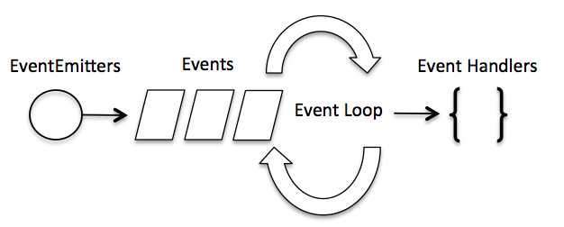

# ife_baidu
百度前端技术学院的作业代码仓库
---- 
# 09.09 day 1

- HTML5新增特性：
  - 用于绘画的canvas元素；（\<canvas\>只是图形容器，需要用js脚本来绘制）
  - 用于媒介回放的video和audio元素；
  - 对本地离线存储有更好的支持；
  - 新的特殊内容元素，比如article、footer、header、nav、section
  - 新的表单控件，比如calendar、date、time、email、url、search 
- HTML5的改进：
    - 新元素
    - 新属性
    - 完全支持CSS3
    - Video和Audio
    - 2D/3D制图
    - 本地存储
    - 本地SQL数据
    - Web应用
- 文档类型（DOCTYPE）是用来说明HTML还是XHTML文档以使浏览器准确地渲染。
- meta元素：不显示在页面上，被机器（浏览器、搜索引擎、其他网络服务设备）解析所用。它指定页面描述、所用字符集、作者等内容。
- web语义化是使用恰当的html标签、class类名让页面有良好的结构和含义，方便人和机器理解。

---
# 09.10 day 2
- - JS中表示“假”：0、0.0、NaN、""、null和undefined；
  - 表示“真":除上边几个的其他所有，比如字符串零（"0"） 
-
    |    表达式    | 真假  |
    | :----------: | :---: |
    |  10 < "42"   | true  |
    | 10 < "42人"  | false |
    | 10 > "42人"  | false |
    | 10 == "42人" | false |
    |  42 == "42"  | true  |
    | 42 == "42.0" | true  |
    | 42 === 42.0  | true  |
    | 42 === "42"  | false |
- 
  |        类别(优先级降序)        |         运算符         |
  | :----------------------------: | :--------------------: |
  |              括号              |          ( )           |
  |        成员、索引操作符        |         . [ ]          |
  |    方法(函数)调用、对象创建    |         () new         |
  | 逻辑非、负号、自增、自减、类型 |    ! - ++ -- typeof    |
  |          乘、除、取模          |         * / %          |
  |             加、减             |          + -           |
  |      关系比较、实例、包含      | <> <= >= instanceof in |
  |         相等、不等比较         |     ==  != === !==     |
  |             逻辑与             |           &&           |
  |             逻辑非             |         \|  \|         |
  |              赋值              |    = += -= *= /= %=    |

- 变量作用域：
  - 函数外声明为全局变量
  - 函数内声明为局部变量
  - 函数内不声明（没有使用 var 关键字）、直接使用，为全局变量
  - JS变量生命周期在它声明时初始化，局部变量在函数执行完毕后销毁；全局变量在页面关闭后销毁。

---
# 09.11 day 3
- **DOM**，Document Objuct Model，文档对象模型，是HTML和XML编程接口。
- \<button \>貌似没有data-value这个属性啊，什么鬼。
- Node类型：文档类、元素类、文本类、属性类、内容类

---
# 09.12 day 4
- display:flex 弹性布局，参考[阮一峰大佬的文章](http://www.ruanyifeng.com/blog/2015/07/flex-grammar.html)

- 相对长度<br>
- 
  |单位|描述|
  |:--:|:--|
  |em|它是描述相对于应用在当前元素的字体尺寸，所以它也是相对长度单位。一般浏览器字体大小默认是16px，则2em=32px|
  |ex|依赖于英文字母小x的高度|
  |ch|数字0的高度|
  |rem|根元素(html)的font-size|
  |vm|viewpoint width，视窗宽度，1vw=视窗宽度的1%|
  |vh|viewpoint height，视窗高度，1vh=视窗高度的1%|
  |vmin|vw和vh的较小的那个|
  |vmax|vw和vh中较大的那个|

- 绝对长度
- |单位|描述|
  |:--:|:--|
  |cm|厘米|
  |mm|毫米|
  |in|英寸|
  |px|像素|
  |pt|point|
  |pc|pica|

---
# 09.13 day 5
- JS是由ECMAScript、DOM、BOM组成。
- JS字符串不可改变，除非重新赋值。

---
# 09.14 day 6
- 逆波兰表达式：又叫“后缀表达式”，需要利用一个栈和一个输出字符串Output，从左到右读入中缀表达式：
```javascript
class Stack {
  constructor() {
    // 使用 Array 保存栈数据
    this.stack = [];
  }

  // 压栈
  push(value) {
    this.stack.push(value);
  }

  // 出栈，栈为空时返回 undefined
  pop() {
    return this.stack.pop();
  }

  size() {
    return this.stack.length;
  }

  empty() {
    return this.size() === 0;
  }
}

const convertToReversePolish = (infixExpression) => {
  const operators = ['+', '-', '*', '/', '(', ')'];

  let stack = new Stack();
  let ret = [];

  // 切割表达式，模拟读取
  infixExpression.replace(/([\d+|\+|\-|\*|\/|\(|\)])/g, (_, expression) => {
    if (operators.includes(expression)) {
      // 读取到操作符，输出所有优先级更低的操作符
      while (true) {
        // 栈为空，直接将当前操作符压入栈中，并跳出循环
        if (stack.empty()) {
          stack.push(expression);
          break;
        }

        // `(` 的优先级最高，直接压入栈中，并跳出循环
        if (expression === '(') {
          stack.push(expression);
          break;
        }

        const op = stack.pop();

        // `)` 的优先级最高，只要操作符不为 `(` 则一直输出
        if (expression === ')') {
          if (op !== '(') {
            ret.push(op);
            continue;
          }
          // 跳出循环，不需要输出 `(`
          break;
        }

        // `(` 只在处理 `)` 时出栈
        if (op === '(') {
          stack.push(op);
          stack.push(expression);
          break;
        }

        if (expression === '+' || expression === '-') {
          // `+` 和 `-` 的优先级最低
          // 除非栈顶操作符也为 `+` 和 `-`，否则输出栈顶操作符，并继续
          if (op !== '+' || op !== '-') {
            ret.push(op);
            continue;
          }
        }

        // 比栈顶预算符优先级相同或更低，将操作符压回栈中，中止
        stack.push(op);
        stack.push(expression);
        break;
      }
    } else {
      // 操作数直接输出
      ret.push(expression);
    }
  });

  // 依次弹出栈中剩下的操作符，并输出
  while (!stack.empty()) {
    let op = stack.pop();

    if (op !== '(') {
      ret.push(op);
    }
  }

  return ret.join(' ');
};


console.log(convertToReversePolish('1 + 1 * 2'));  // => 1 1 2 * +
console.log(convertToReversePolish('(1 + 1) * 2')); // => 1 1 + 2 *
console.log(convertToReversePolish('1 + 2 * 3 + (4 * 5 + 6) * 7'));
// => 1 2 3 * + 4 5 * 6 + 7 * +

const evalReversePolish = (suffixExpression) => {
  const operators = ['+', '-', '*', '/'];

  let stack = new Stack();

  // 切割表达式，模拟读取
  suffixExpression.replace(/([\d+|\+|\-|\*|\/])/g, (_, expression) => {
    if (operators.includes(expression)) {
      const val1 = stack.pop(),
            val2 = stack.pop();

      switch (expression) {
        case '+':
          stack.push(val1 + val2);
          break;
        case '-':
          stack.push(val2 - val1);
          break;
        case '*':
          stack.push(val1 * val2);
          break;
        case '/':
          stack.push(val2 / val1);
          break
      }
    } else {
      // 操作值直接压入栈中
      stack.push(parseInt(expression));
    }
  });

  return stack.pop();
};


console.log(
  evalReversePolish(
    convertToReversePolish('1 + 1 * 2')));  // => 3
console.log(
  evalReversePolish(
    convertToReversePolish('(1 + 1) * 2')));  // => 4
console.log(
  evalReversePolish(
    convertToReversePolish('1 + 2 * 3 + (4 * 5 + 6) * 7')));  // => 189
```


- JS里的正则表达式：使用一个正则表达式字面量，其由包含在斜杠之间的模式组成，如下所示：
```
var re = /ab+c/;
```

&nbsp;&nbsp;&nbsp;&nbsp;或者调用RegExp对象的构造函数，如下所示：
```
var re = new RegExp("ab+c");
```
- 操作数：“操作符”即“运算符”，“操作数”就是在算式中被计算的数。
- flexbox盒子模型

---
# 09.15 day 7
- JS里的快排，[阮一峰大神的博客](http://www.ruanyifeng.com/blog/2011/04/quicksort_in_javascript.html)，主要用了递归和分治法的思想。

---
# 09.16 day 8
- 斐波那契数列的解法：
```
create a Fibonacci function, fabonacci(n), which returns the nth element of the Fibonacci sequence
```
```javascript
//解法1使用递归：
function fibonacci1(nth){
    if(nth == 1 || nth ==2){
        return 1;}
    else{
        return fibonacci1(nth-1)+fibonacci1(nth-2);
        }}

//解法2使用迭代：
function fibonacci2(nth){
    if(nth == 1 ||nth ==2){
        return 1;}
    else{
        var result=0;var one=1; var two=1;
        for(var i = 2; i<nth; i++){
            result = one+two;
            two = one;
            one = result;}
        return result;}
}
//通用公式法
function fibonacci3(n) {
      const SQRT_FIVE = Math.sqrt(5);
      return Math.round(1/SQRT_FIVE * (Math.pow(0.5 + SQRT_FIVE/2, n) - Math.pow(0.5 - SQRT_FIVE/2, n)));
    }
```

- 隐藏语句
```
create a function hideVowel(str), which returns a string replacing all vowels in the given str with “*”
```
```javascript
function hideVowel(str){
    var result = '';
    for(var i=0;i<str.length;i++){
        result+="*";}
    return result;}
```
- 对于一些由value属性定义其显示内容的元素，例如：文本框、各种按钮等，不能使用textContent和innerHTML ，而应该通过其DOM元素的value property来获取/改变其显示内容。
- |DOM style property|CSS|
  |:---:|:--:|
  |backgroundColor|background-color|
  |border|border|
  |color|color|
  |cssFloat|float|
  |fontWeight|font-weight|
  |fontSize|font-size|
  |zIndex|z-index|

- **常见错误**对于fontSize、borderWidth、padding这些有单位的style属性，应该赋予字符串，而不是直接赋值。
- 非侵入式编程：避免在HTML标签中写上onchange、onclick等属性来注册JS事件处理程序，而是通过id、class等简单标识来找到相应需要改动的HTML元素，从而使HTML和JS分离开来。
- |property名|描述|
  |---|---|
  |nodeName|节点名，元素节点为HTML标签名（大写），属性节点为HTML属性名，文本节点始终为“#text”，文档节点名为“#document”|
  |nodeValue|节点值，元素节点值为null，属性节点值为属性值，文本节点值为文本内容。**文档节点值为？？？**|
  |nodeType|节点类型，元素节点为1，属性节点为2，文本节点为3，文档节点为9，注释节点为8。|
  |parentNode|父节点|
  |previousSibling|前一个兄弟节点|
  |nextSibling|后一个兄弟节点|
  |firstChild|第一个子节点|
  |lastChild|最后一个子节点|
  |childNodes|所有子节点的数目|

  ---
# 09.17 day 9
- 文档节点和元素节点可以拥有子节点，但是文本节点和属性节点不行；
- window.onload()：用于浏览器加载完网页之后立刻执行某些操作。这是因为JS中的函数方法等需要在HTML文件渲染完成之后才可使用；如果没有渲染完成，此时的DOM树是不完整的，这样JS文件可能报出“undefined”错误。
- |BOM对象|描述|
  |:---:|:---:|
  |window|浏览器用于显示网页的窗口|
  |document|浏览器窗口内当前的网页，DOM树的根（即使BOM成员，又是DOM成员）
  |location|当前网页的URL|
  |navigator|浏览器本身|
  |screen|浏览器当前占据的屏幕区域|
  |history|浏览器用户访问历史|

- |window对象常用方法：对象名|描述|
  |----|----|
  |alert、confirm、prompt|弹出对话框|
  |setInterval、setTimeout、clearInterval、clearTimeout|定时器|
  |open(url, name, options)、close()|打开新的浏览器窗口，关闭当前浏览器窗口|
  |print()|打印当前网页|
  |focus()、blur()|使当前浏览器获得焦点/失去焦点|
  |scrollBy(dx,dy)、scrollBy(x,y)|将浏览器窗口内页面纵向滚动dx（负值为向上），横向滚动dy（负值向左）；将浏览器窗口内页面滚动到(x,y)坐标处。|

- |document对象property列表|描述|
  |---|---|
  |cookie|当前网页有效的所有cookie，以键值对的形式返回|
  |domain|提供当前网页的Web服务器域名|
  |referrer|前一个网页，用户从那里点击链接访问了当前网页|
  |title|当前网页的title|
  |URL|以字符串形式返回文档的地址栏链接。|
  |anchors|返回文档中所有锚点元素的列表|


---
# 09.18 day 10
- 什么时候不带“( )”，什么时候带？
> 加括号会立即调用函数。
- HTML文档和DOM都是树型结构，因此当一个事件发生的时候，既作用在当前元素上，也作用在当前元素的父元素和祖先元素上。

---
# 09.19 day 11
- Don`t write a loaded document.
- 给事件添加监听器，方法第一个参数为时间名，第二个参数为事件处理器。
```javascript
button.addEventListener('click', function(){alert('hello world');});
```
- | 比较对象 | 说明                                                         |
  | :------: | :----------------------------------------------------------- |
  |   this   | **this表示当前对象的一个引用**。在方法中，this表示该方法所属的对象；如果单独使用，this表示全局对象；在函数中，this表示全局对象；在函数中，在严格模式下，this是未定义的；在实践中，this表示接收事件的元素；类似call()和apply()方法可以将this引用到任何对象。 |
  |   self   | self 指窗口本身，它返回的对象跟window对象是一模一样的。也正因为如此，window对象的常用方法和函数都可以用self代替window。 |
  |  window  | 浏览器窗口                                                   |

---
# 09.20 day 12
- JS中的let：可以代替var。es6的新特性。
- 当使用 position 属性时，IE8 以及更早的版本存在一个问题。如果容器元素（在我们的案例中是 <div class="container">）设置了指定的宽度，并且省略了 !DOCTYPE 声明，那么 IE8 以及更早的版本会在右侧增加 17px 的外边距。这似乎是为滚动条预留的空间。当使用 position 属性时，请始终设置 !DOCTYPE 声明。

---
# 09.21 day 13
- ES6中新增了两个重要的关键字：**let**和**const**。let声明的变量只在let命令所在的代码块中有效；const声明一个只读变量，一旦声明就不能改变。ES6之前，JS只有全局变量和函数内局部变量这两种作用域。let可以理解为局部变量的局部变量。关于js作用域的范围，我还理解不够彻底。
```javascript
var x = 10;
// 这里输出 x 为 10
{ 
    var x = 2;
    // 这里输出 x 为 2
}
// 这里输出 x 为 2

------------------------------

var x = 10;
// 这里输出 x 为 10
{ 
    let x = 2;
    // 这里输出 x 为 2
}
// 这里输出 x 为 10
```

- display : grid 参考[阮一峰大神的博客](http://www.ruanyifeng.com/blog/2019/03/grid-layout-tutorial.html)。grid布局是比flex布局更强大的一种布局。grid-template-columns设置多少列，grid-template-rows设置行数。repeat()能重复写入相同的值，或者重复某种模式。1fr表示某种比例关系，比如“grid-template-columns: repeat(10, 1fr)”表示列宽设成10列，每列是当前块width的1/10。

- event.dataset
- html5的**data-\*** 属性用于存储私有页面后应用的自定义数据，是新增的属性。自定义的数据可以让页面拥有更好的交互体验（不需要使用 Ajax 或去服务端查询数据）。自定义属性前缀 "data-" 会被客户端忽略。
- do{....}while(...)相比while(...){...}，无论while的条件满不满足，前者都会执行一次循坏的代码块，后者则不会。

---
# 09.22 day 14
- nested function嵌套函数
```javascript
var outer = function(){
    var a = 1;
    return function(){
        var b = 2;
        console.log("a:%s, b:%s", a, b);
    }
}
inner = outer(); // 调用outer函数，返回函数inner
inner(); // a:1, b:2
```

- **IIFE**: Inmediately-Invoeked Function Expression 立即调用函数表达式
```javascript
var foo = 'fool';
( function(){
    console.log('Original value is '+foo); // ... is undefined
    var foo = 'foobar';
    console.log('New value is ' + foo) // ... is foobar
})();
```

- 变量提升Variable Hoisting
```javascript
var foo = 'fool';
( function(){
    var foo;
    console.log('Original value is '+foo); // ... is undefined
    foo = 'foobar';
    console.log('New value is ' + foo) // ... is foobar
})();
console.log('foo is ' + foo); // ... is fool
```

- 除了**数字字面表达** （number literal）和**undefined**，其他在JS中都是“对象”。

- 函数提升function hoisting 
```javascript
var a = function(){
    b = function c(){};
    function d(){};
}

console.log(typeof a, typeof b, typeof c, typeof d, typeof e); // function, undefined, undefined, undefined, function
a();
console.log(typeof a, typeof b, typeof c, typeof d, typeof e); // (因为执行了函数a) function, function, undefined, undefined, function
function e(){}; // 函数被提升了
```

- 函数提升仅用于声明，不用于表达
```javascript
var a = function(){
    b = function c(){};
    function d(){};
}

console.log(typeof a, typeof b, typeof c, typeof d, typeof e); // function, undefined, undefined, undefined, undefined
a();
console.log(typeof a, typeof b, typeof c, typeof d, typeof e); // (因为执行了函数a) function, function, undefined, undefined, undefined
f = function e(){}; // 函数被提升了
```

- 调用者caller和被调用对象callee
```javascript
var a = function(){
    console.log("callee:", arguments.callee);
    console.log("caller:", arguments.callee.caller);
}

function b(){a();}
```

- 参数argument
```javascript
function a(b,c){};
console.log(a.length); // 这里将得到函数a的参数的长度，即“2”
```

- **四种函数提升**：普通函数、方法（method）调用、构造子、应用（apply、call）调用

- 函数**构造子**：
```
var Foo = function(){
    this.name = 'foo'; // 全局变量name
}

var result = Foo(); // 普通函数
alert(result); // undefined
alert(name); // foo

```
- call, apply**函数应用模式**
```javascript
var sayHello = function(message, to){
    alert(this.name + 'says' + message + 'to' + to};
};
var peter = {name:'peter'};
var name = 'global';
sayHello.apply(this, ['hello', 'Marry']); // global says hello to Marry
sayHello.apply(peter, ['hello', 'Marry']); // peter says hello to Marry
sayHello.call(this, 'hello', 'Marry'); // global says hello to Marry
sayHello.call(peter, 'hello', 'Marry'); // peter says hello to Marry
```


|4种函数提升的调用模式|this|无return时的返回值|
|:-:|:--|:--|
|普通函数|顶层对象（在浏览器种执行时就是window）|undefined|
|方法模式|当前对象（方法从属的对象，即成员操作符“.”的左侧|undefined|
|构造子模式（new）|正在构造的对象|this（构造好的对象）|
|应用模式（call、apply）|第一个参数|undefined|

- 在作用域中，不管变量和函数写在什么位置，所有变量会被整体提升到作用域顶部，所有函数也会被整体提升到作用域顶部，但是函数整体在变量整体的后面。

- **闭包（closure）**，我认为是JS中通过公有函数修改私有变量的做法。

  ```javascript
  // 计数器困境的解决
  function outerFunction() {
      var counter = 0;
      function innerFunction(){
          return counter += 1;
      }
      return innerFunction;
      /*
       注意 typeof innerFunction 是：function；而typeof innerFunction（）是number；
      */
  }
  var add = outerFunction();
  
  /* 
  调用 outerFunction()返回的是内部函数innerFucntion,那么调用几次add()将调用几次
  内部函数inner Function，内部函数公用了counter，所以能够计数,所以说闭包就是将内部嵌套函数变成外部可调用的。
  */
  
  add();
  add();
  add();
  
  ```

  

- 搞不懂**词法作用域**（lexical scope)是什么东西。

- **this丢失问题**。参考[这里](https://www.cnblogs.com/pssp/p/5216085.html)和[这里](https://blog.csdn.net/qq_22855325/article/details/76267925)。

- **Jquery哲学**：1. 找些HTML元素；2. 对其做一些变动

- **伪元素和伪类**：参考[腾讯全端AlloyTeam团队的文章](http://www.alloyteam.com/2016/05/summary-of-pseudo-classes-and-pseudo-elements/)，伪元素用于创建不在DOM中的元素，并为其创建样式；伪类描述了DOM无法描述的某些状态并为其创建样式，比如:hover表示鼠标悬停在某一元素上时的状态。CSS3 规范中的要求使用双冒号 (::) 表示伪元素，以此来区分伪元素和伪类，比如::before 和::after 等伪元素使用双冒号 (::)，:hover 和:active 等伪类使用单冒号 (:)。除了一些低于 IE8 版本的浏览器外，大部分浏览器都支持伪元素的双冒号 (::) 表示方法。然而，除了少部分伪元素，如::backdrop 必须使用双冒号，大部分伪元素都支持单冒号和双冒号的写法，比如::after，写成:after 也可以正确运行。

- | Jquery 方法的类别       | 具体                                         |
  | ----------------------- | -------------------------------------------- |
  | 移动元素Moving Elements | append(), appendTo(), before(), after()      |
  | 属性Attributes          | css(), attr(), html(), val(), addClass()     |
  | 事件Events              | bind(), trigger(), unbind(), live(), click() |
  | 特效Effects             | show(), fadeOut(), toggle(), animate()       |
  | 遍历Traversing          | find(), is(), prevAll(), next(), hasClass()  |
  | Ajax                    | get(), getJSON(), post(), ajax(), load()     |

  

---

# 09.23 day 15

- 无法向已存在的对象构造器中添加新属性，但是可以通过对象的原型属性（prototype）给对象的构造函数添加新的属性
- 原型链
  - \_\_proto\_\_，缺属性去这里找；
  - \_\_proto\_\_ 指向构造子的prototype；
  - 构造子的prototype用constructor反指向构造子
  - 构造子的prototype也是object，也有自己的构造子
  - 形成了\_\_proto\_\_链条
- JS只有一种结构：对象。每个实例对象


---

# 09.24 day 16

- JS中万物皆对象，但是对象有别，分为普通对象Object和函数对象Function。姑且理解变量声明时带function或者Functioin的就是函数对象，其他是普通对象。每个对象都有\_\_proto\_\_属性，但是**只有函数对象才有prototype属性**。

- \_\_proto\_\_，"构造器的原型"，是每个对象都有的属性，但不是一个规范属性，只是部分浏览器实现了此属性。对应的标准属性是[[ Prototype ]]。

- xxxx.prototype.constructor == xxxx，即“构造子的prototype用constructor反指向构造子”。

- 原型链的顶端是Object.prototype，该对象的\_\_proto\_\_ ===  null，即没有原型。

  ```javascript
  Object.prototype.__proto__ === null // “无”中生“有”
  ```

- 所有构造子的constructor都指向Function；Function的prototype指向一个特殊的匿名函数，而这个特殊的匿名函数的\_\_proto\_\_ 指向Object.prototype

- 所有函数对象的\_\_proto\_\_ 都指向Function.prototype（包括根构造器Object及Function自身），它是一个空函数。这里不说成“构造子”是因为JavaScript中有内置(build-in)构造器/对象共计12个（ES5中新加了JSON），Global不能直接访问，Arguments仅在函数调用时由JS引擎创建，Math，JSON是以对象形式存在的，无需new。它们的_\_proto\_\_是Object.prototype。[参考](https://www.jianshu.com/p/a4e1e7b6f4f8)

- 用Object.create构造出来的对象，不符合 xxxx._\_proto\_\_ === xxxx.constructor.prototype

  ```javascript
  var a1 = {a:1};
  a2 = Object.create(a1);
  a2.__proto__ === a2.constructor.prototype // false
  ```

- null没有_\_proto\_\_，但是typeof null == object，解释说[是个历史遗留bug](https://www.jianshu.com/p/dee9f8b14771)

- 代码复用Code reuse

  ```javascript
  function Animal(name){this.name = name;};
  Animal.prototype.sleep = function(){console.log(this, name);};
  ```

- 函数式编程——缓存

  ```javascript
  // 斐波那契数列
  var count = 0; // 记录调用fibonacci的次数
  var fibonacci = function(){
      var memo = [0, 1];
      var fib = function(n){
          var result = memo[n];
          if(typeof result !== 'number'){
              result = fib(n-1) + fib(n-2);
              memo[n] = result;}
          count++;
          return result;
      };
      return fib;
  }();
  
  for (var i = 0; i <= 10; i += 1){
      console.log(i + ': ' + fibonacci(i));} 
  
  console.log('调用fibonacci的次数为：' + count); // fibonacci调用29次
  ```

  ```javascript
  var memorizer = function(memo, fundamental){
      var shell = function(n){
          var result = memo[n]; // 用一个数组memo来存储历史数据避免重复计算
          
          if(typeof result !== 'number'){
              result = fundamental(shell, n);
              memo[n] = result;
          }
          return result;
      };
      return shell;
  };
  
  var fabonacci = memorizer([0, 1], function(shell, n){
      return shell(n-1) + shell(n-2); // memorizer fibonacci函数
  });
  
  var factorial = memorizer([1, 1], function(shell, n){
      return n*shell(n-1); // memorizer阶乘函数
  });
  ```

  

---

# 09.25 day17 

- 如何使Chrome控制台支持多行js模式?

> Chrome本来就支持多行模式。按下Shift+Enter进行换行，或者将多行JS代码直接粘贴到控制台，回车即可

- 缓存：xxxx.cache，记得初始化。
- 函数式编程关心数据的映射，命令式编程关心解决问题的方法。函数式编程是一种编程范式。我们常见的编程范式有命令式编程、函数式编程、逻辑式编程。常见的面向对象编程是一种命令式编程。


---

# 09.26 day18

- 闭包就是私有变量+私有函数
- 理解变量提升和函数提升可以使我们更了解这门语言，更好地驾驭它，但是在开发中，我们不应该使用这些技巧，而是要规范我们的代码，做到可读性和可维护性。具体做法就是：**无论变量还是函数，都必须先声明后使用。**
- this的指向是由它所在函数调用的上下文决定的，而不是由它所在函数定义的上下文决定的。
- （更加熟悉原型链）：[JavaScript中的原型与原型链](https://segmentfault.com/a/1190000018895543)


---

# 09.27 day19

- JQuery

---

# 09.28 day20

- 如果this所在的方法不在对象的第一层，这是this只是指向前一层的对象，而不会继承更上面的层。

```javascript
var a = {
  p: 'Hello',
  b: {
    m: function() {
      console.log(this.p);
    }
  }
};

a.b.m() // undefined
```

- 切勿包含多层this

```javascript
var o = {
  f1: function () {
    console.log(this);
    var f2 = function () {
      console.log(this);
    }();
  }
}

o.f1()
// Object
// Window
```

  	上面代码包含两层`this`，结果运行后，第一层指向对象`o`，第二层指向全局对象，因为实际执行的是下面的代码。

```javascript
var temp = function(){
    console.log(this);
}

var o ={
    f1: function(){
        console.log(this);
        var f2 = temp();
    }
}
```

​	解决办法是在第二层改用一个指向外层this的变量

```javascript
var o = {
    f1: function(){
        console.log(this);
        var that = this;
        var f2 = function(){
            console.log(that);
        }();
    }
}

o.f1();
// Object
// Object
```

[this](https://wangdoc.com/javascript/oop/this.html)


---

# 09.29 day21
- 重新看了阮一峰的grid布局，对其加深了理解。

---

# 09.30 day22

- 加深对this指针的理解。

  ```javascript
  // 【法1】
  var o = {
      v: "hello",
  	p: ['a1', 'a2'],
  	f: function f(){
  		var that = this;
          this.p.forEach(function(item){
  			console.log(that.v + ' ' + item);// 如果这里用this，因为是多层嵌套的this，会导致这里的this不指向上一层，而是指向顶层对象
          });
      }
  }
  
  o.f();  
  // hello a1
  //hello a2
  
  ```

  ```javascript
  // 【法2】
  var o = {
    v: 'hello',
    p: [ 'a1', 'a2' ],
    f: function f() {
      this.p.forEach(function (item) {
        console.log(this.v + ' ' + item);
      }, this);
    }
  }
  
  o.f()
  // hello a1
  // hello a2
  ```

  - 回调函数中的this往往会改变指向，最好避免使用  ==>  使用绑定this的方法！

- JS提供了call、apply、bind三种方法，来切换/固定this的指向。

  - `call`

      - call方法没有参数，或者参数为`null`或`undefined`，则等同于指向全局对象。

        ```javascript
        var n = 123;
        var obj = { n: 456 };
        function a() {
          console.log(this.n);
        }
        
        a.call() // 123
        a.call(null) // 123
        a.call(undefined) // 123
        a.call(window) // 123
        a.call(obj) // 456
        ```
  
      - 如果`call`方法的参数是一个原始值，那么这个原始值会自动转成对应的包装对象，然后传入`call`方法。
  
        ```javascript
        var f = function () {
              return this;
            };
            
            f.call(5)
            // Number {[[PrimitiveValue]]: 5}
        ```
  
      - call方法的一个应用是调用对象的原生方法
  
        ```javascript
        var obj = {};
        obj.hasOwnProperty('toString') // false
        
        // 覆盖掉继承的 hasOwnProperty 方法
        obj.hasOwnProperty = function () {
          return true;
        };
        obj.hasOwnProperty('toString') // true
        
        Object.prototype.hasOwnProperty.call(obj, 'toString') // false
        
        //上面代码中，hasOwnProperty是obj对象继承的方法，如果这个方法一旦被覆盖，就不会得到正确结果。call方法可以解决这个问题，它将hasOwnProperty方法的原始定义放到obj对象上执行，这样无论obj上有没有同名方法，都不会影响结果。
        ```
  
    - `apply`
    
      - 与call类似。call接受若干个参数；apply接受一个数组作为函数执行时的参数
      
        ```javascript
        func.call(thisValue, arg1, arg2...);
        
        func.apply(thisValue, [arg1, arg2...]);
        ```
    
    - `bind`
    
      - bind方法用于将函数体内的this绑定到某个对象，然后返回一个新函数。

- 空元素与`undefined`的差别在于，数组的`forEach`方法会跳过空元素，但是不会跳过`undefined`。因此，遍历内部元素的时候，会得到不同的结果。

- 看了[别人的成长历程](https://juejin.im/post/5ae3338d6fb9a07aca79e63e)，收获不少。

- 再看“原型链”，还是不太懂。


---

# 10.05 day23

- 浅拷贝：实则为“引用”，新旧变量指向同一内存地址；深拷贝：为真正的拷贝，新旧变量是独立的相同对象，不共享同一内存地址


---

# 10.08 day24

- map and reduce

- apply bind

- CSS属性选择器

  ```scss
  [title]
  {
  	color:blue;
  }
  ```

- document.getElementById()返回的是DOM对象，而$()返回的是jQuery对象

	```
alert($("#div")) // [object Object]
	alert(document.getElementById("div")) // [object HTMLDivElement]
	alert($("#div")[0]) // [object HTMLDivElement]
	```

---

# 10.09 day25

- 主流浏览器内核（由于各个浏览器更新换代，以下结果仅供参考）
  - Trident ，又称IE内核 -> EdgeHTML
    - IE浏览器、Edge、
    - 360（双核）、猎豹（双核）、搜狗、遨游、QQ浏览器的兼容模式
    - 百度浏览器、世界之窗
    
  - Gecko -> Firefox内核
    
    - FireFox及其他仿Firefox开源的浏览器
    
  - Webkit
    - Safari浏览器
    - 搜狗、遨游、QQ浏览器的高速模式
    
  - Chromium/Blink（V8引擎）
    
    - > - **Chromium**是一个建立在WebKit之上的浏览器开源项目，由Google发起的。
      >
      > - **Blink**是Google退出WebKit项目，从而自己创建的渲染引擎。但并不是全新的引擎，Blink目前就是从WebKit直接复制出一个版本出来，然后将与chromium无关的Ports全部移除掉，将代码结构重新整理，就目前而言，Blink的渲染和WebKit是一样，但是，以后两者将各自走不同的路。
      
    - Chrome
    
    - 360（双核）、猎豹（双核）
    
    - QQ浏览器：6.2版本之后使用blink内核
    
    - 微信是QQ浏览器的X5内核 。最新版应该是blink内核。
    
      - X5 tbs 1.x：版本号为02xxxx，使用webkit内核。
      - X5 tbs 2.x：版本号为03xxxx。使用blink内核。
    
  - Presto（已弃）
    
    - Opera浏览器
  
- Sass （Scss） & Less

  - Sass是一种css的开发工具，提供了很多便利写法，大大节省设计者的时间，同时使得CSS开发变得简单、可维护。

  - Sass，Sassy CSS，时髦的CSS

  - Sass文件就是普通的文本文件，里面可以直接使用CSS语法，文件后缀名是.scss

  - Sass提供四种编译风格

    - nested：嵌套缩进的css代码，默认；

    - expanded：没有缩进、拓展的css代码；

    - compact：简洁格式的css代码；

    - compressed：压缩后的css代码。生产环境当中，一般都使用它。

  - Sass的语法：

      - 指定变量

          ```scss
  $primary-color: #333;
          ```

          

      - include
      
        ```scss
        @mixin left {
        　　　　float: left;
        　　　　margin-left: 10px;
        　　}
        div {
        	@include left;
        }
        ```
      
        
      
    - 如果变量需要镶嵌在字符串之中，就必须需要写在#{}之中
    
        ```scss
        p {
            border: {
                color: red;
            }
        　}
        
        $side : left;
        .rounded {
            border-#{$side}-radius: 5px;
        　}
        ```
    
        
    
    - SASS允许在代码中使用算式
    
        ```scss
        .container {
          width: 100%;
        }
        
        article[role="main"] {
          float: left;
          width: 600px / 960px * 100%;
        }
        
        aside[role="complementary"] {
          float: right;
          width: 300px / 960px * 100%;
        }
        ```
    
        
    
    - SASS允许选择器嵌套，属性也可以嵌套，在嵌套的代码块内，可以使用&引用父元素。CSS支持逻辑上的嵌套，但在代碼本身並不是嵌套的。
    
        ```scss
        a {
        　　　　&:hover { color: #ffb3ff; }
        　　}
        ```
    
        
    
    - @extend ：SASS允许一个选择器，继承另一个选择器。        
    
        ```scss
        .class2{
        @extend .class1;
            font-size:120%;
        }
        ```
    
    - @mixin：Mixin有点像C语言的宏（macro），是可以重用的代码块
      
        ```scss
        // 使用@mixin定义一个代码块
        @mixin left {
            float: left;
            margin-left: 10px;
        }
        //使用@include调用这个mixin
        div {
            @include left;
        }
        ```
      - 可以指定参数和缺省值
    
        ```scss
        @mixin left($value: 10px) {
            float: 10px;
            margin-right: $value;
        }
        // 使用时，根据需要加入参数
        div {
            @include left(20px);
        }
        ```
    
        
    
      - 颜色参数
    
        ```scss
        lighten(#cc3, 10%) // #d6d65c
        darken(#cc3, 10%) // #a3a329
        grayscale(#cc3) // #808080
        complement(#cc3) // #33c
        ```
    
        
    
      - @import：插入命令
    
      ```scss
      @import "path/style.scss"
      ```
    
      
    
      - 条件语句
      
        - @if
        
        ```scss
        p{
            @if 1+1 == 2 { border: 1px solid;}
            @if 5<3 { boeder: 2px dotted;}
        }
        ```
      
        
      
      - @else
      
        ```scss
        @if lightess($color) > 30% {
            background-color: #000;
        } @else {
            background-color: #fff;
        }
        ```
      
        
      
      - 循环语句
      
        - @for
        
          ```scss
          @for $i from 1 to 20{
              .border-#{$i} {
                  border: #{$i}px solid blue;
              }
          }
          ```
        
          
        
        - @while 
        
          ```scss
          $i: 6;
          @while $i > 0 {
              .item-#{$i} { width: 2em * $1; };
              $i: $i - 2;
          }
          ```
        
        - @each
        
          ```scss
          @each $member in a, b, c, d {
              .#{$member} {
                  background-image: url("/image/#{$member}.jpg");
              }
          }
          ```
        
          
      
      - 能自定义函数
      
        ```scss
        @function double($n){
            @return $n *2;
        }
        
        #sidebar {
            width: double(5px);
        }
        ```
    
  - SCSS 是 Sass 3 引入新的语法，其语法完全兼容 CSS3，并且继承了 Sass 的强大功能
    
  - Less跟SCSS很像，变量用@，后者变量用$。    

-  弹性布局：
  
  - rem/em布局，根据根元素html的font-size来决定
  - 缺点：rem布局必须通过js来控制根元素font-size的大小，也就是css和js有一定的耦合性，且必须将改变font-size的代码放在css样式之前。
  
- 流式布局：
  - 一开始只是给出最大宽度或者最小宽度或者百分比来改变布局，高度和文字大小等没有改变
  - 代表作栅栏系统（网格系统）。Grid网格布局，兼容性较差；栅格系统往往依赖某个UI库，如Bootstrap
  - css3中引入了vw/vh与视图窗口有关，`vw`表示相对于视图窗口的宽度，`vh`表示相对于视图窗口高度。
  
- 即使页面所有元素的高宽都等比例缩放时，也就是大屏幕下导航是横的，小屏幕下还是横的只不过变小了，在很小或者很大的屏幕显示效果都不会好。
  
-  响应式布局
  
  - [HTML和CSS高级指南之四——响应式设计](https://www.w3cplus.com/css/advanced-html-css-lesson4-responsive-web-design.html)
  - 响应式布局缺点：
    1. 代码量大，难以适用于大型门户网站；
    2. 媒体查询是有限的，也就是可以枚举出来的，只能适应主流的宽高。
  
- 自适应布局：

  - 相对于响应式布局，自适应布局是基于断点使用静态布局。这里断点指的是针对几种常见屏幕进行布局，比如width为320px、480px、768px、960px、1024px、1200px这6种布局进行设计。自适应布局会自动检测屏幕的大小来加载适当的工作布局，但是，一旦页面被加载完成就不再进行自适应。

  - 会逐渐被淘汰。

- 布局建议：
	
  	1. 如果只做pc端，那么静态布局（定宽度）是最好的选择；
   	2. 如果做移动端，且设计对高度和元素间距要求不高，那么弹性布局（rem+js）是最好的选择，一份css+一份js调节font-size搞定；
   	3. 如果pc，移动要兼容，而且要求很高那么响应式布局还是最好的选择，前提是设计根据不同的高宽做不同的设计，响应式根据媒体查询做不同的布局。
   
   


---

# 10.10 day26

- 前端发展很快，现代浏览器原生 API 已经足够好用。我们并不需要为了操作 DOM、Event 等再学习一下 jQuery 的 API。同时由于 React、Angular、Vue 等框架的流行，直接操作 DOM 不再是好的模式，jQuery 使用场景大大减少
- HTTP
  - HTTP请求
  - HTTP响应
- 前后端分离是什么？
  - 本质是前后端业务分开，中间通过特定接口（如Ajax、JSONP）连接。前端项目与后端项目是两个项目，放在两个不同的服务器，需要独立部署，两个不同的工程，两个不同的代码库，不同的开发人员。前端只需要关注页面的样式与动态数据的解析及渲染，而后端专注于具体业务逻辑。
  - 从经典的JSP+Servlet+JavaBean的MVC时代，到SSM（Spring + SpringMVC + Mybatis）和SSH（Spring + Struts + Hibernate）的Java 框架时代，再到前端框架（KnockoutJS、AngularJS、vueJS、ReactJS）为主的MV*时代，然后是Nodejs引领的全栈时代，技术和架构一直都在进步。
  - [前后端分离架构概述](https://blog.csdn.net/fuzhongmin05/article/details/81591072)
- 设计模式是什么？
- Typescript
  - Typescript是JS的一个超集，经过编译之后能编程原生的JS，支持 ECMAScript 6 标准。语法相对原生JS更加优雅、好写。
  - 相对JS增加的功能有：
    - 类型批注和编译时类型检查；
    - 类型推断；
    - 类型擦除；
    - 接口interface；
    - 枚举 enum
    - Mixin；
    - 泛型编程；
    - 名字空间；
    - 元组；
    - Await
  - 从ES6反向移植过来的功能：
    - 类；
    - 模块；
    - lambda函数的箭头语法；
    - 可选参数以及默认参数
  - Any
  - **（待完善！！！）**
- 代码规范
- Vue：
  - **拿来即用**！
  - 无需操作DOM，而是让人更加专注业务逻辑；
  - 全家桶：
    - Vuex
    - Vue-router
    - Vue-cli
    - Axios
- MVC
	- 	 Django是MVT框架，Model、View、Template
	- 	 MVC架构初衷就是为解耦和复用提出的
	- 	 "古代"网页是前端后端融在一起的，比如之前的PHP，JSP等
- Spring 	 
  - JAVA那边的一个著名框架，暂时不用理。
  - 另外两个流行的JAVA MVC框架是Struts（支柱）、Hibernate（冬眠），俗称“SSH”。
- REST，Representational State Transfer，表现层状态转换
  - ResTful
- SEO，Search Engine Optimization，搜索引擎优化
- **重要**！！！学好OOP，实战OOP编程！！！
- leaflet或其他开源的网页地图框架
- Node.js
  1. 引入required模块
  2. 创建服务器
  3. 接收请求与响应请求

---

# 10.11 day27

- **不同的技术栈**
  - MEAN，包括：
    - MongoDB
    - Express，NodeJS的web开发框架
    - AngularJS，超凡的前端框架
    - NodeJS，基于事件的并发环境
  - LAMP
    - Linux
    - Apache
    - MySQL
    - PHP
  - ROR
    - Ruby
    - Rails
  - react+Typescript
  
- PWA：渐进式Web应用

- 函数组合：嵌套函数

- lodash/fp
  
  - lodash的一个模块，用于减少代码量。 
  
- OOP设计开发理念？

- 中间件：
  - 介于操作系统和应用程序之间的套件
  - 将具体业务和底层逻辑解耦的组件。其实跟上边是同一个意思。
  
- 前端框架

  - Vue
    - 爆发力很强
  - React
    - 老牌、目前使用人数最多
  - Angular
  - AngularJS
  - Express
  - Koa
    - 基于NodeJS的下一代服务器 	 
  -  Egg
    - 继承于Koa
  - Electron
    - Github开发的开源js框架
  - Redux
    - Redux是JS状态容器，提供可预测的状态管理
  - mpvue
    - 基于Vue.JS的小程序开发框架
  - 其他

- UI框架

  - Bootstrap

    -  经典

  - ElementUI

    -  基于Vue.js的组件库

  - iView

    -  基于Vue.js的高质量UI组件库

  - Ant Design

    -  基于 React 的 UI 组件库，主要用于研发企业级中后台产品。阿里蚂蚁金服的

  - Ant Design Mobile

    -  一个基于 Preact / React / React Native 的 移动端 UI 组件库

  - Ant Design of Vue

    - Ant Design 的 Vue 实现，开发和服务于企业级后台产品。


- SOAP

  - Simple Object Access Protocol，简单对象访问协议
  - SOAP是一种简单的基于XML的协议，它使应用程序通过HTTP交换信息
  - SOAP是一种简单的基于XML的协议，它使应用程序通过HTTP交换信息

- CRUD

  - 数据库基本操作，Create增加、Retrieve读取、Update更新、Delete删除

- HTML、XML、XHTML区别：

  - HTML：HyperText Markup Language / 超文本标记语言；XML：Extensible Markup Language / 可扩展标记语言；XHTML：Extensible Hypertext Markup Language / 可扩展超文本标记语

  - XHTML是以XML语法形式写HTML，以便阅读和维护。

    > 3C组织在2000年的1月26日，以XML为根本重构了HTML 4.01，取名为：XHTML。

  - 然而HTML5语法又不严谨了，：）

    > HTML5的设计目的是为了在移动设备上支持多媒体。新的语法特征被引进以支持这一点，如video、audio和canvas 标记。HTML5还引进了新的功能，可以真正改变用户与文档的交互方式。这些特性是XHTML不能满足的。
    >
    > HTML5将会取代1999年制定的HTML 4.01、XHTML 1.0标准，以期能在互联网应用迅速发展的时候，使网络标准达到符合当代的网络需求，为桌面和移动平台带来无缝衔接的丰富内容

  - 标签自定义？就是能自己定义叫“xxxx“的标签。

  - HTML5添加了很多语义定义（语义定义仅仅是为了方便程序员理解用，并不会产生特定样式，比如aside并不会让括号内的内容移动到侧边。）

     > | 标签         | 描述                                                         |
     > | :----------- | :----------------------------------------------------------- |
     > | <article>    | 定义页面独立的内容区域。                                     |
     > | <aside>      | 定义页面的侧边栏内容。                                       |
     > | <bdi>        | 允许您设置一段文本，使其脱离其父元素的文本方向设置。         |
     > | <command>    | 定义命令按钮，比如单选按钮、复选框或按钮                     |
     > | <details>    | 用于描述文档或文档某个部分的细节                             |
     > | <dialog>     | 定义对话框，比如提示框                                       |
     > | <summary>    | 标签包含 details 元素的标题                                  |
     > | <figure>     | 规定独立的流内容（图像、图表、照片、代码等等）。             |
     > | <figcaption> | 定义 <figure> 元素的标题                                     |
     > | <footer>     | 定义 section 或 document 的页脚。                            |
     > | <header>     | 定义了文档的头部区域                                         |
     > | <mark>       | 定义带有记号的文本。                                         |
     > | <meter>      | 定义度量衡。仅用于已知最大和最小值的度量。                   |
     > | <nav>        | 定义导航链接的部分。                                         |
     > | <progress>   | 定义任何类型的任务的进度。                                   |
     > | <ruby>       | 定义 ruby 注释（中文注音或字符）。                           |
     > | <rt>         | 定义字符（中文注音或字符）的解释或发音。                     |
     > | <rp>         | 在 ruby 注释中使用，定义不支持 ruby 元素的浏览器所显示的内容。 |
     > | <section>    | 定义文档中的节（section、区段）。                            |
     > | <time>       | 定义日期或时间。                                             |
     > | <wbr>        | 规定在文本中的何处适合添加换行符。                           |
  - 从HTML4.01移除的元素
  	```
  	<acronym>、<applet>、<basefont>、<big>、<center>、<dir>、<font>、<frame>、<frameset>、<noframes>、<strike>
  	```
  
- 编程范式：
  
  - [编程范式，程序员的编程世界观](http://www.nowamagic.net/librarys/veda/detail/2488)
- 


---

# 10.12 day28

- [D3.js](https://d3js.org/)
  - 全称Data-Driven Document，数据驱动文档
  - 专门为数据展示用的JS，同类的有百度的Echars
  
- [moment.js](https://momentjs.com/)
  
  - 专门用于日期处理类的js库，解析、检验、操作、以及显示日期.
  
- [sugar.js](https://sugarjs.com/)
  
  - 用于处理本机对象的js库
  
- [Underscore](http://github.com/jashkenas/underscore/) 
  
  - Underscore是一个 JavaScript 工具库，它提供了一整套函数式编程的实用功能，但是没有扩展任何 JavaScript 内置对象。 他解决了这个问题：“如果我面对一个空白的 HTML 页面，并希望立即开始工作，我需要什么？” 他弥补了 [jQuery](http://jquery.com/) 没有实现的功能，同时又是 [Backbone](http://backbonejs.org/) 必不可少的部分。
  - underscore中文是“下划线”的意思，调用符号也为“\_”；
  
- [require.js](https://requirejs.org/)
  
  - RequireJS是一个JavaScript文件和模块加载程序。它针对浏览器内使用进行了优化，但也可以用于其他javascript环境，如rhino和node。
  
  - ```html
    <script src="js/require.js" defer async="true" ></script>
    ```
  
  - node自带了require
  
- CSS flex模型

  - Flex是Flexible Box的缩写，弹性布局，为了给盒装模型提供最大的灵活性；

  - Flex布局能轻松解决诸如垂直居中的问题。

  - 设为Flex布局之后，子元素的float、clear和vertical-align属性将会失效；

  - 容器的6个属性：

    - flex-direction：指定纵向排列还是横向排列。默认row水平向右排列。
    - flex-wrap：指定跨行之后如何排列。默认nowrap，不换行。
    - flex-flow：是flex-direction和flex-wrap的简写，默认row nowrap。
    - justify-content：定义项目在主轴上的对齐方式，默认flex-start，左对齐。
    - align-items：定义项目在交叉轴上的对齐方式，默认flex-start，交叉轴的起点对齐。
    - align-content：定义了多根轴线的对齐方式，若只有一根轴线则设置无效，默认flex-start，交叉轴的起点对齐。

  - 项目（content）的6个属性：

    - order：数值越小，排列越靠前，默认为0；
    - flex-grow：定义项目的放大比例，默认为0；
    - flex-shrink：定义项目的缩小比例，默认为1；
    - flex-basis：定义在分配多余空间之前，项目占据的主轴空间，默认为auto
    - flex：flex-grow、flex-shrink、flex-basis的简写，默认为0 1 auto。
    - align-self：允许单个项目与其他项目不一样的对齐方式，默认为auto

  - 垂直居中布局：

    ```css
    .box{
        display: flex;
        justify-content: center;
        align-items: center;
    }
    ```

    

- angular、react、vue、jquery区别

  - Angluar.js是一代，从2代开始叫angular，2代是1代很大的改进
  - https://www.cnblogs.com/zhuzhenwei918/p/7447434.html说到，react周边是整个社区在维护，Vue主要是作者尤雨溪在维护。Vue和React都采用虚拟DOM的方式，都是渐进式、组件化的。

- 渐进增强、平稳退化

  - 本质都是尽量cover所有浏览器；
  - 平稳退化又叫“优雅降级”，就是在实现所有功能和特效之后，为无法支持所有功能的浏览器增加候选方案，使其上边可以降级体验而不至于完全失效；
  - 渐进增加指从最基本的可用性出发，在保证站点页面在低级浏览器中的可用性和可访问性的基础上，逐步增强功能及提高用户体验。

- IE兼容性问题及解决方案

  - [浏览器兼容性问题解决方案 · 总结](https://juejin.im/post/59a3f2fe6fb9a0249471cbb4)

- 浏览器前缀：

  - css前缀
    - `-webkit- (`谷歌, Safari, 新版Opera浏览器, 以及几乎所有iOS系统中的浏览器(包括iOS 系统中的火狐浏览器); 简单的说，所有基于WebKit 内核的浏览器)
    - `-moz- `(火狐浏览器)
    - `-o-` (旧版Opera浏览器)
    - `-ms-` (IE浏览器 和 Edge浏览器)
  - API前缀
    - 接口前缀 ===> 大写
    - 属性和方法前缀 ===> 小写

- [前端性能优化之雅虎35条军规](https://juejin.im/post/5b73ef38f265da281e048e51)

  

- 如果替换了prototype对象，那么，下一步必须为新的prototype对象加上constructor属性，并将这个属性指回原来的构造函数，否则会导致继承链混乱。（还是不太明白）

  ```javascript
  // 定义Animal类
  function Animal(){
  
  　　　　this.species = "动物";
  
  　　}
  // 定义继承Animal的子类Cat
  function Cat(name,color){
  
  　　　　this.name = name;
  
  　　　　this.color = color;
  
  　　}
  // Cat的原型指向一个Animal实例，表示继承
  Cat.prototype = new Animal();
  var cat1 = new Cat("大毛","黄色");
  alert(cat1.species); // 动物
  
  // 不写Cat.prototype.constructor = Cat;
  alert(Cat.prototype.constructor == Animal); //true
  alert(cat1.constructor == Cat.prototype.constructor); // true
  // 前边都没问题，但是下边这句有问题。cat1的构造函数应该是Cat才对，但是现在确是Animal，而不是Cat
  alert(cat1.constructor == Animal); // true
  alert(cat1.constructor == Cat); // false
  
  // 因此替换了prototype对象，下一步必须为新的prototype对象加上constructor属性，并将这个属性指回原来的构造函数
  Cat.prototype.constructor = Cat;
  alert(cat1.constructor == Animal); // false
  alert(cat1.constructor == Cat); // true
  ```

- Ajax

  - Asynchronous JavaScript and XML
- BOM ===> 浏览器五大对象
	
	-  Window
	-  History
	-  Location
	-  Navigator
	-  Screen


---

# 10.13 day29

- Node.js
  - Node.js is a JavaScript runtime built on Chrome`s V8 JavaScript engine.
  
  - 简单来说就是运行在服务端的JS程序，或者说是服务端上跑JS程序的一个运行环境。
  
  - 三大步骤：
    - 引入（require）node.js自带的http模块
    - 创建服务器
    - 接收请求和相应请求
    
  - node.js常用API
  
  - 常用API
    
    - File System
    - HTTP
    - Path
    - Process
    - REPL
    - Times
    - Events
    
  - 事件驱动程序 -> 事件回调函数
  
    
  
- 箭头函数表达式

  - 没有自己的**this**、**arguments**、**super**、**new.target**。

  - 适合取代原本需要匿名函数的地方；

  - 不能用作构造函数

  - 箭头函数改写的闭包

    ```javascript
    function outer(){
        var i = 0;
        function inner(){
            ++i;
            return i;
        }
        return inner;
    }
    var v = outer();
    v(); // 1
    v(); // 2
    
    // 改写下
    var outer2 = (i=0) => () => (++i);
    var v = outer2();
    v(); // 1
    v(); // 2
    ```

  - 箭头函数递归

    ```javascript
    var fact = (x) => (x==0 ? 1 : x*fact(x-1));
    fact(5) // 5*4*3*2*1 = 120
    ```

    
---
# 10.15 day30
- 查询字符串

  - 就是querystring啦
  - 通过“?”附加在URL末尾，由以“&”分隔的多个参数名值对构成，参数名和参数值用等号“=”连接

- 正则表达式

  - JS中用夹在两个左斜杆中间的部分表示正则表达式的模式，也可用RegExp( )函数

    ```javascript
    /abc/.test("sdafjalkfabcskf") // 形式一，true
    
    RegExp("abc").test("AabcA")  // 形式二，true
    ```

    

  - . 匹配除了换行符\\n之外的任意字符

  - i 紧接在右斜杆表示该正则表达式不区分大小写

    ```javascript
    /mart/i.test("WALMART") // true
    ```

    

  - | 表示“或”

    ```javascript
    /abc|def|g/.test('def') // true
    ```

    

  - ( ) 表示一种组合

  - ^ 表示匹配开头某字符的形式，$表示匹配结尾为某字符的形式

  - \ 表示对字符进行转义

    >  / \ $ . [ ]  ( ) ^ * + ? 

  - \* 表示匹配0个以上的某字符/模式串

    ```
    "/a.*a/" matches "aa", "aba", "a8qa", "a!?_a", ..
    ```

    

  - \+ 表示匹配1个以上的某字符/模式串

    ```
    "/Goo+gle/" matches "Google", "Gooogle", "Goooogle", ...
    ```

    

  - ? 表示匹配0次或1次前边紧挨着的某字符/模式串

    ```
    "/a(bc)?/" matches "a" or "abc” 
    ```

    

  - {min,max}表示匹配出现次数介于min和max之间的字符/模式串

    - {min,} 匹配最少min次
    - {,max} 匹配最高max次
    - {n} 匹配恰好n次

  - [] 表示匹配[ ]中任意组合的字符串

    ```
    "/[bcd]art/"  ==  "/(b|c|d)art/"
    ```

  - 特殊转义字符串

    - \d, [0-9]
    - \D, 除去[0-9]
    - \w, [a-zA-Z_0-9]
    - \W, 除去[a-zA-Z_0-9]
    - \s, 任意空白字符(, \t, \n, etc.)
    - \S, 除去任意空白字符

  - 通过在 *****、**+** 或 **?** 限定符之后放置 **?**，该表达式从"贪心"表达式转换为"非贪心"表达式或者最小匹配。

    ```javascript
    /<.*>/.exec("<H1>Chapter 1 - 介绍正则表达式</H1>") // 匹配所有
    /<.*?>/.exec("<H1>Chapter 1 - 介绍正则表达式</H1>") // 只匹配<H1>
    ```

    

- request.url

  - 提取查询字段

    ```javascript
    $node 
    require('url').parse('/status?name=ryan', true)
    // 或者
    require('querystring').parse('/status?name=ryan')
    ```

    

---

# 10.16 day31

- 重温“绝对定位”

  - 绝对定位相对于最近的**已定位**的祖先元素。如果没有已定位的祖先元素，那么它的位置将相对于最初的包含块（指window？）
  - 如果对一个元素进行相对定位，它将出现在它所在的位置上。然后，可以通过设置垂直或水平位置，让这个元素“相对于”它的起点进行移动。注意，在使用相对定位时，无论是否进行移动，元素仍然占据原来的空间。因此，移动元素会导致它覆盖其它框。

- axios

  - 是一个基于Promise的HTTP库，可以用在浏览器或者node.js中。

- 服务端渲染

- JSX

  - 是JS的拓展。JSX 可以生成 React “元素”。

  ```jsx
  const element = <h1>hello,world</h1>
  ```

  

- RIA

  - rich Internet Applications，丰富性互联网应用程序，是一种具有近似于传统桌面[应用软件](https://zh.wikipedia.org/wiki/应用软件)系统功能和特性的[网络应用](https://zh.wikipedia.org/wiki/网络应用程序)系统。
  - RIA系统最大的特点是将大部分处理任务都从[用户界面](https://zh.wikipedia.org/wiki/用户界面)端移植到[客户端](https://zh.wikipedia.org/wiki/客户端)，仅保留一些必要数据与[服务器](https://zh.wikipedia.org/wiki/服务器)端进行信息交互。

---

# 10.17 day32

- AJAX

  - load() 方法从服务器加载数据，并把返回的数据放入被选元素中。

    ```javascript
    $(selector).load( URL, data, callback);
    ```

  - callback还可以规定当请求完成时其他动作。

    - *response* - 包含来自请求的结果数据
    - *status* - 包含请求的状态（"success", "notmodified", "error", "timeout" 或 "parsererror"）
    - *xhr* - 包含 XMLHttpRequest 对象

    ```javascript
    $("#div1").load("/example/jquery/demo_twest.txt",function(responseTxt,statusTxt,xhr){
          if(statusTxt=="success")
            alert("外部内容加载成功！");
          if(statusTxt=="error")
            alert("Error: "+xhr.status+": "+xhr.statusText);
        });
    ```

- 常见的表单组建的应用（Echarts.D3.js等）

- windows任务栏没办法自动隐藏

  - 因为资源管理器挂了
  - ctrl+shift+esc打开资源管理器，点击详细信息，找到“windows资源管理器”，右键“重启”

- 同源策略

  - 一种安全策略
    - 若两个页面协议、主机、端口相同，则视为同源

- JS里边的指针？

- 浮点数精度问题

  ```
  0.1 + 0.2 == 0.3 // false，由于精度误差，结果为0.30000000000000004，17位小数。
  0.15 + 0.15 == 0.3 // true，由于精度误差，这里反而结果为true
  				// 所以永远不要测试某个特定的浮点数值。
  ```

  

- 按位非操作：操作数的负值减一（正负都一样）。

- 表示false：

  ```javascript
  '' NaN null undefined 0
  ```

  

- 同时使用两个逻辑非操作符，实际上等同于Boolean()

  ```javascript
  !!"blue" // true
  !!0 // false
  !!NaN // false
  !!"" //fasle
  !!12345 // true
  ```

  

- python里边没有自增运算符？

  > Python等语言，for的逻辑是使用迭代器，连三段for的语法都没有，也禁止使用赋值语句的结果来做条件判断，自然也就不需要递增递减了。
  > python整数型是不可变的，无法“自增”，只能增加之后赋值给新的同名变量
  
- Zepto

  - **Zepto**是一个**轻量级**的针对现代高级浏览器的**JavaScript 库**， 它**与jquery 有着类似的api**。 如果你会用 jquery，那么你也会用 zepto。

- 前端代码规范https://github.com/ecomfe/spec

- Serverless

---

# 10.18 day33