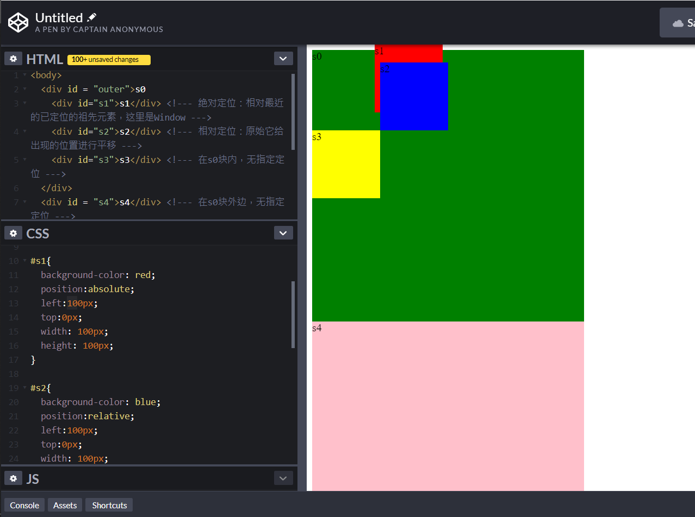
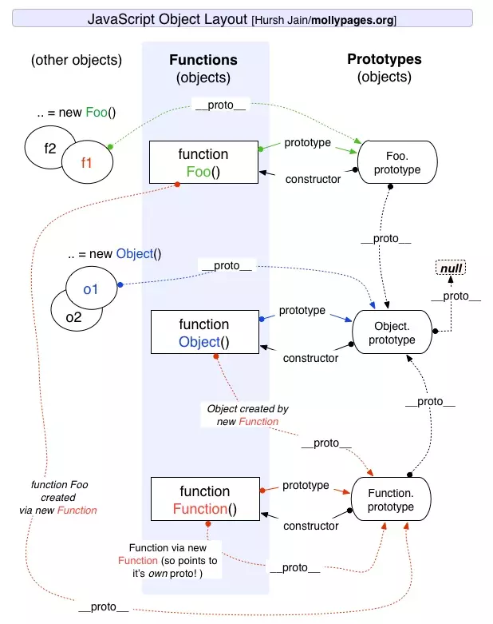

- ife_baidu

百度前端技术学院的作业代码仓库
---- 
# 09.09 day1

- HTML5新增特性：
  - 用于绘画的canvas元素；（\<canvas\>只是图形容器，需要用js脚本来绘制）
  - 用于媒介回放的video和audio元素；
  - 对本地离线存储有更好的支持；
  - 新的特殊内容元素，比如article、footer、header、nav、section
  - 新的表单控件，比如calendar、date、time、email、url、search 
- HTML5的改进：
    - 新元素
    - 新属性
    - 完全支持CSS3
    - Video和Audio
    - 2D/3D制图
    - 本地存储
    - 本地SQL数据
    - Web应用
- 文档类型（DOCTYPE）是用来说明HTML还是XHTML文档以使浏览器准确地渲染。
- meta元素：不显示在页面上，被机器（浏览器、搜索引擎、其他网络服务设备）解析所用。它指定页面描述、所用字符集、作者等内容。
- web语义化是使用恰当的html标签、class类名让页面有良好的结构和含义，方便人和机器理解。

---
# 09.10 day2
- - JS中表示“假”：0、0.0、NaN、""、null和undefined；
  - 表示“真":除上边几个的其他所有，比如字符串零（"0"） 
|    表达式    | 真假  |
| :----------: | :---: |
|  10 < "42"   | true  |
| 10 < "42人"  | false |
| 10 > "42人"  | false |
| 10 == "42人" | false |
|  42 == "42"  | true  |
| 42 == "42.0" | true  |
| 42 === 42.0  | true  |
| 42 === "42"  | false |
- 
  |        类别(优先级降序)        |         运算符         |
  | :----------------------------: | :--------------------: |
  |              括号              |          ( )           |
  |        成员、索引操作符        |         . [ ]          |
  |    方法(函数)调用、对象创建    |         () new         |
  | 逻辑非、负号、自增、自减、类型 |    ! - ++ -- typeof    |
  |          乘、除、取模          |         * / %          |
  |             加、减             |          + -           |
  |      关系比较、实例、包含      | <> <= >= instanceof in |
  |         相等、不等比较         |     ==  != === !==     |
  |             逻辑与             |           &&           |
  |             逻辑非             |         \|  \|         |
  |              赋值              |    = += -= *= /= %=    |

- 变量作用域：
  - 函数外声明为全局变量
  - 函数内声明为局部变量
  - 函数内不声明（没有使用 var 关键字）、直接使用，为全局变量
  - JS变量生命周期在它声明时初始化，局部变量在函数执行完毕后销毁；全局变量在页面关闭后销毁。

---
# 09.11 day3
- **DOM**，Document Objuct Model，文档对象模型，是HTML和XML编程接口。
- \<button\>貌似没有data-value这个属性啊，什么鬼。
- Node类型：文档类、元素类、文本类、属性类、内容类

---
# 09.12 day4
- display:flex 弹性布局，参考[阮一峰大佬的文章](http://www.ruanyifeng.com/blog/2015/07/flex-grammar.html)

- 相对长度<br>
- 
  |单位|描述|
  |:--:|:--|
  |em|它是描述相对于应用在当前元素的字体尺寸，所以它也是相对长度单位。一般浏览器字体大小默认是16px，则2em=32px|
  |ex|依赖于英文字母小x的高度|
  |ch|数字0的高度|
  |rem|根元素(html)的font-size|
  |vm|viewpoint width，视窗宽度，1vw=视窗宽度的1%|
  |vh|viewpoint height，视窗高度，1vh=视窗高度的1%|
  |vmin|vw和vh的较小的那个|
  |vmax|vw和vh中较大的那个|

- 绝对长度
- |单位|描述|
  |:--:|:--|
  |cm|厘米|
  |mm|毫米|
  |in|英寸|
  |px|像素|
  |pt|point|
  |pc|pica|

---
# 09.13 day5
- JS是由ECMAScript、DOM、BOM组成。
- JS字符串不可改变，除非重新赋值。

---
# 09.14 day6
- 逆波兰表达式：又叫“后缀表达式”，需要利用一个栈和一个输出字符串Output，从左到右读入中缀表达式：
```javascript
class Stack {
  constructor() {
    // 使用 Array 保存栈数据
    this.stack = [];
  }

  // 压栈
  push(value) {
    this.stack.push(value);
  }

  // 出栈，栈为空时返回 undefined
  pop() {
    return this.stack.pop();
  }

  size() {
    return this.stack.length;
  }

  empty() {
    return this.size() === 0;
  }
}

const convertToReversePolish = (infixExpression) => {
  const operators = ['+', '-', '*', '/', '(', ')'];

  let stack = new Stack();
  let ret = [];

  // 切割表达式，模拟读取
  infixExpression.replace(/([\d+|\+|\-|\*|\/|\(|\)])/g, (_, expression) => {
    if (operators.includes(expression)) {
      // 读取到操作符，输出所有优先级更低的操作符
      while (true) {
        // 栈为空，直接将当前操作符压入栈中，并跳出循环
        if (stack.empty()) {
          stack.push(expression);
          break;
        }

        // `(` 的优先级最高，直接压入栈中，并跳出循环
        if (expression === '(') {
          stack.push(expression);
          break;
        }

        const op = stack.pop();

        // `)` 的优先级最高，只要操作符不为 `(` 则一直输出
        if (expression === ')') {
          if (op !== '(') {
            ret.push(op);
            continue;
          }
          // 跳出循环，不需要输出 `(`
          break;
        }

        // `(` 只在处理 `)` 时出栈
        if (op === '(') {
          stack.push(op);
          stack.push(expression);
          break;
        }

        if (expression === '+' || expression === '-') {
          // `+` 和 `-` 的优先级最低
          // 除非栈顶操作符也为 `+` 和 `-`，否则输出栈顶操作符，并继续
          if (op !== '+' || op !== '-') {
            ret.push(op);
            continue;
          }
        }

        // 比栈顶预算符优先级相同或更低，将操作符压回栈中，中止
        stack.push(op);
        stack.push(expression);
        break;
      }
    } else {
      // 操作数直接输出
      ret.push(expression);
    }
  });

  // 依次弹出栈中剩下的操作符，并输出
  while (!stack.empty()) {
    let op = stack.pop();

    if (op !== '(') {
      ret.push(op);
    }
  }

  return ret.join(' ');
};


console.log(convertToReversePolish('1 + 1 * 2'));  // => 1 1 2 * +
console.log(convertToReversePolish('(1 + 1) * 2')); // => 1 1 + 2 *
console.log(convertToReversePolish('1 + 2 * 3 + (4 * 5 + 6) * 7'));
// => 1 2 3 * + 4 5 * 6 + 7 * +

const evalReversePolish = (suffixExpression) => {
  const operators = ['+', '-', '*', '/'];

  let stack = new Stack();

  // 切割表达式，模拟读取
  suffixExpression.replace(/([\d+|\+|\-|\*|\/])/g, (_, expression) => {
    if (operators.includes(expression)) {
      const val1 = stack.pop(),
            val2 = stack.pop();

      switch (expression) {
        case '+':
          stack.push(val1 + val2);
          break;
        case '-':
          stack.push(val2 - val1);
          break;
        case '*':
          stack.push(val1 * val2);
          break;
        case '/':
          stack.push(val2 / val1);
          break
      }
    } else {
      // 操作值直接压入栈中
      stack.push(parseInt(expression));
    }
  });

  return stack.pop();
};


console.log(
  evalReversePolish(
    convertToReversePolish('1 + 1 * 2')));  // => 3
console.log(
  evalReversePolish(
    convertToReversePolish('(1 + 1) * 2')));  // => 4
console.log(
  evalReversePolish(
    convertToReversePolish('1 + 2 * 3 + (4 * 5 + 6) * 7')));  // => 189
```


- JS里的正则表达式：使用一个正则表达式字面量，其由包含在斜杠之间的模式组成，如下所示：
```
var re = /ab+c/;
```

&nbsp;&nbsp;&nbsp;&nbsp;或者调用RegExp对象的构造函数，如下所示：
```
var re = new RegExp("ab+c");
```
- 操作数：“操作符”即“运算符”，“操作数”就是在算式中被计算的数。
- flexbox盒子模型

---
# 09.15 day7
- JS里的快排，[阮一峰大神的博客](http://www.ruanyifeng.com/blog/2011/04/quicksort_in_javascript.html)，主要用了递归和分治法的思想。

---
# 09.16 day8
- 斐波那契数列的解法：
```
create a Fibonacci function, fabonacci(n), which returns the nth element of the Fibonacci sequence
```
```javascript
//解法1使用递归：
function fibonacci1(nth){
    if(nth == 1 || nth ==2){
        return 1;}
    else{
        return fibonacci1(nth-1)+fibonacci1(nth-2);
        }}

//解法2使用迭代：
function fibonacci2(nth){
    if(nth == 1 ||nth ==2){
        return 1;}
    else{
        var result=0;var one=1; var two=1;
        for(var i = 2; i<nth; i++){
            result = one+two;
            two = one;
            one = result;}
        return result;}
}
//通用公式法
function fibonacci3(n) {
      const SQRT_FIVE = Math.sqrt(5);
      return Math.round(1/SQRT_FIVE * (Math.pow(0.5 + SQRT_FIVE/2, n) - Math.pow(0.5 - SQRT_FIVE/2, n)));
    }
```

- 隐藏语句
```
create a function hideVowel(str), which returns a string replacing all vowels in the given str with “*”
```
```javascript
function hideVowel(str){
    var result = '';
    for(var i=0;i<str.length;i++){
        result+="*";}
    return result;}
```
- 对于一些由value属性定义其显示内容的元素，例如：文本框、各种按钮等，不能使用textContent和innerHTML ，而应该通过其DOM元素的value property来获取/改变其显示内容。
- |DOM style property|CSS|
  |:---:|:--:|
  |backgroundColor|background-color|
  |border|border|
  |color|color|
  |cssFloat|float|
  |fontWeight|font-weight|
  |fontSize|font-size|
  |zIndex|z-index|

- **常见错误**对于fontSize、borderWidth、padding这些有单位的style属性，应该赋予字符串，而不是直接赋值。
- 非侵入式编程：避免在HTML标签中写上onchange、onclick等属性来注册JS事件处理程序，而是通过id、class等简单标识来找到相应需要改动的HTML元素，从而使HTML和JS分离开来。
- |property名|描述|
  |---|---|
  |nodeName|节点名，元素节点为HTML标签名（大写），属性节点为HTML属性名，文本节点始终为“#text”，文档节点名为“#document”|
  |nodeValue|节点值，元素节点值为null，属性节点值为属性值，文本节点值为文本内容。**文档节点值为？？？**|
  |nodeType|节点类型，元素节点为1，属性节点为2，文本节点为3，文档节点为9，注释节点为8。|
  |parentNode|父节点|
  |previousSibling|前一个兄弟节点|
  |nextSibling|后一个兄弟节点|
  |firstChild|第一个子节点|
  |lastChild|最后一个子节点|
  |childNodes|所有子节点的数目|

  ---
# 09.17 day9
- 文档节点和元素节点可以拥有子节点，但是文本节点和属性节点不行；
- window.onload()：用于浏览器加载完网页之后立刻执行某些操作。这是因为JS中的函数方法等需要在HTML文件渲染完成之后才可使用；如果没有渲染完成，此时的DOM树是不完整的，这样JS文件可能报出“undefined”错误。
- |BOM对象|描述|
  |:---:|:---:|
  |window|浏览器用于显示网页的窗口|
  |document|浏览器窗口内当前的网页，DOM树的根（即使BOM成员，又是DOM成员）
  |location|当前网页的URL|
  |navigator|浏览器本身|
  |screen|浏览器当前占据的屏幕区域|
  |history|浏览器用户访问历史|

- |window对象常用方法：对象名|描述|
  |----|----|
  |alert、confirm、prompt|弹出对话框|
  |setInterval、setTimeout、clearInterval、clearTimeout|定时器|
  |open(url, name, options)、close()|打开新的浏览器窗口，关闭当前浏览器窗口|
  |print()|打印当前网页|
  |focus()、blur()|使当前浏览器获得焦点/失去焦点|
  |scrollBy(dx,dy)、scrollBy(x,y)|将浏览器窗口内页面纵向滚动dx（负值为向上），横向滚动dy（负值向左）；将浏览器窗口内页面滚动到(x,y)坐标处。|

- |document对象property列表|描述|
  |---|---|
  |cookie|当前网页有效的所有cookie，以键值对的形式返回|
  |domain|提供当前网页的Web服务器域名|
  |referrer|前一个网页，用户从那里点击链接访问了当前网页|
  |title|当前网页的title|
  |URL|以字符串形式返回文档的地址栏链接。|
  |anchors|返回文档中所有锚点元素的列表|


---
# 09.18 day10
- 什么时候不带“( )”，什么时候带？
> 加括号会立即调用函数。
- HTML文档和DOM都是树型结构，因此当一个事件发生的时候，既作用在当前元素上，也作用在当前元素的父元素和祖先元素上。

---
# 09.19 day11
- Don`t write a loaded document.
- 给事件添加监听器，方法第一个参数为时间名，第二个参数为事件处理器。
```javascript
button.addEventListener('click', function(){alert('hello world');});
```
- | 比较对象 | 说明                                                         |
  | :------: | :----------------------------------------------------------- |
  |   this   | **this表示当前对象的一个引用**。在方法中，this表示该方法所属的对象；如果单独使用，this表示全局对象；在函数中，this表示全局对象；在函数中，在严格模式下，this是未定义的；在实践中，this表示接收事件的元素；类似call()和apply()方法可以将this引用到任何对象。 |
  |   self   | self 指窗口本身，它返回的对象跟window对象是一模一样的。也正因为如此，window对象的常用方法和函数都可以用self代替window。 |
  |  window  | 浏览器窗口                                                   |

---
# 09.20 day12
- JS中的let：可以代替var。es6的新特性。
- 当使用 position 属性时，IE8 以及更早的版本存在一个问题。如果容器元素（在我们的案例中是 <div class="container">）设置了指定的宽度，并且省略了 !DOCTYPE 声明，那么 IE8 以及更早的版本会在右侧增加 17px 的外边距。这似乎是为滚动条预留的空间。当使用 position 属性时，请始终设置 !DOCTYPE 声明。

---
# 09.21 day13
- ES6中新增了两个重要的关键字：**let**和**const**。let声明的变量只在let命令所在的代码块中有效；const声明一个只读变量，一旦声明就不能改变。ES6之前，JS只有全局变量和函数内局部变量这两种作用域。let可以理解为局部变量的局部变量。关于js作用域的范围，我还理解不够彻底。
```javascript
var x = 10;
// 这里输出 x 为 10
{ 
    var x = 2;
    // 这里输出 x 为 2
}
// 这里输出 x 为 2

------------------------------

var x = 10;
// 这里输出 x 为 10
{ 
    let x = 2;
    // 这里输出 x 为 2
}
// 这里输出 x 为 10
```

- display : grid 参考[阮一峰大神的博客](http://www.ruanyifeng.com/blog/2019/03/grid-layout-tutorial.html)。grid布局是比flex布局更强大的一种布局。grid-template-columns设置多少列，grid-template-rows设置行数。repeat()能重复写入相同的值，或者重复某种模式。1fr表示某种比例关系，比如“grid-template-columns: repeat(10, 1fr)”表示列宽设成10列，每列是当前块width的1/10。

- event.dataset
- html5的**data-\*** 属性用于存储私有页面后应用的自定义数据，是新增的属性。自定义的数据可以让页面拥有更好的交互体验（不需要使用 Ajax 或去服务端查询数据）。自定义属性前缀 "data-" 会被客户端忽略。
- do{....}while(...)相比while(...){...}，无论while的条件满不满足，前者都会执行一次循坏的代码块，后者则不会。

---
# 09.22 day14
- nested function嵌套函数
```javascript
var outer = function(){
    var a = 1;
    return function(){
        var b = 2;
        console.log("a:%s, b:%s", a, b);
    }
}
inner = outer(); // 调用outer函数，返回函数inner
inner(); // a:1, b:2
```

- **IIFE**: Inmediately-Invoeked Function Expression 立即调用函数表达式
```javascript
var foo = 'fool';
( function(){
    console.log('Original value is '+foo); // ... is undefined
    var foo = 'foobar';
    console.log('New value is ' + foo) // ... is foobar
})();
```

- 变量提升Variable Hoisting
```javascript
var foo = 'fool';
( function(){
    var foo;
    console.log('Original value is '+foo); // ... is undefined
    foo = 'foobar';
    console.log('New value is ' + foo) // ... is foobar
})();
console.log('foo is ' + foo); // ... is fool
```

- 除了**数字字面表达** （number literal）和**undefined**，其他在JS中都是“对象”。

- 函数提升function hoisting 
```javascript
var a = function(){
    b = function c(){};
    function d(){};
}

console.log(typeof a, typeof b, typeof c, typeof d, typeof e); // function, undefined, undefined, undefined, function
a();
console.log(typeof a, typeof b, typeof c, typeof d, typeof e); // (因为执行了函数a) function, function, undefined, undefined, function
function e(){}; // 函数被提升了
```

- 函数提升仅用于声明，不用于表达
```javascript
var a = function(){
    b = function c(){};
    function d(){};
}

console.log(typeof a, typeof b, typeof c, typeof d, typeof e); // function, undefined, undefined, undefined, undefined
a();
console.log(typeof a, typeof b, typeof c, typeof d, typeof e); // (因为执行了函数a) function, function, undefined, undefined, undefined
f = function e(){}; // 函数被提升了
```

- 调用者caller和被调用对象callee
```javascript
var a = function(){
    console.log("callee:", arguments.callee);
    console.log("caller:", arguments.callee.caller);
}

function b(){a();}
```

- 参数argument
```javascript
function a(b,c){};
console.log(a.length); // 这里将得到函数a的参数的长度，即“2”
```

- **四种函数提升**：普通函数、方法（method）调用、构造子、应用（apply、call）调用

- 函数**构造子**：
```
var Foo = function(){
    this.name = 'foo'; // 全局变量name
}

var result = Foo(); // 普通函数
alert(result); // undefined
alert(name); // foo

```
- call, apply**函数应用模式**
```javascript
var sayHello = function(message, to){
    alert(this.name + 'says' + message + 'to' + to};
};
var peter = {name:'peter'};
var name = 'global';
sayHello.apply(this, ['hello', 'Marry']); // global says hello to Marry
sayHello.apply(peter, ['hello', 'Marry']); // peter says hello to Marry
sayHello.call(this, 'hello', 'Marry'); // global says hello to Marry
sayHello.call(peter, 'hello', 'Marry'); // peter says hello to Marry
```


|4种函数提升的调用模式|this|无return时的返回值|
|:-:|:--|:--|
|普通函数|顶层对象（在浏览器种执行时就是window）|undefined|
|方法模式|当前对象（方法从属的对象，即成员操作符“.”的左侧|undefined|
|构造子模式（new）|正在构造的对象|this（构造好的对象）|
|应用模式（call、apply）|第一个参数|undefined|

- 在作用域中，不管变量和函数写在什么位置，所有变量会被整体提升到作用域顶部，所有函数也会被整体提升到作用域顶部，但是函数整体在变量整体的后面。

- **闭包（closure）**，我认为是JS中通过公有函数修改私有变量的做法。

  ```javascript
  // 计数器困境的解决
  function outerFunction() {
      var counter = 0;
      function innerFunction(){
          return counter += 1;
      }
      return innerFunction;
      /*
       注意 typeof innerFunction 是：function；而typeof innerFunction（）是number；
      */
  }
  var add = outerFunction();
  
  /* 
  调用 outerFunction()返回的是内部函数innerFucntion,那么调用几次add()将调用几次
  内部函数inner Function，内部函数公用了counter，所以能够计数,所以说闭包就是将内部嵌套函数变成外部可调用的。
  */
  
  add();
  add();
  add();
  
  ```

  

- 搞不懂**词法作用域**（lexical scope)是什么东西。

- **this丢失问题**。参考[这里](https://www.cnblogs.com/pssp/p/5216085.html)和[这里](https://blog.csdn.net/qq_22855325/article/details/76267925)。

- **Jquery哲学**：1. 找些HTML元素；2. 对其做一些变动

- **伪元素和伪类**：参考[腾讯全端AlloyTeam团队的文章](http://www.alloyteam.com/2016/05/summary-of-pseudo-classes-and-pseudo-elements/)，伪元素用于创建不在DOM中的元素，并为其创建样式；伪类描述了DOM无法描述的某些状态并为其创建样式，比如:hover表示鼠标悬停在某一元素上时的状态。CSS3 规范中的要求使用双冒号 (::) 表示伪元素，以此来区分伪元素和伪类，比如::before 和::after 等伪元素使用双冒号 (::)，:hover 和:active 等伪类使用单冒号 (:)。除了一些低于 IE8 版本的浏览器外，大部分浏览器都支持伪元素的双冒号 (::) 表示方法。然而，除了少部分伪元素，如::backdrop 必须使用双冒号，大部分伪元素都支持单冒号和双冒号的写法，比如::after，写成:after 也可以正确运行。

- | Jquery 方法的类别       | 具体                                         |
  | ----------------------- | -------------------------------------------- |
  | 移动元素Moving Elements | append(), appendTo(), before(), after()      |
  | 属性Attributes          | css(), attr(), html(), val(), addClass()     |
  | 事件Events              | bind(), trigger(), unbind(), live(), click() |
  | 特效Effects             | show(), fadeOut(), toggle(), animate()       |
  | 遍历Traversing          | find(), is(), prevAll(), next(), hasClass()  |
  | Ajax                    | get(), getJSON(), post(), ajax(), load()     |

  

---

# 09.23 day15

- 无法向已存在的对象构造器中添加新属性，但是可以通过对象的原型属性（prototype）给对象的构造函数添加新的属性
- 原型链
  - \_\_proto\_\_，缺属性去这里找；
  - \_\_proto\_\_ 指向构造子的prototype；
  - 构造子的prototype用constructor反指向构造子
  - 构造子的prototype也是object，也有自己的构造子
  - 形成了\_\_proto\_\_链条
- JS只有一种结构：对象。每个实例对象


---

# 09.24 day16

- JS中万物皆对象，但是对象有别，分为普通对象Object和函数对象Function。姑且理解变量声明时带function或者Functioin的就是函数对象，其他是普通对象。每个对象都有\_\_proto\_\_属性，但是**只有函数对象才有prototype属性**。

- \_\_proto\_\_，"构造器的原型"，是每个对象都有的属性，但不是一个规范属性，只是部分浏览器实现了此属性。对应的标准属性是[[ Prototype ]]。

- xxxx.prototype.constructor == xxxx，即“构造子的prototype用constructor反指向构造子”。

- 原型链的顶端是Object.prototype，该对象的\_\_proto\_\_ ===  null，即没有原型。

  ```javascript
  Object.prototype.__proto__ === null // “无”中生“有”
  ```

- 所有构造子的constructor都指向Function；Function的prototype指向一个特殊的匿名函数，而这个特殊的匿名函数的\_\_proto\_\_ 指向Object.prototype

- 所有函数对象的\_\_proto\_\_ 都指向Function.prototype（包括根构造器Object及Function自身），它是一个空函数。这里不说成“构造子”是因为JavaScript中有内置(build-in)构造器/对象共计12个（ES5中新加了JSON），Global不能直接访问，Arguments仅在函数调用时由JS引擎创建，Math，JSON是以对象形式存在的，无需new。它们的_\_proto\_\_是Object.prototype。[参考](https://www.jianshu.com/p/a4e1e7b6f4f8)

- 用Object.create构造出来的对象，不符合 xxxx._\_proto\_\_ === xxxx.constructor.prototype

  ```javascript
  var a1 = {a:1};
  a2 = Object.create(a1);
  a2.__proto__ === a2.constructor.prototype // false
  ```

- null没有_\_proto\_\_，但是typeof null == object，解释说[是个历史遗留bug](https://www.jianshu.com/p/dee9f8b14771)

- 代码复用Code reuse

  ```javascript
  function Animal(name){this.name = name;};
  Animal.prototype.sleep = function(){console.log(this, name);};
  ```

- 函数式编程——缓存

  ```javascript
  // 斐波那契数列
  var count = 0; // 记录调用fibonacci的次数
  var fibonacci = function(){
      var memo = [0, 1];
      var fib = function(n){
          var result = memo[n];
          if(typeof result !== 'number'){
              result = fib(n-1) + fib(n-2);
              memo[n] = result;}
          count++;
          return result;
      };
      return fib;
  }();
  
  for (var i = 0; i <= 10; i += 1){
      console.log(i + ': ' + fibonacci(i));} 
  
  console.log('调用fibonacci的次数为：' + count); // fibonacci调用29次
  ```

  ```javascript
  var memorizer = function(memo, fundamental){
      var shell = function(n){
          var result = memo[n]; // 用一个数组memo来存储历史数据避免重复计算
          
          if(typeof result !== 'number'){
              result = fundamental(shell, n);
              memo[n] = result;
          }
          return result;
      };
      return shell;
  };
  
  var fabonacci = memorizer([0, 1], function(shell, n){
      return shell(n-1) + shell(n-2); // memorizer fibonacci函数
  });
  
  var factorial = memorizer([1, 1], function(shell, n){
      return n*shell(n-1); // memorizer阶乘函数
  });
  ```

  

---

# 09.25 day17 

- 如何使Chrome控制台支持多行js模式?

> Chrome本来就支持多行模式。按下Shift+Enter进行换行，或者将多行JS代码直接粘贴到控制台，回车即可

- 缓存：xxxx.cache，记得初始化。
- 函数式编程关心数据的映射，命令式编程关心解决问题的方法。函数式编程是一种编程范式。我们常见的编程范式有命令式编程、函数式编程、逻辑式编程。常见的面向对象编程是一种命令式编程。


---

# 09.26 day18

- 闭包就是私有变量+私有函数
- 理解变量提升和函数提升可以使我们更了解这门语言，更好地驾驭它，但是在开发中，我们不应该使用这些技巧，而是要规范我们的代码，做到可读性和可维护性。具体做法就是：**无论变量还是函数，都必须先声明后使用。**
- this的指向是由它所在函数调用的上下文决定的，而不是由它所在函数定义的上下文决定的。
- （更加熟悉原型链）：[JavaScript中的原型与原型链](https://segmentfault.com/a/1190000018895543)


---

# 09.27 day19

- JQuery

---

# 09.28 day20

- 如果this所在的方法不在对象的第一层，这是this只是指向前一层的对象，而不会继承更上面的层。

```javascript
var a = {
  p: 'Hello',
  b: {
    m: function() {
      console.log(this.p);
    }
  }
};

a.b.m() // undefined
```

- 切勿包含多层this

```javascript
var o = {
  f1: function () {
    console.log(this);
    var f2 = function () {
      console.log(this);
    }();
  }
}

o.f1()
// Object
// Window
```

  	上面代码包含两层`this`，结果运行后，第一层指向对象`o`，第二层指向全局对象，因为实际执行的是下面的代码。

```javascript
var temp = function(){
    console.log(this);
}

var o ={
    f1: function(){
        console.log(this);
        var f2 = temp();
    }
}
```

​	解决办法是在第二层改用一个指向外层this的变量

```javascript
var o = {
    f1: function(){
        console.log(this);
        var that = this;
        var f2 = function(){
            console.log(that);
        }();
    }
}

o.f1();
// Object
// Object
```

[this](https://wangdoc.com/javascript/oop/this.html)


---

# 09.29 day21
- 重新看了阮一峰的grid布局，对其加深了理解。

---

# 09.30 day22

- 加深对this指针的理解。

  ```javascript
  // 【法1】
  var o = {
      v: "hello",
  	p: ['a1', 'a2'],
  	f: function f(){
  		var that = this;
          this.p.forEach(function(item){
  			console.log(that.v + ' ' + item);// 如果这里用this，因为是多层嵌套的this，会导致这里的this不指向上一层，而是指向顶层对象
          });
      }
  }
  
  o.f();  
  // hello a1
  //hello a2
  
  ```

  ```javascript
  // 【法2】
  var o = {
    v: 'hello',
    p: [ 'a1', 'a2' ],
    f: function f() {
      this.p.forEach(function (item) {
        console.log(this.v + ' ' + item);
      }, this);
    }
  }
  
  o.f()
  // hello a1
  // hello a2
  ```

  - 回调函数中的this往往会改变指向，最好避免使用  ==>  使用绑定this的方法！

- JS提供了call、apply、bind三种方法，来切换/固定this的指向。

  - [JS-this-call/apply/bind](https://juejin.im/post/5bfbe4ed51882553624438cf)

  - `call`

    - call方法没有参数，或者参数为`null`或`undefined`，则等同于指向全局对象。

      ```javascript
      var n = 123;
      var obj = { n: 456 };
      function a() {
        console.log(this.n);
      }
      
      a.call() // 123
      a.call(null) // 123
      a.call(undefined) // 123
      a.call(window) // 123
      a.call(obj) // 456
      ```

    - 如果`call`方法的参数是一个原始值，那么这个原始值会自动转成对应的包装对象，然后传入`call`方法。

      ```javascript
      var f = function () {
            return this;
          };
          
          f.call(5)
          // Number {[[PrimitiveValue]]: 5}
      ```

    - call方法的一个应用是调用对象的原生方法

      ```javascript
      var obj = {};
      obj.hasOwnProperty('toString') // false
      
      // 覆盖掉继承的 hasOwnProperty 方法
      obj.hasOwnProperty = function () {
        return true;
      };
      obj.hasOwnProperty('toString') // true
      
      Object.prototype.hasOwnProperty.call(obj, 'toString') // false
      
      //上面代码中，hasOwnProperty是obj对象继承的方法，如果这个方法一旦被覆盖，就不会得到正确结果。call方法可以解决这个问题，它将hasOwnProperty方法的原始定义放到obj对象上执行，这样无论obj上有没有同名方法，都不会影响结果。
      ```

    - `apply`

      - 与call类似。call接受若干个参数；apply接受一个数组作为函数执行时的参数
      
        ```javascript
        func.call(thisValue, arg1, arg2...);
        
        func.apply(thisValue, [arg1, arg2...]);
        ```

    - `bind`

      - bind方法用于将函数体内的this绑定到某个对象，然后返回一个新函数。
      - 由于bind返回的是一个新函数，得调用之后才执行，而apply、call会立即执行。

- 空元素与`undefined`的差别在于，数组的`forEach`方法会跳过空元素，但是不会跳过`undefined`。因此，遍历内部元素的时候，会得到不同的结果。

- 看了[别人的成长历程](https://juejin.im/post/5ae3338d6fb9a07aca79e63e)，收获不少。

- 再看“原型链”，还是不太懂。


---

# 10.05 day23

- 浅拷贝：实则为“引用”，新旧变量指向同一内存地址；深拷贝：为真正的拷贝，新旧变量是独立的相同对象，不共享同一内存地址


---

# 10.08 day24

- map and reduce

- apply bind

- CSS属性选择器

  ```scss
  [title]
  {
  	color:blue;
  }
  ```

- document.getElementById()返回的是DOM对象，而$()返回的是jQuery对象

	```
alert($("#div")) // [object Object]
	alert(document.getElementById("div")) // [object HTMLDivElement]
	alert($("#div")[0]) // [object HTMLDivElement]
	```

---

# 10.09 day25

- 主流浏览器内核（由于各个浏览器更新换代，以下结果仅供参考）
  - Trident ，又称IE内核 -> EdgeHTML
    - IE浏览器、Edge、
    - 360（双核）、猎豹（双核）、搜狗、遨游、QQ浏览器的兼容模式
    - 百度浏览器、世界之窗
    
  - Gecko -> Firefox内核
    
    - FireFox及其他仿Firefox开源的浏览器
    
  - Webkit
    - Safari浏览器
    - 搜狗、遨游、QQ浏览器的高速模式
    
  - Chromium/Blink（V8引擎）
    
    - > - **Chromium**是一个建立在WebKit之上的浏览器开源项目，由Google发起的。
      >
      > - **Blink**是Google退出WebKit项目，从而自己创建的渲染引擎。但并不是全新的引擎，Blink目前就是从WebKit直接复制出一个版本出来，然后将与chromium无关的Ports全部移除掉，将代码结构重新整理，就目前而言，Blink的渲染和WebKit是一样，但是，以后两者将各自走不同的路。
      
    - Chrome
    
    - 360（双核）、猎豹（双核）
    
    - QQ浏览器：6.2版本之后使用blink内核
    
    - 微信是QQ浏览器的X5内核 。最新版应该是blink内核。
    
      - X5 tbs 1.x：版本号为02xxxx，使用webkit内核。
      - X5 tbs 2.x：版本号为03xxxx。使用blink内核。
    
  - Presto（已弃）
    
    - Opera浏览器
  
- Sass （Scss） & Less

  - Sass是一种css的开发工具，提供了很多便利写法，大大节省设计者的时间，同时使得CSS开发变得简单、可维护。

  - Sass，Sassy CSS，时髦的CSS

  - Sass文件就是普通的文本文件，里面可以直接使用CSS语法，文件后缀名是.scss

  - Sass提供四种编译风格

    - nested：嵌套缩进的css代码，默认；

    - expanded：没有缩进、拓展的css代码；

    - compact：简洁格式的css代码；

    - compressed：压缩后的css代码。生产环境当中，一般都使用它。

  - Sass的语法：

      - 指定变量

          ```scss
  $primary-color: #333;
          ```

          

      - include
      
        ```scss
        @mixin left {
        　　　　float: left;
        　　　　margin-left: 10px;
        　　}
        div {
        	@include left;
        }
        ```
      
        
      
    - 如果变量需要镶嵌在字符串之中，就必须需要写在#{}之中
    
        ```scss
        p {
            border: {
                color: red;
            }
        　}
        
        $side : left;
        .rounded {
            border-#{$side}-radius: 5px;
        　}
        ```
    
        
    
    - SASS允许在代码中使用算式
    
        ```scss
        .container {
          width: 100%;
        }
        
        article[role="main"] {
          float: left;
          width: 600px / 960px * 100%;
        }
        
        aside[role="complementary"] {
          float: right;
          width: 300px / 960px * 100%;
        }
        ```
    
        
    
    - SASS允许选择器嵌套，属性也可以嵌套，在嵌套的代码块内，可以使用&引用父元素。CSS支持逻辑上的嵌套，但在代碼本身並不是嵌套的。
    
        ```scss
        a {
        　　　　&:hover { color: #ffb3ff; }
        　　}
        ```
    
        
    
    - @extend ：SASS允许一个选择器，继承另一个选择器。        
    
        ```scss
        .class2{
        @extend .class1;
            font-size:120%;
        }
        ```
    
    - @mixin：Mixin有点像C语言的宏（macro），是可以重用的代码块
      
        ```scss
        // 使用@mixin定义一个代码块
        @mixin left {
            float: left;
            margin-left: 10px;
        }
        //使用@include调用这个mixin
        div {
            @include left;
        }
        ```
      - 可以指定参数和缺省值
    
        ```scss
        @mixin left($value: 10px) {
            float: 10px;
            margin-right: $value;
        }
        // 使用时，根据需要加入参数
        div {
            @include left(20px);
        }
        ```
    
        
    
      - 颜色参数
    
        ```scss
        lighten(#cc3, 10%) // #d6d65c
        darken(#cc3, 10%) // #a3a329
        grayscale(#cc3) // #808080
        complement(#cc3) // #33c
        ```
    
        
    
      - @import：插入命令
    
      ```scss
      @import "path/style.scss"
      ```
    
      
    
      - 条件语句
      
        - @if
        
        ```scss
        p{
            @if 1+1 == 2 { border: 1px solid;}
            @if 5<3 { boeder: 2px dotted;}
        }
        ```
      
        
      
      - @else
      
        ```scss
        @if lightess($color) > 30% {
            background-color: #000;
        } @else {
            background-color: #fff;
        }
        ```
      
        
      
      - 循环语句
      
        - @for
        
          ```scss
          @for $i from 1 to 20{
              .border-#{$i} {
                  border: #{$i}px solid blue;
              }
          }
          ```
        
          
        
        - @while 
        
          ```scss
          $i: 6;
          @while $i > 0 {
              .item-#{$i} { width: 2em * $1; };
              $i: $i - 2;
          }
          ```
        
        - @each
        
          ```scss
          @each $member in a, b, c, d {
              .#{$member} {
                  background-image: url("/image/#{$member}.jpg");
              }
          }
          ```
        
          
      
      - 能自定义函数
      
        ```scss
        @function double($n){
            @return $n *2;
        }
        
        #sidebar {
            width: double(5px);
        }
        ```
    
  - SCSS 是 Sass 3 引入新的语法，其语法完全兼容 CSS3，并且继承了 Sass 的强大功能
    
  - Less跟SCSS很像，变量用@，后者变量用$。    

-  弹性布局：
  
  - rem/em布局，根据根元素html的font-size来决定
  - 缺点：rem布局必须通过js来控制根元素font-size的大小，也就是css和js有一定的耦合性，且必须将改变font-size的代码放在css样式之前。
  
- 流式布局：
  - 一开始只是给出最大宽度或者最小宽度或者百分比来改变布局，高度和文字大小等没有改变
  - 代表作栅栏系统（网格系统）。Grid网格布局，兼容性较差；栅格系统往往依赖某个UI库，如Bootstrap
  - css3中引入了vw/vh与视图窗口有关，`vw`表示相对于视图窗口的宽度，`vh`表示相对于视图窗口高度。
  
- 即使页面所有元素的高宽都等比例缩放时，也就是大屏幕下导航是横的，小屏幕下还是横的只不过变小了，在很小或者很大的屏幕显示效果都不会好。
  
-  响应式布局
  
  - [HTML和CSS高级指南之四——响应式设计](https://www.w3cplus.com/css/advanced-html-css-lesson4-responsive-web-design.html)
  - 响应式布局缺点：
    1. 代码量大，难以适用于大型门户网站；
    2. 媒体查询是有限的，也就是可以枚举出来的，只能适应主流的宽高。
  
- 自适应布局：

  - 相对于响应式布局，自适应布局是基于断点使用静态布局。这里断点指的是针对几种常见屏幕进行布局，比如width为320px、480px、768px、960px、1024px、1200px这6种布局进行设计。自适应布局会自动检测屏幕的大小来加载适当的工作布局，但是，一旦页面被加载完成就不再进行自适应。

  - 会逐渐被淘汰。

- 布局建议：
	
  	1. 如果只做pc端，那么静态布局（定宽度）是最好的选择；
   	2. 如果做移动端，且设计对高度和元素间距要求不高，那么弹性布局（rem+js）是最好的选择，一份css+一份js调节font-size搞定；
   	3. 如果pc，移动要兼容，而且要求很高那么响应式布局还是最好的选择，前提是设计根据不同的高宽做不同的设计，响应式根据媒体查询做不同的布局。
   
   


---

# 10.10 day26

- 前端发展很快，现代浏览器原生 API 已经足够好用。我们并不需要为了操作 DOM、Event 等再学习一下 jQuery 的 API。同时由于 React、Angular、Vue 等框架的流行，直接操作 DOM 不再是好的模式，jQuery 使用场景大大减少
- HTTP
  - HTTP请求
  - HTTP响应
- 前后端分离是什么？
  - 本质是前后端业务分开，中间通过特定接口（如Ajax、JSONP）连接。前端项目与后端项目是两个项目，放在两个不同的服务器，需要独立部署，两个不同的工程，两个不同的代码库，不同的开发人员。前端只需要关注页面的样式与动态数据的解析及渲染，而后端专注于具体业务逻辑。
  - 从经典的JSP+Servlet+JavaBean的MVC时代，到SSM（Spring + SpringMVC + Mybatis）和SSH（Spring + Struts + Hibernate）的Java 框架时代，再到前端框架（KnockoutJS、AngularJS、vueJS、ReactJS）为主的MV*时代，然后是Nodejs引领的全栈时代，技术和架构一直都在进步。
  - [前后端分离架构概述](https://blog.csdn.net/fuzhongmin05/article/details/81591072)
- 设计模式是什么？
- Typescript
  - Typescript是JS的一个超集，经过编译之后能编程原生的JS，支持 ECMAScript 6 标准。语法相对原生JS更加优雅、好写。需要理解接口（Interfaces）、泛型（Generics）、类（Classes）、枚举类型（Enums）等前端工程师可能不是很熟悉的概念， 有一定的学习成本。
  - 相对JS增加的功能有：
    - 类型批注和编译时类型检查；
    - 类型推断；
    - 类型擦除；
    - 接口interface；
    - 枚举 enum
    - Mixin；
    - 泛型编程；
    - 名字空间；
    - 元组；
    - Await
  - 从ES6反向移植过来的功能：
    - 类；
    - 模块；
    - lambda函数的箭头语法；
    - 可选参数以及默认参数
  - Any
  - **（待完善！！！）**
- 代码规范
- Vue：
  - **拿来即用**！
  - 无需操作DOM，而是让人更加专注业务逻辑；
  - 全家桶：
    - Vuex
    - Vue-router
    - Vue-cli
    - Axios
- MVC
	- 	 Django是MVT框架，Model、View、Template
	- 	 MVC架构初衷就是为解耦和复用提出的
	- 	 "古代"网页是前端后端融在一起的，比如之前的PHP，JSP等
- Spring 	 
  - JAVA那边的一个著名框架，暂时不用理。
  - 另外两个流行的JAVA MVC框架是Struts（支柱）、Hibernate（冬眠），俗称“SSH”。
- REST，Representational State Transfer，表现层状态转换
  - ResTful
- SEO，Search Engine Optimization，搜索引擎优化
- **重要**！！！学好OOP，实战OOP编程！！！
- leaflet或其他开源的网页地图框架
- Node.js
  1. 引入required模块
  2. 创建服务器
  3. 接收请求与响应请求

---

# 10.11 day27

- **不同的技术栈**
  - MEAN，包括：
    - MongoDB
    - Express，NodeJS的web开发框架
    - AngularJS，超凡的前端框架
    - NodeJS，基于事件的并发环境
  - LAMP
    - Linux
    - Apache
    - MySQL
    - PHP
  - ROR
    - Ruby
    - Rails
  - react+Typescript
  
- PWA：渐进式Web应用

- 函数组合：嵌套函数

- lodash/fp
  
  - lodash的一个模块，用于减少代码量。 
  
- OOP设计开发理念？

- 中间件：
  - 介于操作系统和应用程序之间的套件
  - 将具体业务和底层逻辑解耦的组件。其实跟上边是同一个意思。
  
- 前端框架

  - Vue
    - 爆发力很强
  - React
    - 老牌、目前使用人数最多
  - Angular
  - AngularJS
  - Express
  - Koa
    - 基于NodeJS的下一代服务器 	 
  -  Egg
    - 继承于Koa
  - Electron
    - Github开发的开源js框架
  - Redux
    - Redux是JS状态容器，提供可预测的状态管理
  - mpvue
    - 基于Vue.JS的小程序开发框架
  - 其他

- UI框架

  - Bootstrap

    -  经典

  - ElementUI

    -  基于Vue.js的组件库

  - iView

    -  基于Vue.js的高质量UI组件库

  - Ant Design

    -  基于 React 的 UI 组件库，主要用于研发企业级中后台产品。阿里蚂蚁金服的

  - Ant Design Mobile

    -  一个基于 Preact / React / React Native 的 移动端 UI 组件库

  - Ant Design of Vue

    - Ant Design 的 Vue 实现，开发和服务于企业级后台产品。


- SOAP

  - Simple Object Access Protocol，简单对象访问协议
  - SOAP是一种简单的基于XML的协议，它使应用程序通过HTTP交换信息
  - SOAP是一种简单的基于XML的协议，它使应用程序通过HTTP交换信息

- CRUD

  - 数据库基本操作，Create增加、Retrieve读取、Update更新、Delete删除

- HTML、XML、XHTML区别：

  - HTML：HyperText Markup Language / 超文本标记语言；XML：Extensible Markup Language / 可扩展标记语言；XHTML：Extensible Hypertext Markup Language / 可扩展超文本标记语

  - XHTML是以XML语法形式写HTML，以便阅读和维护。

    > 3C组织在2000年的1月26日，以XML为根本重构了HTML 4.01，取名为：XHTML。

  - 然而HTML5语法又不严谨了，：）

    > HTML5的设计目的是为了在移动设备上支持多媒体。新的语法特征被引进以支持这一点，如video、audio和canvas 标记。HTML5还引进了新的功能，可以真正改变用户与文档的交互方式。这些特性是XHTML不能满足的。
    >
    > HTML5将会取代1999年制定的HTML 4.01、XHTML 1.0标准，以期能在互联网应用迅速发展的时候，使网络标准达到符合当代的网络需求，为桌面和移动平台带来无缝衔接的丰富内容

  - 标签自定义？就是能自己定义叫“xxxx“的标签。

  - HTML5添加了很多语义定义（语义定义仅仅是为了方便程序员理解用，并不会产生特定样式，比如aside并不会让括号内的内容移动到侧边。）

     > | 标签         | 描述                                                         |
     > | :----------- | :----------------------------------------------------------- |
     > | <article>    | 定义页面独立的内容区域。                                     |
     > | <aside>      | 定义页面的侧边栏内容。                                       |
     > | <bdi>        | 允许您设置一段文本，使其脱离其父元素的文本方向设置。         |
     > | <command>    | 定义命令按钮，比如单选按钮、复选框或按钮                     |
     > | <details>    | 用于描述文档或文档某个部分的细节                             |
     > | <dialog>     | 定义对话框，比如提示框                                       |
     > | <summary>    | 标签包含 details 元素的标题                                  |
     > | <figure>     | 规定独立的流内容（图像、图表、照片、代码等等）。             |
     > | <figcaption> | 定义 <figure> 元素的标题                                     |
     > | <footer>     | 定义 section 或 document 的页脚。                            |
     > | <header>     | 定义了文档的头部区域                                         |
     > | <mark>       | 定义带有记号的文本。                                         |
     > | <meter>      | 定义度量衡。仅用于已知最大和最小值的度量。                   |
     > | <nav>        | 定义导航链接的部分。                                         |
     > | <progress>   | 定义任何类型的任务的进度。                                   |
     > | <ruby>       | 定义 ruby 注释（中文注音或字符）。                           |
     > | <rt>         | 定义字符（中文注音或字符）的解释或发音。                     |
     > | <rp>         | 在 ruby 注释中使用，定义不支持 ruby 元素的浏览器所显示的内容。 |
     > | <section>    | 定义文档中的节（section、区段）。                            |
     > | <time>       | 定义日期或时间。                                             |
     > | <wbr>        | 规定在文本中的何处适合添加换行符。                           |
  - 从HTML4.01移除的元素
  	```
  	<acronym>、<applet>、<basefont>、<big>、<center>、<dir>、<font>、<frame>、<frameset>、<noframes>、<strike>
  	```
  
- 编程范式：
  
  - [编程范式，程序员的编程世界观](http://www.nowamagic.net/librarys/veda/detail/2488)
- 


---

# 10.12 day28

- [D3.js](https://d3js.org/)
  - 全称Data-Driven Document，数据驱动文档
  - 专门为数据展示用的JS，同类的有百度的Echars
  
- [moment.js](https://momentjs.com/)
  
  - 专门用于日期处理类的js库，解析、检验、操作、以及显示日期.
  
- [sugar.js](https://sugarjs.com/)
  
  - 用于处理本机对象的js库
  
- [Underscore](http://github.com/jashkenas/underscore/) 
  
  - Underscore是一个 JavaScript 工具库，它提供了一整套函数式编程的实用功能，但是没有扩展任何 JavaScript 内置对象。 他解决了这个问题：“如果我面对一个空白的 HTML 页面，并希望立即开始工作，我需要什么？” 他弥补了 [jQuery](http://jquery.com/) 没有实现的功能，同时又是 [Backbone](http://backbonejs.org/) 必不可少的部分。
  - underscore中文是“下划线”的意思，调用符号也为“\_”；
  
- [require.js](https://requirejs.org/)
  
  - RequireJS是一个JavaScript文件和模块加载程序。它针对浏览器内使用进行了优化，但也可以用于其他javascript环境，如rhino和node。
  
  - ```html
    <script src="js/require.js" defer async="true" ></script>
    ```
  
  - node自带了require
  
- CSS flex模型

  - Flex是Flexible Box的缩写，弹性布局，为了给盒装模型提供最大的灵活性；

  - Flex布局能轻松解决诸如垂直居中的问题。

  - 设为Flex布局之后，子元素的float、clear和vertical-align属性将会失效；

  - 容器的6个属性：

    - flex-direction：指定纵向排列还是横向排列。默认row水平向右排列。
    - flex-wrap：指定跨行之后如何排列。默认nowrap，不换行。
    - flex-flow：是flex-direction和flex-wrap的简写，默认row nowrap。
    - justify-content：定义项目在主轴上的对齐方式，默认flex-start，左对齐。
    - align-items：定义项目在交叉轴上的对齐方式，默认flex-start，交叉轴的起点对齐。
    - align-content：定义了多根轴线的对齐方式，若只有一根轴线则设置无效，默认flex-start，交叉轴的起点对齐。

  - 项目（item / content）的6个属性：

    - order：数值越小，排列越靠前，默认为0；
    - flex-grow：定义项目的放大比例，默认为0；
    - flex-shrink：定义项目的缩小比例，默认为1；
    - flex-basis：定义在分配多余空间之前，项目占据的主轴空间，默认为auto
    - flex：flex-grow、flex-shrink、flex-basis的简写，默认为0 1 auto。
    - align-self：允许单个项目与其他项目不一样的对齐方式，默认为auto

  - 垂直居中布局：

    ```css
    .box{
        display: flex;
        justify-content: center;
        align-items: center;
    }
    ```

    ```css
    .container{
        height: 200px;
        display: flex;
        border: 1px solid gray;
    }
    
    /* 设置父元素display为flex，之后子元素margin:auto就可以垂直居中 */
    .box{
        width: 60px;
        height: 60px;
        background-color: gray;
        margin: auto;
    }
    ```
    
    

- angular、react、vue、jquery区别

  - Angluar.js是一代，从2代开始叫angular，2代是1代很大的改进
  - https://www.cnblogs.com/zhuzhenwei918/p/7447434.html说到，react周边是整个社区在维护，Vue主要是作者尤雨溪在维护。Vue和React都采用虚拟DOM的方式，都是渐进式、组件化的。

- 渐进增强、平稳退化

  - 本质都是尽量cover所有浏览器；
  - 平稳退化又叫“优雅降级”，就是在实现所有功能和特效之后，为无法支持所有功能的浏览器增加候选方案，使其上边可以降级体验而不至于完全失效；
  - 渐进增加指从最基本的可用性出发，在保证站点页面在低级浏览器中的可用性和可访问性的基础上，逐步增强功能及提高用户体验。

- IE兼容性问题及解决方案

  - [浏览器兼容性问题解决方案 · 总结](https://juejin.im/post/59a3f2fe6fb9a0249471cbb4)

- 浏览器前缀：

  - css前缀
    - `-webkit- (`谷歌, Safari, 新版Opera浏览器, 以及几乎所有iOS系统中的浏览器(包括iOS 系统中的火狐浏览器); 简单的说，所有基于WebKit 内核的浏览器)
    - `-moz- `(火狐浏览器)
    - `-o-` (旧版Opera浏览器)
    - `-ms-` (IE浏览器 和 Edge浏览器)
  - API前缀
    - 接口前缀 ===> 大写
    - 属性和方法前缀 ===> 小写

- [前端性能优化之雅虎35条军规](https://juejin.im/post/5b73ef38f265da281e048e51)

  

- 如果替换了prototype对象，那么，下一步必须为新的prototype对象加上constructor属性，并将这个属性指回原来的构造函数，否则会导致继承链混乱。（还是不太明白）

  ```javascript
  // 定义Animal类
  function Animal(){
  
  　　　　this.species = "动物";
  
  　　}
  // 定义继承Animal的子类Cat
  function Cat(name,color){
  
  　　　　this.name = name;
  
  　　　　this.color = color;
  
  　　}
  // Cat的原型指向一个Animal实例，表示继承
  Cat.prototype = new Animal();
  var cat1 = new Cat("大毛","黄色");
  alert(cat1.species); // 动物
  
  // 不写Cat.prototype.constructor = Cat;
  alert(Cat.prototype.constructor == Animal); //true
  alert(cat1.constructor == Cat.prototype.constructor); // true
  // 前边都没问题，但是下边这句有问题。cat1的构造函数应该是Cat才对，但是现在却是Animal，而不是Cat
  alert(cat1.constructor == Animal); // true
  alert(cat1.constructor == Cat); // false
  
  // 因此替换了prototype对象，下一步必须为新的prototype对象加上constructor属性，并将这个属性指回原来的构造函数
  Cat.prototype.constructor = Cat;
  alert(cat1.constructor == Animal); // false
  alert(cat1.constructor == Cat); // true
  ```

- Ajax

  - Asynchronous JavaScript and XML
- BOM ===> 浏览器五大对象
	
	-  Window
	-  History
	-  Location
	-  Navigator
	-  Screen


---

# 10.13 day29

- Node.js
  - Node.js is a JavaScript runtime built on Chrome`s V8 JavaScript engine.
  
  - 简单来说就是运行在服务端的JS程序，或者说是服务端上跑JS程序的一个运行环境。
  
  - 三大步骤：
    - 引入（require）node.js自带的http模块
    - 创建服务器
    - 接收请求和相应请求
    
  - node.js常用API
  
  - 常用API
    
    - File System
    - HTTP
    - Path
    - Process
    - REPL
    - Times
    - Events
    
  - 事件驱动程序 -> 事件回调函数
  
    
  
- 箭头函数表达式

  - 没有自己的**this**、**arguments**、**super**、**new.target**。

  - 适合取代原本需要匿名函数的地方；

  - 不能用作构造函数

  - 箭头函数改写的闭包

    ```javascript
    function outer(){
        var i = 0;
        function inner(){
            ++i;
            return i;
        }
        return inner;
    }
    var v = outer();
    v(); // 1
    v(); // 2
    
    // 改写下
    var outer2 = (i=0) => () => (++i);
    var v = outer2();
    v(); // 1
    v(); // 2
    ```

  - 箭头函数递归

    ```javascript
    var fact = (x) => (x==0 ? 1 : x*fact(x-1));
    fact(5) // 5*4*3*2*1 = 120
    ```

    
---
# 10.15 day30
- 查询字符串

  - 就是querystring啦
  - 通过“?”附加在URL末尾，由以“&”分隔的多个参数名值对构成，参数名和参数值用等号“=”连接

- 正则表达式

  - JS中用夹在两个左斜杆中间的部分表示正则表达式的模式，也可用RegExp( )函数

    ```javascript
    /abc/.test("sdafjalkfabcskf") // 形式一，true
    
    RegExp("abc").test("AabcA")  // 形式二，true
    ```

    

  - . 匹配除了换行符\\n之外的任意字符

  - i 紧接在右斜杆表示该正则表达式不区分大小写

    ```javascript
    /mart/i.test("WALMART") // true
    ```

    

  - | 表示“或”

    ```javascript
    /abc|def|g/.test('def') // true
    ```

    

  - ( ) 表示一种组合

  - ^ 表示匹配开头某字符的形式，$表示匹配结尾为某字符的形式

  - \ 表示对字符进行转义

    >  / \ $ . [ ]  ( ) ^ * + ? 

  - \* 表示匹配0个以上的某字符/模式串

    ```
    "/a.*a/" matches "aa", "aba", "a8qa", "a!?_a", ..
    ```

    

  - \+ 表示匹配1个以上的某字符/模式串

    ```
    "/Goo+gle/" matches "Google", "Gooogle", "Goooogle", ...
    ```

    

  - ? 表示匹配0次或1次前边紧挨着的某字符/模式串

    ```
    "/a(bc)?/" matches "a" or "abc” 
    ```

    

  - {min,max}表示匹配出现次数介于min和max之间的字符/模式串

    - {min,} 匹配最少min次
    - {,max} 匹配最高max次
    - {n} 匹配恰好n次

  - [] 表示匹配[ ]中任意组合的字符串

    ```
    "/[bcd]art/"  ==  "/(b|c|d)art/"
    ```

  - 特殊转义字符串

    - \d, [0-9]
    - \D, 除去[0-9]
    - \w, [a-zA-Z_0-9]
    - \W, 除去[a-zA-Z_0-9]
    - \s, 任意空白字符(, \t, \n, etc.)
    - \S, 除去任意空白字符

  - 通过在 *****、**+** 或 **?** 限定符之后放置 **?**，该表达式从"贪心"表达式转换为"非贪心"表达式或者最小匹配。

    ```javascript
    /<.*>/.exec("<H1>Chapter 1 - 介绍正则表达式</H1>") // 匹配所有
    /<.*?>/.exec("<H1>Chapter 1 - 介绍正则表达式</H1>") // 只匹配<H1>
    ```

    

- request.url

  - 提取查询字段

    ```javascript
    $node 
    require('url').parse('/status?name=ryan', true)
    // 或者
    require('querystring').parse('/status?name=ryan')
    ```

    

---

# 10.16 day31

- 重温“绝对定位”

  - 绝对定位相对于最近的**已定位**的祖先元素。如果没有已定位的祖先元素，那么它的位置将相对于最初的包含块（指window？）
  - 如果对一个元素进行相对定位，它将出现在它所在的位置上。然后，可以通过设置垂直或水平位置，让这个元素“相对于”它的起点进行移动。注意，在使用相对定位时，无论是否进行移动，元素仍然占据原来的空间。因此，移动元素会导致它覆盖其它框。

- axios

  - 是一个基于Promise的HTTP库，可以用在浏览器或者node.js中。

- 服务端渲染

- JSX

  - 是JS的拓展。JSX 可以生成 React “元素”。

  ```jsx
  const element = <h1>hello,world</h1>
  ```

  

- RIA

  - rich Internet Applications，丰富性互联网应用程序，是一种具有近似于传统桌面[应用软件](https://zh.wikipedia.org/wiki/应用软件)系统功能和特性的[网络应用](https://zh.wikipedia.org/wiki/网络应用程序)系统。
  - RIA系统最大的特点是将大部分处理任务都从[用户界面](https://zh.wikipedia.org/wiki/用户界面)端移植到[客户端](https://zh.wikipedia.org/wiki/客户端)，仅保留一些必要数据与[服务器](https://zh.wikipedia.org/wiki/服务器)端进行信息交互。

---

# 10.17 day32

- AJAX

  - load() 方法从服务器加载数据，并把返回的数据放入被选元素中。

    ```javascript
    $(selector).load( URL, data, callback);
    ```

  - callback还可以规定当请求完成时其他动作。

    - *response* - 包含来自请求的结果数据
    - *status* - 包含请求的状态（"success", "notmodified", "error", "timeout" 或 "parsererror"）
    - *xhr* - 包含 XMLHttpRequest 对象

    ```javascript
    $("#div1").load("/example/jquery/demo_twest.txt",function(responseTxt,statusTxt,xhr){
          if(statusTxt=="success")
            alert("外部内容加载成功！");
          if(statusTxt=="error")
            alert("Error: "+xhr.status+": "+xhr.statusText);
        });
    ```

- 常见的表单组建的应用（Echarts.D3.js等）

- windows任务栏没办法自动隐藏

  - 因为资源管理器挂了
  - ctrl+shift+esc打开资源管理器，点击详细信息，找到“windows资源管理器”，右键“重启”

- 同源策略

  - 一种安全策略
    - 若两个页面协议、主机、端口相同，则视为同源

- JS里边的指针？

- 浮点数精度问题

  ```
  0.1 + 0.2 == 0.3 // false，由于精度误差，结果为0.30000000000000004，17位小数。
  0.15 + 0.15 == 0.3 // true，由于精度误差，这里反而结果为true
  				// 所以永远不要测试某个特定的浮点数值。
  ```

  

- 按位非操作：操作数的负值减一（正负都一样）。

- 表示false：

  ```javascript
  '' NaN null undefined 0
  ```

  

- 同时使用两个逻辑非操作符，实际上等同于Boolean()

  ```javascript
  !!"blue" // true
  !!0 // false
  !!NaN // false
  !!"" //fasle
  !!12345 // true
  ```

  

- python里边没有自增运算符？

  > Python等语言，for的逻辑是使用迭代器，连三段for的语法都没有，也禁止使用赋值语句的结果来做条件判断，自然也就不需要递增递减了。
  > python整数型是不可变的，无法“自增”，只能增加之后赋值给新的同名变量
  
- Zepto

  - **Zepto**是一个**轻量级**的针对现代高级浏览器的**JavaScript 库**， 它**与jquery 有着类似的api**。 如果你会用 jquery，那么你也会用 zepto。

- 前端代码规范https://github.com/ecomfe/spec

- Serverless

---

# 10.18 day33

- Vue

  - 声明式渲染：用一个简洁的模板来声明式地将数据渲染到DOM系统。

    ```html
    <div id = 'app'>
        {{message}}
    </div>
    ```

    ```javascript
    var app = new Vue({
        el: '#app',
        data: {
            message: 'Hello Vue!'
        }
    })
    ```

    

  - **指令**带有前缀 `v-`，以表示它们是 Vue 提供的特殊特性

  - v-model 能双向绑定

  - 使用 `Object.freeze()`，这会阻止修改现有的属性，也意味着响应系统无法再*追踪*变化。

  - vue ui，端口localhost:8000，快速构建工程用

  - vue文件有3个区域：\<template\>（模板、HTML）、\<script\>（vue脚本）、\<style\>（样式，css）

  - 修饰符`.`

    - 修饰符 (modifier) 是以半角句号 `.` 指明的特殊后缀，用于指出一个指令应该以特殊方式绑定。例如，`.prevent` 修饰符告诉 `v-on` 指令对于触发的事件调用 `event.preventDefault()`：

    ```vue
    <form v-on:submit.prevent="onSubmit">...</form>
    ```

  - v-bind缩写 `:`

    ```vue
  	<!-- 完整语法 -->
    <a v-bind:href="url">...</a>
    
    <!-- 缩写 -->
    <a :href="url">...</a>
    ```
  
    

  - v-on缩写`@`

    ```vue
  	<!-- 完整语法 -->
    <a v-on:click="doSomething">...</a>
    
    <!-- 缩写 -->
    <a @click="doSomething">...</a>
    ```
  
    

  - APP.vue，入口文件

  - 组件，我目前理解就是包含了特定html结构（写在template里边）、css样式（写在style里边）和js交互特效（写在script）的封装好的模块，可以在别的网页嵌入使用、复用多次。

    > 组件是可复用的 Vue 实例，且带有一个名字

  - 

- localStorage

  - 拓展了cookiet的4K限制；
  - 大多数桌面浏览器会设置每个来源5MB的限制，Chrome和Safari对每个来源的限制是2.5MB，而IOS版Safari和Android版WebKit的限制也是2.5MB；
  - 会将第一次请求的数据直接保存在本地，相当于有了一个5M的数据库。
  - 在隐私模式下不可读。
  - 只能在高级点的浏览器使用，IE8以上。每个浏览器对于localStorage的大小不一。
  - 不能被爬虫抓到。
  - 同域名、同协议、同端口
  - API：
    - 存： localStorage.setItem(key, value)	
    - 读： localStorage.readItem(key)
    - 删除单个数据： localStorage.removeItem(key)
    - 删除全部数据： localStorage.clear()
    - 得到某个索引的key： localStorage.key(index)

---

# 10.20 day34

- **变量一定要在声明之后使用**

- ES6 规定暂时性死区和`let`、`const`语句不出现变量提升，主要是为了减少运行时错误，防止在变量声明前就使用这个变量，从而导致意料之外的行为。这样的错误在 ES5 是很常见的，现在有了这种规定，避免此类错误就很容易了。暂时性死区的本质就是，只要一进入当前作用域，所要使用的变量就已经存在了，但是不可获取，只有等到声明变量的那一行代码出现，才可以获取和使用该变量。

- 基本类型：undefined、null、Boolean、Number、String；引用类型：指那些可能由多个值组成的对象

  - 不能给基本数据类型添加属性，尽管不报错

    ```javascript
    var name = "leo";
    name.age = 24;
    alert(name.age) //undefined
    ```
    可以向引用类型添加属性
    ```javascript
    var person = new Object();
    person.age = 24;
    alert(person.age); // 24
    ```

  - 复制变量值时基本数据类型是创建独立的副本；引用类型的副本本质是一个指针，所以修改其中一个变量，也会影响另一个变量。

  - ECMAScript中所有函数的参数都是**按值传递**的，**并非按引用传递**。

    ```javascript
    function setName(obj){
        obj.name = 'leo';
        var obj = new Object();
        obj.name = 'ant';
    }
    var person = new Object();
    setName(person);
    console.log(person.name) // leo，而不是ant，尽管内部重新定义了obj，
    // 但是后来的obj是个局部变量，在函数执行完毕就被销毁了。
    ```

    

- with语句

  - with是将代码的作用域设置到一个特定的对象中，还能延长变量的作用域

  - with语句主要是为了简化多次编写同一对象的工作，比如下边多次用到location对象时，用with就简洁得多：

    ```javascript
    var qs = location.search.substring(1);
    var hostName = location.hostname;
    var url = location.href;
    ```

    ```javascript
    with(location){
        var qs = search.substring(1);
        var hostName = hostname;
        var url = href;
    }
    ```
    严格模式下不允许使用with语句。由于大量使用with语句会使性能下降，在开发大型程序时，不建议使用with语句。

    

- 垃圾收集

  - 标记清除 mark-and-sweep
  - 引用计数 reference counting 

- JS栈

  - push() & pop()

- JS队列

  - 队列队头移除、队尾添加：shift( ) & push( );
  - 队列队头添加，队尾移除：unshift( ) & pop( )

---
# 10.21 day35

- 检测数组

  - Array.isArray( )，不要用instanceof Array，因为后者无法辨识多个全局执行环境

    ```javascript
    var iframe = document.createElement("iframe");
    document.body.appendChild(iframe);
    xArray = window.frames[window.frames.length-1].Array; //这个的意思其实是找到最新的frame，也就是刚才创建的iframe，可以认为是一个新的网页，然后调用里边的Array，命名为xArray
    var arr = new xArray(1, 2, 3); //[1, 2, 3]
    
    // 正确检测出为数组类型
    Array.isArray(arr) // true
    // 用instanceof Array方法出错了，因为在多frames环境下不适用
    arr instanceof Array; // false
    // 这个所谓常用方法也出错了。
    arr.constructor == Array; // false
    ```
    
  - 若没有Array.isArray()，则在其他代码之前运行下面代码来创建该方法
    
    ```javascript
    if (!Array.isArray) {
      Array.isArray = function(arg) {
          // 在原型找
        return Object.prototype.toString.call(arg) === '[object Array]';
      };
    }
    ```
    
    

- sort在比较每一项的时候，会先调用各项toString( ) 方法，所以是对各项的字符串值比较

  ```javascript
  var A = [ 0, 1 , 5 , 10, 15 ]
  A.sort() // [0, 1, 10, 15, 5]
  ```

   通过设定一个比较函数解决这问题。

  ```javascript
  A.sort(function(){}) // [0, 1, 5, 10, 15]
  A.sort(function(a,b){return b-a}) // [15, 10, 5, 1, 0] 
  ```

- localStorage，兼容只支持globalStorage的浏览器

  ```javascript
  function getLocalStorage(){
      if(typeof localStorage == "object") return localStorage;
      else if(typeof globalStorage == "object") return globalStorage(location.host);
      else throw new Error("Local storage not available !!")
  }
  ```

- sprite雪碧图

  - CSS Sprite(CSS 精灵), 也称作雪碧图，是一种css图向合成技术
  - 不使用雪碧图， 单纯调用小图片有以下优缺点：
    - 优点：调用简单、维护方便； 
    - 缺点：请求文件过多、引发性能问题；
  - 用webpack、gulp之类构建、维护

- IE=edge,chrome=1

  ```html
  <meta http-equiv="X-UA-COMPATIBLE" content="IE=edge,chrome=1"/>
  ```

  - X-UA-COMPATIBLE是从IE8新加的一个设置，对于IE8以下的浏览器是不识别的。通过在meta中设置X-UA-COMPATIBLE来指定兼容性。上述代码告诉IE浏览器，IE 8-10的版本都以Edge引擎来渲染，IE11默认了此设置；chrome=1表示如果用户有安装Google Chrome Frame插件则优先启动它。这个插件可以让用户的IE浏览器外不变，但用户在浏览网页时，实际上使用的是Google Chrome浏览器J内核，而且支持IE6、7、8等多个版本的IE浏览器。但是，由于chrome框架项目已经结束，chrome=1部分对于还没有安装chrome框架插件的浏览器来说是多余的。因此照下边写就可以了：

  ```html
  <meta http-equiv="X-UA-Compatible" content="IE=edge" />
  ```


---

# 10.22 day36
- 不建议直接实例化Number类型，原因与显式创建Boolean对象一样。具体来讲，就是在使用typeof和instanceof操作符测试基本类型数值与引用类型数值时，得到结果完全不同。

  ```javascript
  var numCreated = new Number;
  var num = 600;
  typeof numCreated; // "object"
  typeof num; // "number"
  numCreated instanceof Number // true
  num instanceof Number // false
  ```

  

- toPrecision( ) ：看哪种格式最格式，自动选择toFixed( )或者toExponential( )

- 字符串操作方法：slice( )、substr( )、substring( )

- 字符串位置方法：indexOf( )、lastIndexOf( )

- 带**toLocale**的函数方法时针对特定地区的实现。对有些地区来说，针对地区的方法与其通用方法得到的结果相同，但少数语言（如土耳其语）会设置特殊的规则，所以使用针对地区的方法稳妥些。

  - toLowerCase( ) --> toLocaleLowerCase( ); toUpperCase( ) --> toLocaleUpperCase( )

- RegExp正则表达式

  - 在ES3中，正则表达式字面量始终会共享同一个RegExp实例，而使用构造函数创建的每一个新RegExp实例都是一个新实例。ES5中使用正则表达式字面量必须像直接俄调用RegExp后遭函数一样，每次创建新的RegExp实例。所以下边例子都报错。

    ```javascript
    var re = null , i;
    
    for ( i = 0; i < 10; i++){
        re  = /cat/g;
        re.test("catastrophe")
    } // 本来这个在循环中再次调用test()方法会失败。
    
    for ( i = 0; i < 10; i++){
        re  = new RegExp("cat" , "g");
        re.test("catastrophe")
    }
    
    ```
  - exec( ) 专门为捕获组而设计；设置全局标志后，在匹配到了第一个匹配项之后会继续查找新匹配项
  - test( ) 只检测目标字符串与模式是否匹配而不关心字符串的实际内容
    

- 事件流

  - IE事件冒泡流
    
    -  事件开始时由最具体的元素（文档中嵌套层次最深的那个节点）接收，然后逐级向上传播
  - Netscape Communicator事件捕获流
    
    -  与事件冒泡流相反，从不具体的节点向下传播到具体、深层次的节点
  -  除非有特殊需求，否则尽管放心使用事件冒泡流
  - DOM2级事件流
    
    -  三个阶段：事件捕获阶段、处于目标阶段、事件冒泡阶段
    
    

---
# 10.23 day37
- \<time\>
  
  - \<time\> 标签是 HTML5 中的新标签。
  
  - \<time\> 标签定义公历的时间（24 小时制）或日期，时间和时区偏移是可选的。该元素能够以机器可读的方式对日期和时间进行编码，这样，举例说，用户代理能够把生日提醒或排定的事件添加到用户日程表中，搜索引擎也能够生成更智能的搜索结果。
    
  -  新增表单控件之一
  
- 重拾闭包

  - 闭包是提供公有函数接口访问私有变量；

  - 闭包的私有变量常驻内存，需要手动删除

  - 下边是个闭包的例子，结合了this的指向

    ```javascript
    var name = "The Window";
    
    　　var object = {
    　　　　name : "My Object",
    
    　　　　getNameFunc : function(){
    　　　　　　var that = this;
    　　　　　　return function(){
    　　　　　　　　return that.name;
    　　　　　　};
    
    　　　　},
    		getThis: function(){
    			return function(){
    　　　　　　　　return this.name;
    　　　　　　};} 
    
    　　};
    
    	alert(object.getNameFunc()()); // My Object
    	alert(object.getThis()()); // Window
    ```

    

- JS里边没有指针？

- JS操纵cookie

  - 每个cookie最大为4kB；每个域最多20个cookiet（每个浏览器略有不同）；cookie是其域名专有的，网站无法读其它域的cookie，只能读它自己的。
  - 获取当前页面的cookie：document.cookie

- JS写HTML脚本

- link与@import

- 相对定位、绝对定位

  

  - relative相对定位都以它原本元素出现位置为基准进行平移，注意relative移动后的元素仍会占据原本出现的位置空间；
  - absolute绝对定位是以最接近的已定位的父元素进行定位，若没有父元素设置定位属性，则以body为基准

- \<link\>和@import

  -  \<link\>是XHTML的标签，除了加载CSS之外，还可以定义RSS等其他业务；@import属于CSS范畴，只能加载CSS；
  -  当一个页面被加载时，\<link\>所引用的CSS会当程序运行到\<link\>所处位置时被加载；而@import会等页面全部加载完再加载所引用的CSS；
  -  \<link\>是XHTML标签，无兼容问题；@import在CSS2.1提出，低版本浏览器不支持；
  -  link支持JavaScript控制DOM去改变样式，而@import只能加载CSS文件，所以不支持。

- 为什么网页要符合W3C标准

  - https://validator.w3.org/docs/help.html#why-validate
  -  为了规范化、统一化。符合此标准的网站，在相同客户端浏览器上渲染出来的页面是一致的

- HTTP常见相应代码

  -  200：请求成功；
  -  403：表示资源不可用，服务器理解客户的请求，但拒绝处理它，通常由于服务器上文件或目录的权限设置导致的WEB访问错误；
  -  404：请求失败，请求的资源服务器未能提供；
  -  500：服务器遇到了不知道如何处理的情况；
  -  502：服务器作为网关需要得到一个处理这个请求的响应，但是得到一个错误的响应；
  -  503：服务器没有准备好处理请求。 常见原因是服务器因维护或重载而停机。

---
# 10.24 day38

- font-size: 62.5%？
  - 《响应式Web设计实践》中提到过这一点，桌面浏览器默认页面字体大小是16px，这种情况下设置成具体像素大小或者对应的百分比，看起来的效果是一样的，但是其他类型的设备的默认字体大小不一定是16px,特别是高分辨率的设备，16px大小的字体在它们上面看起来会非常小；
  - 这是因为HTML默认的font-size是1em = 16px，1em = 100%。为了兼容性采用使用了百分比的rem（root-em）的方式，默认1rem = 10px，所以1rem = 62.5%em = 62.5%
  
- 垂直居中：
  - display: flex
  - transform
  - display：table + inline-block
  
- [网页特殊符号(HTML字符实体)大全](https://blog.csdn.net/u013778905/article/details/53177042)

- window.opener

  - 返回创建调用对象（窗口）的window对象，可理解为指向其源窗口

    ```html
    <!DOCTYPE html>
    <html>
    <head>
    <meta charset="utf-8">
    <title>菜鸟教程(runoob.com)</title>
    <script>
    function openWin(){
        myWindow=window.open('','','width=200,height=100');
        myWindow.document.write("<p>这是'我的窗口'</p>");
        myWindow.focus();
        myWindow.opener.document.write("<p>这是父窗口");
    }
    </script>
    </head>
    <body>
    
    <input type="button" value="打开窗口" onclick="openWin()" />
    
    </body>
    </html>
    ```

    

- JS脚本直接写HTML

  - document.write
    - 直接在页面写内容，覆盖页面内容，写死的
  - innerHTML
    - 是DOM元素对象的一个属性，用于设置内容

- innerHTML、innerText、textContent、outerHTML

  - textContent是Node对象属性，innerText是HTMLElement对象属性，innerHTML是Element对象属性。innerHTML原封不动返回嵌套在调用对象内的所有内容，包括嵌套的标签。“innerText”和“textContent”是无法把html标签转化成标签的，而是当做纯文本内容显示出来，**textContent包括 `<script>` 和 `<style>` 元素的文本内容，然而 innerText 不显示包括在其中的内容**。直接使用innerHTML可能会遭受XSS攻击。

  -   使用innerText 会有兼容性，低版本的火狐浏览器不支持使用，而是支持使用textContent

    ```javascript
    // 兼容性设置
    function getInnerText(element){
        return (typeof element.textContent == "string")?element.textContent : element.innerText;
    }
    ```
    
  - 另外，innerHTML获取对象起始标签和结束标签内的HTML，outerHTML获取对象及其内容的HTML
    
  - textContent会获取display:none的节点的文本；而innerText好像会感知到节点是否呈现一样，不作返回。也就是说，textContent能够获取元素的所有子节点上的文本，不管这个节点是否呈现；而innerText只返回呈现到页面上的文本。
    
  - 由于 innerText 受 CSS 样式的影响，它会触发重排（reflow），但 textContent 不会

- 昨天的笔试题：统计给定字符串中出现次数最多的字符，返回该字符和出现的次数 --> 没用过字典啊，伤！

  ```javascript
  // 昨天写的时候直接用两个数组遍历，之前没用过JS的字典类型，现在重新写一下
  // 其实字典的原型就是Array类。
  // 如果Max有多个，只能检测出第一个，小bug得改改。
  var str = 'asdfkljgornlknxknaldfhojvfgnpbmskoiuxlkjvsejnklvn';
  var result = {}
  for(var i = 0; i < str.length; i++){
      if(!result[str.charAt(i)]){
          result[str.charAt(i)] = 1;
      }
      else{
          result[str.charAt(i)]++;
      }
  }
  console.log(result)
  
  var Max = 0, Char = '';
  for(var key in result){
      if(result[key] > Max){ 
          Max = result[key];
          Char = key;
      }
  }
  
  console.log("出现次数最多的是" + Char + "，出现次数为" + Max + "次");
  ```

  

- 如何判断一个字符串真的是String类型

- 如何判断一个数组真的是Array类型

  ```javascript
  if(!Array.isArray){
      Array.isArray = function(arg){
          return Object.prototype.toString.call(arg) === '[object Array]' // 注意是小写o
      }
  }
  ```

  

- 交换两数

  ```javascript
  // 无需开辟新的存储空间，只使用数值型
  a ^= b;
  b ^= a;
  a ^= b;
  
  // 万能法，使用任何类型
  a=[b,b=a][0] // 这个数组第一个值是b，第二个值是执行 b = a 的结果，最后a取这个数组的第一个值
  ```

- [JavaScript排序算法总结](https://juejin.im/post/57dcd394a22b9d00610c5ec8)

  - 冒泡排序：核心是两两比较，遇到前者比后者大的就互换，最多得执行n-1遍，出来结果是升序。
    
    - 传统冒泡排序中每一趟排序操作只能找到一个最大值或最小值,我们考虑利用在每趟排序中进行正向和反向两遍冒泡的方法一次可以得到两个最终值(最大者和最小者) , 从而使排序趟数几乎减少了一半
    
      ```javascript
      // 原始冒泡排序
      function bubbleSort(arr){
          var len = arr.length;
          for(var i = 0; i< len -1; i++){ // 总共n-1趟就可以了
              for(var j = 0; j < len-1; j++){
                  if(arr[j] > arr[j+1]) arr[j] = [arr[j+1], arr[j+1] = arr[j]][0]; // 万能互换法
              }
          }
          return arr;
      }
      var arr=[3,44,38,5,47,15,36,26,27,2,46,4,19,50,48];
      console.log(bubbleSort(arr));
      ```
    
      ```javascript
      
      ```
    
      
    
      ```javascript
      // 同趟正反双冒泡
      function bubbleSort(arr){
          var low = 0;
          var high = arr.length - 1;
          var j=0;
          while(low < high){
              for(j = low; j < high; j++){ // 正向冒泡，每趟找到该趟最大者
                  if(arr[j] > arr[j+1]){
                      arr[j] = arr[j+1] ^ arr[j];
                      arr[j+1] = arr[j+1] ^ arr[j];
                		arr[j] = arr[j+1] ^ arr[j];}
              }
              --high; // 前移一位，去掉当前最大者
              for(j = high; j > low; j--){ // 反向冒泡，找到该趟最小者
                  if(arr[j] < arr[j-1]){
                      arr[j-1] = arr[j] ^ arr[j-1];
                      arr[j] = arr[j] ^ arr[j-1];
                      arr[j-1] = arr[j] ^ arr[j-1];}
      		}
              ++low;
          }
      	return arr;}	
      }
      ```
    
      ```javascript
      // 同趟正反双冒泡标记法
      ```
    
  - 

---
# 10.25 day39
- node.js的优缺点
  - 优点：使用事件驱动、非阻塞式I/O模型；轻量、高效；前后端可以用同一种语言写，减轻开发者负担
  - 缺点：不适合构建大型服务器网站
  
- boostrap是什么？

  - 一个UI库，太老了，直接学Ant Design等新库吧

- A*算法
  - 核心思想：
  - A* in JS
  
- BFC：块格式化上下文

- 如何搭建一个购物车？

  

---

# 10.26 day40

- css3新特性：

  - 边框样式：CSS3增加了圆角边框（border-radius）、阴影框（box-shadow）、边框图片（border-image）

  - 背景样式：新增了几种背景属性background-image背景图片、background-size背景图片大小、background-origin指定背景图像的位置区域（content-box, padding-box,和 border-box）、background-clip从指定位置开始绘制；还有增加了多重背景

  - 渐变样式：linear-gradient，可以设置线性渐变、透明度；repeating-linear-gradient()设置多重线性渐变；radial-gradient，径向渐变，外加shape 参数定义了形状，可以是值 circle 或 ellipse，默认ellipse；repeating-radial-gradient()多重径向渐变

  - 文字效果
    - text-shadow，向文本添加阴影。水平阴影，垂直阴影，模糊的距离，以及阴影的颜色
    - box-shadow，添加盒子阴影
    - text-overflow，规定当文本溢出包含元素时发生的事情。
    - word-wrap，允许对长的不可分割的单词进行分割并换行到下一行。
    - word-break，规定非中日韩文本的换行规则。
    
  - 字体
    
    - @font-face 可以使用网络字体
    
  - 2D、3D转换 transform
    
    - 旋转，缩放，移动（平移）和倾斜
    
  - 过渡trainsition：CSS属性 花费时间 效果曲线(默认ease) 延迟时间(默认0)

  - 动画

    - **@keyframes**规则，就是中间关键帧啦。

      ```scss
      div
      {
      	width:100px;
      	height:100px;
      	background:red;
      	position:relative;
      	animation:myfirst 5s linear 2s infinite alternate;
      }
      
      @keyframes myfirst
      {
      	0%   {background:red; left:0px; top:0px;}
      	25%  {background:yellow; left:200px; top:0px;}
      	50%  {background:blue; left:200px; top:200px;}
      	75%  {background:green; left:0px; top:200px;}
      	100% {background:red; left:0p; top:0px;}
      }
      
      ```

  - 多列布局

  - 用户界面：resize、box-sizing、outline-offset、

  - **媒体查询**@media

    ```css
  @media not|only mediatype and (expressions) {
        CSS 代码...;
    }
    ```
  
  - 图片
  - filter 图片滤镜属性，为元素添加可视效果 (例如：模糊与饱和度) 。
    
    - 模态Modal
    
  - 弹性盒子：`display: flex`
  
- 网格模型：`display: grid`
  
- 目标伪类 `:target`：可以为活动的锚点设置样式
  
- UI元素状态伪类 `:enabled`匹配启用的元素、`:disable`匹配禁用的元素、`:checked`匹配被选中的元素
  
- 结构性伪类
  
    - `:root`匹配文档根元素； 
  - ` :nth-child(n)`匹配其父元素的第n个子元素； 
    - `:nth-last-child(n)`匹配其父元素倒数第n个元素； 
    - `:nth-of-type(n)`匹配父元素第n个有相同选择器的子元素； 
    - `:nth-last-of-type`匹配其父元素倒数第n个有相同选择器的子元素； 
    - `:first-child`匹配其父元素的第一个子元素； 
    - `lat-child`匹配其父元素最后一个子元素； 
    - `first-of-type`匹配父元素第1个有相同选择器的子元素 ；
    - `last-of-type`匹配父元素最后一个有相同选择器的子元素； 
    - `only-child` 匹配其父元素唯一有着相同选择器的子元素
    - `empty`匹配没有子元素（包括文字节点）的元素
    
   - 语言伪类`:lang(val)`，匹配带有指定lang属性的元素
  
  - 否定伪类`:not(style)`，匹配所有非指定类型元素的其他元素
  
- JavaScript中有set()函数吗？

  - ES6才提供的新的数据结构Set

  - 对数组重复元素进行删除并排序

    ```javascript
    var array = [1,2,3,4,5,6,2,4,5,1];
    var set = new Set(array);
    array = Array.from(set);
    array.sort(function(a,b){return a-b}) // [1, 2, 3, 4, 5, 6]
    ```
    
  - set 通过values()\keys()取得内部的items
  
  - 拓展运算符（...）内部使用for...of循环，所以也可以用于Set结构。将扩展运算符与Set结合，可以去除数组的重复成员。
  
    ```javascript
    var arr = [3, 5, 2, 2, 5, 5];
    var unique = [...new Set(arr)]; 
    unique; // [3, 5, 2]
    ```
  
  - 数组的`map`和`filter`方法也可以间接用于 Set 了
  
    ```javascript
    var set = new Set([1, 2, 3]);
    set = new Set([...set].map(x => x * 2));
    console.log(set);
    // 返回Set结构：{2, 4, 6}
    
    var set = new Set([1, 2, 3, 4, 5]);
    set = new Set([...set].filter(x => (x % 2) == 0));
    console.log(set);
    // 返回Set结构：{2, 4}
    ```


- JS辗转相除求最大公约数

  ```javascript
  function f(num1, num2){
      if(num1 < 1 || num2 < 1 || parseInt(num1) !== num1 || parseInt(num2) !== num2){
          throw "ERROR：请输入正整数";
      }
  	var yushu = 0;
  	if(num1 < num2){
  		num1 = [num2, num2 = num1][0];} // 保证num1大于等于num2
  	yushu = num1 % num2;
  	return yushu == 0? num2 : f(num2, yushu)} // 如果余数为0，返回较小的值作为最大公约数，如果不为0，继续递归求值
  ```
  
- JavaScript11种内置对象：Array、String、Boolean、Number、Math、Object、Date、Function、Global、Error、RegExp

- JavaScript的typeof有6种：object、function、string、boolean、number、undefined


---

# 10.27 day41

- **JavaScript中没有类的概念！！！** **JavaScript中没有类的概念！！！** **JavaScript中没有类的概念！！！**

  > ECMAScript中没有类的概念。
  >
  > ECMA-262把对象定义为：“无序属性的集合，其属性可以包含其他值、对象或者函数。” 

- 类

  - 类是ES6引入的，实质上是JavaScript现有的基于原型继承的**语法糖**。类语法不会为JavaScript引入新的面向对象的继承模型

  - 函数声明会提升，但是类声明并不会。因此要先声明类再使用。

  - 一个类只能有一个constructor初始化方法，包含多个会报错。

  - 一个构造函数可以使用super关键字来调用一个父类的构造函数

  - static关键字用来定义一个类的静态方法。静态方法通常用于为一个应用程序创建工具函数。

    
---
# 10.28 day42

- **由于不存在函数签名的特性，ECMAScript函数不能重载**

- 创建对象

  - 工厂模式

    ```javascript
    function createPerson(name, age, job){
        var o = new Object; // 记得要创建一个新对象
        o.name = name;
        o.age = age;
        o.job = job;
        o.sayName = function(){
            alert(this.name);
        }
        return o; // 记得要return
    }
    
    var person1 = createPerson("leo", 24, "Software Engineer");
    ```

    - 工厂模式虽然解决了多个相似对象的问题，但是**没有解决对象识别的问题**，即不能用instanceof之类的函数来检测对象是不是属于该类。

  - 构造函数模式

    ```javascript
    function Person(name, age, job){
        this.name = name;
        this.age = age;
        this.job = job;
        this.sayName = function(){
            alert(this.name);
        }
    }
    var person1 = new Person("leo", 24, "Software Engineer");
    ```

    - 缺点：每个方法要在每个实例上重新创建一遍。

  - 原型模式

    - 使用构造函数prototype属性来指定那些应该被共享的属性和方法。组合使用构造函数模式和原型模式时，使用构造函数定义实例属性，而使用原型定义共享的属性和方法	

  - 组合使用构造函数模式和原型模式

  - 动态原型模式

  - 寄生构造函数模式

  - 稳妥构造函数模式

- 复习字符串的加减规则 

- 严格模式

  - 旨在提前发现错误，及时捕获一些可能导致编程错误的ECMAScript行为；
  - "use strict"这种模式可以向后兼容不支持严格模式的JavaScript引擎。对于支持严格模式的引擎会启动，对于不支持的引擎则是当作遇到了一个未赋值的字符串字面量而忽略这一编译指令。
  - 变量：
    - 没有声明的变量赋值，抛出ReferenceError；
    - 不能使用implements、interface、let、package、private、peotected、public、static和yield这些保留字作为变量名
  - 对象：
    - 为只读属性赋值抛出TypeError
    - 为不可配置属性使用delete操作符会抛出TypeError
    - 为不可拓展对象添加属性会抛出TypeError
    - 同一对象内不能有重名属性名
  - 函数
    - 命名函数的参数必须唯一，否则抛出错误
    - arguments的值仍然是传入的值
    - 淘汰了arguments.callee和arguments.caller
    - 与变量相似，不能使用implements、interface、let、package、private、peotected、public、static和yield这些保留字作为函数名
  - eval()
    - 在包含的上下文中不再创建变量或者函数。
    - 虽然可以在eval()中声明变量和函数，但这些变量或函数只能在被求值的特殊作用域中有效，随即被销毁。
    - 明确禁止eval和arguments作为标识符，也不允许读写它们的值
  - 抑制this
    - 在非严格模式下，使用apply或call时，null或undefined值会转换成全局对象，而严格模式则仍然是null或undefined，因此访问null或undefined的属性时就会报错。
  - 其他变化
    - 去掉八进制字面量
    - 修改了parseInt() 的行为

- Electron

  - [Electron构建跨平台应用Mac/Windows/Linux](https://juejin.im/post/5c46ab47e51d45522b4f55b1#heading-45https://juejin.im/post/5c46ab47e51d45522b4f55b1#heading-45)
  - 是一个用HTML、CSS和JavaScript来构架桌面应用的开源库
  - `github` 的 `atom` 编辑器、微软的 `vscode` 编辑器，包括阿里内部的一些 软件也是用 `electron` 开发的
  
- for、forEach、for...in...、for...of...的区别
  
  - for循环
  
  - forEach（ES5起）
  
    ```javascript
    myArray.forEach(function (value) {
      console.log(value);
    });
    ```
  
    缺点：不能通过break或者return中断循环；
  
  - for...in...循环实际是为可枚举（enumerable）对象设计的
  
    ```javascript
    var obj = {a:1, b:2, c:3};
        
    for (var prop in obj) {
      console.log("obj." + prop + " = " + obj[prop]);
    }
    
    // 输出:
    // "obj.a = 1"
    // "obj.b = 2"
    // "obj.c = 3"
    ```
  
    不推荐用for...in...来循环数组
  
  - for...of...（ES6）循环可迭代（iterable）对象
  
    ```javascript
    // ------------ 循环数组 ------------
    var iterable = [10, 20, 30];
    
    for (const value of iterable) {
      console.log(value);
    }
    // 10
    // 20
    // 30
    
    // ------------ 循环字符串 ------------
    var iterable = "boo";
    for (let value of iterable) {
      console.log(value);
    }
    // "b"
    // "o"
    // "o"
    
    // ------------ 循环类型化的数组（TypedArray）------------
    var iterable = new Uint8Array([0x00, 0xff]);
    for(let value of iterable){
        console.log(value);
    }
    // 0
    // 255
    
    // ------------ 循环Map ------------ 
    var iterable = new Map([["a", 1], ["b", 2], ["c", 3]]);
    for (let [key, value] of iterable) {
      console.log(value);
    }
    // 1
    // 2
    // 3
    for (let entry of iterable) {
      console.log(entry);
    }
    // [a, 1]
    // [b, 2]
    // [c, 3]
    
    // ------------ 循环Set ------------
    var iterable = new Set([1, 1, 2, 2, 3, 3]);
    for (let value of iterable) {
      console.log(value);
    }
    // 1
    // 2
    // 3
    
    // ------------ 循环一个 DOM collection ------------ 
    // Note: This will only work in platforms that have
    // implemented NodeList.prototype[Symbol.iterator]
    let articleParagraphs = document.querySelectorAll("article > p");
    
    for (let paragraph of articleParagraphs) {
      paragraph.classList.add("read");
    }
    
    // ------------ 循环一个拥有枚举属性的对象 ------------
    for (var key of Object.keys(someObject)) {
      console.log(key + ": " + someObject[key]);
    }
    
    // ------------ 循环一个生成器 ------------
    function* fibonacci() { // a generator function
      let [prev, curr] = [0, 1];
      while (true) {
        [prev, curr] = [curr, prev + curr];
        yield curr;
      }
    }
    
    for (let n of fibonacci()) {
      console.log(n);
      // truncate the sequence at 1000
      if (n >= 1000) {
        break;
      }
    }
    // 输出1到1600之间的斐波那契数
    ```
  
    
  
---
# 10.29 day43
- box-sizing

  - CSS3新增特性

  - 该属性定义了 [user agent](https://developer.mozilla.org/en-US/docs/Glossary/user_agent) 应该如何计算一个元素的总宽度和总高度。首先，重新认识下盒子模型：

    

    默认设置是content-box，如果设置一个元素的width为100px，那么最终绘制出来的元素的content的宽会有100px，如果有任何border或padding，最后绘制出来的元素回比预想大；设置成border-box则会告知浏览器你想要设置的border和padding都是包含在width内的，content区的实际宽度是width减去(border + padding)的值

    

    

  - IE不支持

- 重温**CSS组合选择器**

  - 紧邻兄弟选择器`A + B`：节点B紧邻着节点A，并且拥有共同的父节点
  - 一般兄弟选择器`A ~ B`：节点B在节点A后面的任意位置，并且这俩节点的父节点相同。（CSS3）
  - 孩子选择器`A > B`：选择节点A的所有直接子节点B。
  - 后代选择器`A B`：选择节点A下所有子节点B，无论B是否是直接子节点。

- `:`表示伪类，`::`表示伪元素，虽然一般都可以用`:`表示伪类和伪元素，但是严谨点比较好。

- 属性前缀：

  之所以要加属性前缀，是因为在某个属性成为W3C标准之前，一部分浏览器产商已经先有了对应实现，此时还只是该浏览器的私有属性，因为需要加入前缀以示区分。

- Modernizr.js ：

  检查浏览器端属性支持情况的js库，支持定制检查。

- 使用`::before`和`::after`两个伪元素时，content属性必须设置，否则伪元素不能生效，如果不想显示content内容，可以将其设置为空值。

- `!!`就是将所有其他类型都转换成boolean型

  ```javascript
  var foo,goo;  
  alert(!foo);//undifined情况下，一个感叹号返回的是true;  
  alert(!goo);//null情况下，一个感叹号返回的也是true;  
  var o={flag:true};  
  var test=!!o.flag;//等效于var test=o.flag||false;  
  alert(test);  
  
  这段例子，演示了在undifined和null时，用一个感叹号返回的都是true,用两个感叹号返回的就是false,所以两个感叹号的作用就在于，如果明确设置了变量的值（非null/undifined/0/""等值),结果就会根据变量的实际值来返回，如果没有设置，结果就会返回false。
  ```

- 选择器权重：

  - 分4个等级：内联样式；ID选择器；类、伪类、属性选择器；元素、伪元素。内联样式优先级最高，元素和伪元素的优先级最低，最终权重根据不同的优先级加权运算。
  - `!important`可以将规则提升到最高权重。
  - 由于从右向左匹配，建议用更简短、更容易被查找到的选择器

---
# 10.30 day44

- JavaScript面向对象

  - [js:面向对象编程，带你认识封装、继承和多态](https://juejin.im/post/59396c96fe88c2006afc2707)

    ​	

  - 私有、保护、公有

    ```javascript
    var Book = function(id, name, price0){
        //private(在函数内部定义，函数外部访问不到，实例化之后实例化的对象访问不到)
    	var num = 1;
        var id = id;
        function checkID(){
            console.log('private');
        }
        
        //protected(可以访问到函数内部的私有属性和私有方法，在实例化之后就可以对实例化的类进行初始化拿到函数的私有属性)
        this.getName = function(){
            console.log(id);
        }
        this.getPrice = function(){
            console.log(price);
        }
        
        //public(实例化的之后，实例化的对象就可以访问到了~)
        this.name = name;
        this.copy = function(){
            console.log('public!')
        }
    }
    
    //在Book的原型上添加的方法实例化之后可以被实例化对象继承
    Book.prototype.proFunction = function(){
    	console.log('This is a proFunction')
    }
    
    //在函数外部通过.语法创建的属性和方法，只能通过该类访问，实例化对象访问不到
    Book.setTime = function(){
        console.log('This is new time')
    }
    
    var book1 = new Book('111', 'JS高级程序设计', '$999');
    book1.getName();        // 111 getName是protected，可以访问到类的私有属性，所以实例化之后也可以访问到函数的私有属性
    book1.checkID();        //报错book1.checkId is not a function
    console.log(book1.id)   // undefined id是在函数内部通过定义的，是私有属性，所以实例化对象访问不到
    console.log(book1.name) //name 是通过this创建的，所以在实例化的时候会在book1中复制一遍name属性，所以可以访问到
    book1.copy()            //public!
    book1.proFunction();    //This is a proFunction
    Book.setTime();         //This is new time
    book1.setTime();        //报错book1.setTime is not a function
    ```

  - 继承（参考https://juejin.im/post/59396c96fe88c2006afc2707#heading-16）

    - 类型继承：使用原型的方式，将方式添加在**父类原型**上，然后子类的原型是父类的一个实例化对象 `var o = new Object; o.__proto__ = Object.prototype ? `。**子类之间会互相影响。**

      ```javascript
      // 声明父类
      var SuperClass = function(){
          var id = 1; // 父类私有变量
          this.name = ['JavaScript']; // public，实例化的之后，实例化的对象就可以访问到了~)
          this.superValue = function(){ // 父类访问私有变量的方法，protected
              console.log('superValue is true!');
              console.log(id);
          }
      };
      
      // 为父类添加公有方法
      SuperClass.prototype.getSuperValue = function(){
          return this.superValue();
      }
      
      // 声明子类
      var SubClass = function(){
          this.subValue = function(){
              console.log('this is subValue!')
          }
      };
      
      // 继承父类，关键代码！！！！
      SubClass.prototype = new SuperClass();
      
      // 为子类添加公有方法
      SubClass.prototype.getSubValue = function(){
          return this.subValue()
      }
      
      var sub = new SubClass();
      var sub2 = new SubClass();
      
      sub.getSuperValue();
      sub.getSubValue();
      
      console.log(sub.id); // undefined
      console.log(sub.name); // ['JavaScript']
      
      sub.name.push("Java");
      sub2.name; // ["JavaScript", "Java"]
      ```

      

    - 构造函数继承：除去类型继承的缺点，核心思想是`SuperClass.call(this, id)`，直接改变this的指向，使得this创建的属性和方法在子类中复制一份，因为是单独负值，所以各个实例化的子类互不影响。但是缺点是带来了**内存浪费**的问题。

      ```javascript
      // 父类
      function SuperClass(id){
          var name = 'JavaScript';
          this.books = ['JS','HTML5','CSS3'];
          this.id = id;
      }
      
      // 父类原型
      SuperClass.prototype.showBooks = function(){
          console.log(this.books);
      }
      
      // 子类
      function SubClass(id){
          SuperClass.call(this, id)
      }
      
      var sub1 = new SubClass(101);
      var sub2 = new SubClass(111);
      
      console.log(sub1.books); // ["JS", "HTML5", "CSS3"]
      console.log(sub2.id); // 1111
      console.log(sub1.name); // undefined
      sub2.showBooks(); // 报错
      sub2.books.push("JQuery");
      console.log(sub2.books); // ["JS", "HTML5", "CSS3", "JQuery"]
      ```

      

    - 组合式继承：对前两者继承方式取长补短

      ```javascript
      // 父类
      var SuperClass = function(name){
          this.name = name;
          this.books = ["JavaScript", "HTML5", "CSS3"];
      }
      // 父类原型上的方法
      SuperClass.prototype.showBooks = function(){
          console.log(this.books);
      }
      
      // 子类
      var SubClass = function(name){
          SuperClass.call(this, name) // 父类构造函数第二次被调用
      };
      
      // 子类继承父类（链式继承）
      SubClass.prototype = new SuperClass(); // 调用new，父类构造函数第一次被调用
      SubClass.prototype.constructor = SubClass; // 替换了prototype对象，下一步必须为新的prototype对象加上constructor属性，并将这个属性指回原来的构造函数
      
      // 实例化子类
      var sub1 = new SubClass("web1");
      var sub2 = new SubClass("web2");
      sub1.showBooks(); // ["JavaScript", "HTML5", "CSS3"]
      sub1.books.push("Zepto"); //  ["JavaScript", "HTML5", "CSS3", "Zepto"]
      console.log(sub1.books); //  ["JavaScript", "HTML5", "CSS3", "Zepto"]
      console.log(sub2.books); // ["JavaScript", "HTML5", "CSS3"]
      ```

      

    - 寄生式继承

    - 寄生组合继承：由于组合继承中父类的构造函数被创建了2次（一次在call()，一次在new），寄生组合继承解决了这个问题。它通过给父类的原型创建一个副本，然后修改子类constructor属性，最后再指定了子类的原型。

      ```javascript
      // 原型式继承
      // 原型式继承其实就是类式继承的封装，实现的功能是返回一个实例，该实例的原型继承了传入的o对象
      function inheritObject(o){
          // 声明一个过渡函数对象
          function F(){};
          // 过渡对象的原型继承父对象
          F.prototype = o;
          // 返回一个过渡对象实例，该实例的原型继承父对象
          return new F();
      }
      
      // 寄生式继承
      // 寄生式继承就是对原型继承的二次封装，使得子类的原型等于父类的原型，并且在封装的过程中对继承的对象进行了扩展
      function inheritPrototype(subClass, superClass){
          //复制一份父类的原型保存在变量中，使得p的原型等于父类的原型
          var p = inheritObject(superClass.prototype);
          //修正因为重写子类原型导致子类constructor属性被修改
          p.constructor = subClass;
          //设置子类的原型
          subClass.prototype = p;
      }
      
      // 定义父类
      var SuperClass = function(name){
          this.name = name;
          this.books = ["JavaScript", "HTML5", "CSS3"];
      }
      // 父类原型上的方法
      SuperClass.prototype.showBooks = function(){
          console.log(this.books);
      }
      // 子类
      var SubClass = function(name){
          SuperClass.call(this, name) // 父类构造函数被创建一次
      };
      
      inheritPrototype(SubClass,SuperClass);
      // 实例化子类
      var sub1 = new SubClass("web1");
      ```

      

- Symbol：ES6引入的原始数据类型、也是基本数据类型，表示独一无二的值。JavaScript有6种基本数据类型：Undefined、Null、Boolean、Number、String、Symbol；1种引用类型Object，再细分为4种类型：Object、Array、Data、RegExp、Function。基本数据类型放在栈中，按值访问；引用类型放在堆中，按引用访问。栈内存保存了变量标识符和指向堆内存中该对象的指针；堆内存保存了对象的内容。

  > 参考https://segmentfault.com/a/1190000006752076

- 回调地狱

  - https://segmentfault.com/a/1190000009644973

  - 特点：多个回调函数，回调深度大，往往是代码块结尾有很多层右括号

    ```javascript
    ajax('http://url-1', data1, function (err, result) {
        if (err) {
            return handle(err);
        }
        ajax('http://url-2', data2, function (err, result) {
            if (err) {
                return handle(err);
            }
            ajax('http://url-3', data3, function (err, result) {
                if (err) {
                    return handle(err);
                }
                return success(result);
            });
        });
    });
    ```

  - 解决方案：

    - 【法1】promise
      - 三种状态pending、resolve、reject，最迟到指定时间返回回调函数的结果
    - 【法2】generator
    - 【法3】async / await

- HTML5语义标签

  ```html
  <body>
      <header>header</header>
      <nav>navigator</nav>
      <div>
      	<article>article
       	 	<section>section</section>
      	</article>
      </div>
      <aside>sidebar</aside>
      </div>
      <footer>footer</footer>
  </body>
  ```

  

---
# 10.31 day45

- 垂直居中

  - 绝对定位

    - 简单粗暴，需要知道文本所放置的块的高度和宽度，直接写死 

      ```css
      .wrapper{
          margin: 10px, 10px;
          background: gray;
          width: 200px;
          height: 250px;
          position: relative
      }
      .inner{
          width: 100px;
          overflow-wrap: break-word;
          position: absolute;
          left:50%;
          top:50%;
          transform:translate(-50%,-50%); //如果我们不知道容器的高度和宽度，这是一种将元素居中而不使用边距的巧妙方法
      }
      ```

      

  - flex布局

    - 在兼容性允许的情况下能用flex就用flex

      ```css
      .flex{
          display: flex;
          align-items: center;
          justify-content: center;
      }
      
      .block-text{
          width: 100px;
          overflow-wrap: break-word;
      }
      
      ```

      

  - 单行文本/行内元素/行内块级元素

    - 设置line-height 等于 height，缺点是只能用于单行内容，并且要知道高度值

      ```css
      .test {
        margin-top: 20px;
        width: 200px;
        height: 50px;
        line-height: 50px;
        background-color: gray;
        text-align: center;
      }
      ```

      

  - 多行文本/行内元素/行内块级元素

    - 如元素在页面呈现为5行,则line-height的值为height/5。只能用于行内内容；需要知道高度和最终呈现多少行来计算line-height的值。

  - 单个块级元素

    ```css
    #parent{
        display: table-cell;
        vertical-align: middle;
    }
    ```

    - 缺点：设置table-cell的元素，宽度和高度设置百分比都将无效，需要给它父元素设置display: table才生效。table-cell不感知margin。在父元素上设置table-row等属性，也会使其不感知height。设置float或position会对默认布局造成破坏，可以考虑为之增加一个父div定义float等属性。内容溢出时会自动撑开父元素。

  - vertical-align和line-height

    - [vertical-align和line-height的基友关系](https://www.zhangxinxu.com/wordpress/2015/08/css-deep-understand-vertical-align-and-line-height/) 
    - 需要熟知原理才能顺手使用！

- 移动web思维导图

  ! [移动web前端高效开发实战脑图](img/移动web前端高效开发实战脑图.jpg)

- HTML5

  - 新语义元素
  
  - 表单增强型应用：
    - input元素的type属性扩充：search、tal、url、email、date、color、range、datetime、month、week
    - input通过属性进行表单验证：required、pattern
    - input元素其他有用属性：autofocus、form、placeholder
    
  - HTML5新元素progress、meter和特殊属性contenteditable
  
  - 音频audio、视频video
  
  - 访问设备相关
    - 定位当前地理位置navigator.geolocation
    - 调用摄像头navigator.mediaDevices.getUserMedia
    
  - 离线和存储
    - .manifest和.appcache
    
    - Service Worker
      
      - **解决离线之后资源如何缓存、更新的问题**
        
      - 后台消息传递、网络代理、离线缓存、消息推送
      
      - 是一段后台运行的脚本，不会直接参与DOM操作，但是会通过postMessage传递信息与DOM交互
      
        ```javascript
        // 注册service worker
        navigator.serviceWorker.register("sw.js").then(function(registration){
            console.log("Service Worker注册成功")
        }).catch(function(err){
            console.log("Service Worker注册失败")
        })
        
        // ------------------------------------ //
            
        // sw.js
        // 操纵需要缓存的资源
        var cacheFiles = [
            "style.css",
            "main.js"
        ]
        // 在install事件中缓存资源
        self.addEventListener("install", function(evt){
            evt.waiUntil(
                caches.open("mycache").then(function(cache){
                    return cache.addAll(cacheFiles);
            	})
            ); 
        });
        ```
      
    - indexedDB
      - 一个前端DB，为了满足localStorage、sessionStorage等5M存储空间不够用和解决web Stroage只能存储string类型的数据而提出。存储空间很大，一般来说不少于250MB。
      
      - 是一个**事务型**数据库系统，基于Javascript的**面向对象**的数据库系统；
      
        - ACID特性，即原子性（Atomicity）、一致性（Consistency）、隔离性（Isolation）、持久性（Durability）
        - 简单来说事务型数据库就是要么全部成功，要么全部失败。如修改多条数据，前边几条已经成功，但是中间某一条失败了，那么应该直接返回失败，放弃所有已有的修改。
        - 一个数据库**事务**通常包含了一个序列的对数据库的读/写操作。它为数据库操作序列提供了一个从失败中恢复到正常状态的方法，同时提供了数据库即使在异常状态下仍能保持一致性的方法；此外，当多个应用程序在并发访问数据库时，可以在这些应用程序之间提供一个隔离的方法，以防止彼此操作互相干扰
      
      - 可以大量存储结构化的数据，并且使用**基于索引**的高效API检索
      
      - 创建一个indexedDB数据库
      
        ```javascript
        var request = indexedDB.open("myDatabase", 1) //数据库名、版本号
        request.addEventListener("success", e =>{
            console.log("连接数据库成功");
        });
        request.addEventListener("error", e=>{
            console.log("连接数据库失败")
        })
        ```
      
      - 创建一个对象仓库（Object store），类似MySQL中“表”的概念
      
        ```javascript
        var request = indexedDB.open('myDatabase', 2);
        
        request.addEventListener('upgradeneeded', e => {
            const db = e.target.result;
            const  store = db.createObjectStore('Users', {keyPath: 'userId', autoIncrement: false}); // 第一个是对象仓库的名字, 第二个是可选参数，用于指定数据的主键,以及是否自增主键
            console.log('创建对象仓库成功');
        });
        ```
      
      - 增删改查
      
        ```javascript
        // 添加数据
        const request = indexedDB.open('myDatabase', 3);
        request.addEventListener("success", e => {
            const db = e.target.result;
        	// 使用transaction()来创建一个事务.transaction()接受两个参数,第一个是你要操作的对象仓库名称,第二个是你创建的事务模式.
            const tx = db.transaction("Users", "readwrite");
            const store = tx.objectStore("Users");
        	const reqAdd = store.add({"userID": 1, "userName": "李白", "age": 24});
        	reqAdd.addEventListener("success", e => {console.log("保存成功")}); 
        }) // 保存成功
        
        ```
        
        ```javascript
        // 删除数据
        const request = indexedDB.open("myDatabase", 3);
        request.addEventListerner("success", e => {
	          const db = e.target.result;
	          const tx = db.transaction("Users", "readwrite");
	          const store = tx.objectStore("User");
	          //真正删除数据的一行代码
	          const reqDelete = store.delete(1);
	          reqDelete.addEventListener("success", e => {
	              console.log("删除成功"); // 删除成功
	          })
	      })
	      ```
	      
        ```javascript
        // 查找数据
        const request = indexedDB.open("myDatabase", 3);
        request.addEventListerner("success", e => {
            const db = e.target.result;
            const tx = db.transaction("Users", "readwrite");
            const store = tx.objectStore("User");
            // 获取数据
            const reqGet = store.get(1);
            reqGet.addEventListener("success", e => {
                console.log(this.result.userName); // 李白
            })
        ```
      
    - [阮一峰的indexedDB介绍](http://www.ruanyifeng.com/blog/2018/07/indexeddb.html)里边有具体讲到IndexedDB的API
    
      > IndexedDB 不属于关系型数据库（不支持 SQL 查询语句），更接近 NoSQL 数据库。
      
    - ```
      数据库： IDBDatabase对象；
      对象仓库：IDBObjectStore对象
      索引：IDBIndex对象
      事务：IDBTransaction对象
      操作请求：IDBRequest对象
      指针：IDBCursor对象
      主键集合：IDBKeyRange对象
      ```
    
  - Canvas、SVG、WebGL
  
  - 不一样的通信
  
    - PostMessages
  
    - XMLHttpRequest Level 2
  
      - 1代就是AJAX
      - 2代相比1代增加了如下几点：
        
        1. 设置HTTP请求超时时间
        
        2. 使用FormData对象管理表单数据
        
        3. 用于上传文件
      
        4. **跨域请求**（需要浏览器支持，并且服务器进行对应设置）
      
        5. 获取服务器端的二进制数据
      
        6. 获得数据传输的进度信息
  
    - Server Sent Event
  
      - **服务端主动向客户端发送数据，并更新客户端信息**，替代原本客户端向服务端轮询以获取、更新信息的行为
      - 优点：轻量，相对简单；单项传送数据（服务端 -> 客户端）；基于HTTP协议；默认支持断线重连；自定义发送数据类型 
      - Server Sent Event通过**EvevtSource对象**接收服务端发送的事件通知
    
    - WebSocket
      - 基于TCP、全双工
        - 可替代AJAX，可以开发即时聊天、互动游戏、股票信息等
      
    - WebRTC
    
      - Web Real-time Communication，Web实时通信，为浏览器和移动网页应用提供实时语音或视频通话功能
  - 其他
     - 	History 新增pushState和replaceState API，配合在window对象上新增的popState事件使用，实现单页应用功能；
     - 	Drag和Drop
     - 	Web Workers 多线程
     - 	window.performance 分析网站性能
---
# 11.01 day46
- 为什么刷新之后网页能滚动到刷新前浏览的位置？

  答：跳转页面前将滚动条的位置存储在了用户的cookie里,下次自动判断当前页面获取cookie里的滚动条的值进行滚动 。参考[页面刷新后保持滚动条的位置不变](https://blog.csdn.net/kunguo/article/details/1660400?locationNum=3&fps=1)。

- 控制台输出图片、带样式的字体

  ```javascript
  console.log("%cHello World"," text-shadow: 0 1px 0 #ccc,0 2px 0 #c9c9c9,0 3px 0 #bbb,0 4px 0 #b9b9b9,0 5px 0 #aaa,0 6px 1px rgba(0,0,0,.1),0 0 5px rgba(0,0,0,.1),0 1px 3px rgba(0,0,0,.3),0 3px 5px rgba(0,0,0,.2),0 5px 10px rgba(0,0,0,.25),0 10px 10px rgba(0,0,0,.2),0 20px 20px rgba(0,0,0,.15);font-size:5em")
  ```

  

  只要将上边代码的样式部分添加"background:url(XXXXX)" 就能在控制台看到图片了。

  

---

# 11.02 day47

- Web代理工具NProxy和HTTP服务器http-server有啥用？
- devicePixelRatio设备像素比：物理像素 / dips。（PS：dips，设备独立像素）


---

# 11.03 day48

- WebRTC主要用于实时通信，处理实时媒体流

  - 主要API：
    - MediaDevice
    - RTCPeerConnection
    - RTCDataChannel

- 9种跨域方式实现

  参考[九种跨域方式实现原理（完整版）](https://juejin.im/post/5c23993de51d457b8c1f4ee1)

  - JSONP
  
    - 原生实现：JSON
  
      ```js
      var script = document.createElement('script');
      script.type = 'text/script';
      // 传参一个回调函数名给后端，方便后端返回时执行这个在前端定义的回调函数
      script.src = 'http://www.domain2.com:8080/login?user=admin&callback=handleCallback';
      document.head.appendChild(script);
      
      // 回调函数
      function handleCallback(res){
          alert(JSON.stringify(res));
      }
      ```
      
      服务端返回如下（返回时即执行全局函数）
      
      ```js
      handleCallback({"status": true, "user": "admin"})
      ```
      
    - AJAX
    
      - Asynchronous JavaScript and XML，用JavaScript执行异步XML请求（`XMLHttpRequest`）
      
      - 现代浏览器上写AJAX主要依靠`XMLHttpRequest`对象（XMLHttpRequest Level 2）
      
        ```js
        // JQuery ajax
        $.ajax({
            url: 'http://www.domain2.com:8080/login',
            type:'get',
            dataType: 'jsonp', // 请求方式为jsonp
            jsonpCallback: 'handleCallback' // 自定义回调函数名
            data: {}
        })
        ```
      
    - vue.js里边的$http.jsonp
    
      ```js
      this.$http.jsonp("http://www.domain2.com:8080/login",{
          params:{},
          jsonp: 'handleCallback'
      }).then(res => console.log(res));
      ```
    
    - 后端node.js代码实例：
    
      ```js
      var querystring = require('querystring');
      var http = require('http');
      var server = http.createServer();
      
      server.on('request', function(req,res){
          var params = qs.parse(req.url.split('?')[1]);
          var fn = params.callback;
          
          // jsonp返回设置
          res.writeHead(200, {'Content-Type': 'text/javascript'});
          res.write(fn + '(' + JSON.stringify(params) + ')');
          
          res.end();
      })
      
      server.listen('8080');
      console.log('Server is running at port 8080...');
      ```
    
    - 只能实现GET一种请求
    
  - CORS
  
  - PosrMessage
  
  - WebSocket
  
  - Node中间件代理（两次跨域）
  
  - Nginx反向代理
  
  - window.name + iframe
  
  - location.hash + iframe
  
    - 实现原理：a与b通过中间页面c通信。三个页面中，不同域间通过iframe的location.hash传值，相同域直接js访问通信
    
    - a与b不同域，b与c不同域，a与c同域
    
      1.）a.html：(http://www.domain1.com/a.html)
    
      ```html
      <iframe id="iframe" src="http://www.domain2.com/b.html" style="display:none;"></iframe>
      <script>
          var iframe = document.getElementById('iframe');
      
          // 向b.html传hash值
          setTimeout(function() {
              iframe.src = iframe.src + '#user=admin';
          }, 1000);
          
          // 开放给同域c.html的回调方法
          function onCallback(res) {
              alert('data from c.html ---> ' + res);
          }
      </script>
      ```
    
      2.）b.html：(http://www.domain2.com/b.html)
    
      ```html
      <iframe id="iframe" src="http://www.domain1.com/c.html" style="display:none;"></iframe>
      <script>
          var iframe = document.getElementById('iframe');
      
          // 监听a.html传来的hash值，再传给c.html
          window.onhashchange = function () {
              iframe.src = iframe.src + location.hash;
          };
      </script>
      ```
    
      3.）c.html：(http://www.domain1.com/c.html)
    
      ```html
      <script>
          // 监听b.html传来的hash值
          window.onhashchange = function () {
              // 再通过操作同域a.html的js回调，将结果传回
              window.parent.parent.onCallback('hello: ' + location.hash.replace('#user=', ''));
          };
      </script>
      ```
    
  - document.domain + iframe
  
    - 主域相同、子域不同的跨域方案
    
    - 实现原理：两个页面都通过JS强制设置document.domain为基础主域，从而实现同域
    
      父窗口：(http://www.domain.com/a.html)
    
      ```html
      <iframe id='iframe' src='http://child.domain.com/b.html'></iframe>
      <script>
          document.domain = 'domain.com';
          var user = 'admin';
      </script>
      ```
    
      子窗口：(http://child.domain.com/b.html)
    
      ```html
      <script>
          document.domain = 'domain.com';
          // 获取父窗口中变量
          alert('Get js data from parent -->' + window.parent.user); // 返回"admin"
      </script>
      ```
  
- 为什么有同源策略？ 

  同源策略是为了安全。同源策略限制了从同一个源加载的文档或脚本如何与来自另一个源的资源进行交互。这是一个用于隔离潜在恶意文件的重要安全机制。 如果没有同源策略，入侵者可能利用cookie（CSRF攻击）或者直接操纵DOM元素来获取你的账号密码。

- 为什么要跨域？

  为了获取外界的资源，即上线跟别人（别的域）打交道，所以得绕开同源策略，这就是“跨域”。

---

# 11.04 day49

- CSS3
  - 盒模型：box-sizing改变默认的CSS盒模型对元素宽高的计算方式，默认content-box，width和height只包括内容的宽高。border-box是IE怪异模式使用的盒模型，width和height包括内边距和边框，不包括外边框。
  - @font-face：获取指定在线字体，使得网页在不适用图片的情况下，运用更加个性化、美观的字体。
  - 自适应布局：calc函数
  
- DOM2事件模型：
  - 支持为同一DOM元素注册多个同类型事件
  - 把事件分成捕获阶段和冒泡阶段
  
- 事件委托：将事件交给父元素或者祖先元素处理的方式。优点：

  ```javascript
  function showMe(e){
      alert(e.target.tagName);
  }
  document.querySelector("body").addEventListener('click', showMe, false)
  ```
  - 提高性能：所占用内存空间更小

  - 动态监听：无论未来子元素 b增删多少，监听依旧有效

  - IE没有event .target属性。所以兼顾IE写成如下形式

    ```javascript
    return e.srcElement ? e.srcElement : e.target
    ```

- typeof返回六种类型：

  -  undefined——未定义；
  -  boolean——布尔值；
  -  string——字符串；
  -  number——数值型；
  -  object——对象或者null
  -  function——函数

---

# 11.05 day50

- ACID:
  - A，原子性
  - C，一致性
  - I，隔离性
  - D，持久性

---
# 11.06 day51 
- 后发优势：
  - 又叫后动优势、次动优势、先动劣势，指相对于行业的先进入企业，后进入者由于较晚进入行业而获得的较先动企业不具有的[竞争优势](https://baike.baidu.com/item/竞争优势/80963)，通过观察先动者的行动及效果来减少自身面临的不确定性而采取相应行动，获得更多的[市场份额](https://baike.baidu.com/item/市场份额/7026134)。例如：研发成本优势、[行业风险](https://baike.baidu.com/item/行业风险/5431948)把握优势等。
  - 优势体现在三个方面：
    - 后动者的**“免费搭乘”**效应：后动者可能会在产品和工艺研究与开发、顾客教育、员工培训、政府审批、基础投资等很多方面比先动者节省大量的投资，却可以从中获益。
    - 先动者锁定了**错误的技术或营销策略**：由于市场初期，技术和[顾客需求](https://baike.baidu.com/item/顾客需求)的不确定性和“非连续性”(discontinuities)往往导致先动者的错误决策，而后动者可以从先动者的错误中吸取这些教训，不再犯先动者曾经犯过的错误。
    - **在位者惯性**：：由于[沉没成本](https://baike.baidu.com/item/沉没成本)的存在，组织僵化，企业不愿引进[新产品](https://baike.baidu.com/item/新产品)或改进产品，不愿改革，而后动者作为一个追赶者，时刻都想抓住机遇从而取代先动者的地位，因而对企业的[组织结构](https://baike.baidu.com/item/组织结构)、技术、[产品](https://baike.baidu.com/item/产品)等都进行大量的革新，从而在与先动者的竞争中占有优势。
- attribute 与 property的不同
  - attribute是“属性”的意思，property是“所有物”的意思；
  
  - attribute返回字符串类型；property返回任意类型
  
  - attribute由HTML来定义，并不存在于DOM中，即只要是HTML标签内定义的都是attribute
  
  - property属于DOM，DOM本质是Javascript中的一个object。我们可以像普通操作一样读写、设置property。
  
    ```js
    document.getElementById('test').foo = 1;
    // 设置property：foo为number: 1
    document.getElementById('test').foo;
    // 读取property，返回number：1
    $('#test').prop('foo');
    // jQuery读取property，返回number：1
    ```
  
    ```js
    $('test').prop('foo',{
        age: 23,
        name: 'John'
    });
    // jQuery设置property：foo为一个object
    document.getElementById('test').foo.age;
    // 返回number：23
    document.getElementById('test').foo.name;
    // 返回string："John"
    ```
  
    非自定义attribute，如id、class、title等，都会有对应的property映射
  
    ```html
    <div id="test" class="button" foo="1"></div>
    ```
  
    ```js
    document.getElementById("test").id; // 返回string："test"
    document.getElementById("test").className; // 返回string："button"
    document.getElementById('test').foo; // // 返回undefined，因为foo是自定义attribute
    ```
  
    非自定义的property或attribute的变化多是联动的
  
    ```html
    <div id="test" class="button" foo="1"></div>
    ```
  
    ```js
    var div = document.getElementById('test');
    div.className = 'red-input';
    div.getAttribute('class');
    // 返回string："red-input"
    div.setAttribute('class','green-input');
    div.className;
    // 返回string："green-input"
    ```
  
    带有默认值的attribute不随property变化而变化
  
    ```html
    <input id="search" value="foo" />
    ```
  
    ```js
    var input = document.getElementById('search');
    input.value = 'foo2';
    input.getAttribute('value');
    // 返回string："foo"
    ```


---

# 11.07 day52

- undefined和null的区别

  - 以下来自阮一峰https://www.ruanyifeng.com/blog/2014/03/undefined-vs-null.html：

    - 在JavaScript中，将一个变量赋值为undefined或null，老实说，几乎没区别。undefined和null在if语句中，都会被自动转为false，相等运算符甚至直接报告两者相等。

      ```js
      undefined == null
      // true
      ```

      Google公司开发的JavaScript语言的替代品Dart语言，就明确规定只有null，没有undefined！

    - JavaScript的最初版本是这样区分的：**null是一个表示“无”的对象，转为数值时为0；undefined时一个表示“无”的值，转为数值时为NaN**

      ```js
      Number(null);
      // 0
      
      Number(undefined)
      // NaN
      ```

    - 但是，上面这样的区分，在实践中很快就被证明不可行。null和undefined基本是同义的，只有一些细微的差别。
    
      **null表示"没有对象"，即该处不应该有值**
    
      （1） 作为函数的参数，表示该函数的参数不是对象。
    
      （2） 作为对象原型链的终点。
    
      ```js
      Object.getPrototypeOf(Object.prototype)
      // null
      ```
    
      **undefined表示"缺少值"，就是此处应该有一个值，但是还没有定义。**典型用法是：
    
      （1）变量被声明了，但没有赋值时，就等于undefined。
    
      （2) 调用函数时，应该提供的参数没有提供，该参数等于undefined。
    
      （3）对象没有赋值的属性，该属性的值为undefined。
    
      （4）函数没有返回值时，默认返回undefined。
    
      ```js
      var i;
      i // undefined
      
      function f(x){console.log(x)}
      f() // undefined
      
      var  o = new Object();
      o.p // undefined
      
      var x = f();
      x // undefined
      ```

- 定义函数的几种方式

  - 参考[**javascript函数的三种定义方式及区别**](https://blog.csdn.net/sinat_32546159/article/details/62072569)

  - 函数语句式

    ```js
    function add(m, n){return m+n;};
    ```

  - 函数表达式（函数字面量、函数直接量）

    ```js
    var sum = function add(m, n){return m + n;};
    ```

  - 函数构造法（参数必须加引号，一般不推荐这种方式）

    ```js
    var fun = new Function('arg1', 'arg2', 'alert(arg1 + "," + arg2);');
    ```

    - 每一次调用都动态新建一个Function，用完之后就销毁了，不占用内存，所以说是“动态”的

  - ```js
    //3种函数定义方式，前两种常用
     
    /**
    * 1，function 语句式
    * 形式：句子
    * 名称：有名
    * 性质：静态
    * 解析时机：优先解析
    * 作用域：具有函数的作用域（正常的作用域）
    */
    function test1() {
        alert("我是test1");
    }
    test1();
     
     
    /**
    * 2，函数直接量 ECMAScript 推荐的方式
    * 形式：表达式
    * 名称：匿名
    * 性质：静态
    * 解析时机：顺序解析
    * 作用域：具有函数的作用域（正常的作用域）
    */
    var test2 = function() {
        alert("我是test2");
    };
    test2();
     
    /**
    * 3，function 构造函数式,a,b是形参，函数执行体直接写在后边，以分号结束
    * 形式：表达式
    * 名称：匿名
    * 性质：动态
    * 解析时机：顺序解析
    * 作用域：顶级函数（顶级作用域）
    */
    var test3 = new Function("a", "b", "return a+b;");
    alert(test3(10,20));
    ```

  - **优先级**：前两者会被解释一次，是静态的，有函数的作用域；Function构造函数式每次执行都动态new一次，说明有顶级作用域。执行顺序优先级不同，函数语句式优先解释，其他两个程序运行到哪解释到哪。

    ```js
    //********************执行顺序经典例子**************
    /**
     * js解析器会先找所有的function当做全局变量放内存，就找到了1,4，静态的，4把1覆盖，
     * 执行到函数1，所以打印4
     * 执行到函数2，是动态构建的覆盖4，所以打印2，之后销毁
     * 执行到函数3，覆盖函数4，打印3
     * 执行到函数4，其实调用的是函数3，打印3
     * 执行到函数5，动态创建一个覆盖3，打印5，后销毁
     * 执行到函数6，覆盖函数3，打印6
     */
    //alert结果：4 2 3 3 5 6
    
    function f(){ return 1;}             //函数1
    alert(f());        //返回值为4，说明第1个函数被第4个函数覆盖，
            
    var f = new Function("return 2;");    //函数2
    alert(f());        //返回值为2，说明第4个函数被第2个函数覆盖
            
    var f =  function(){ return 3;};    //函数3
    alert(f());        //返回值为3，说明第4个函数被第3个函数覆盖
            
    function f(){ return 4;}            //函数4
    alert(f());        //返回值为3，说明第4个函数被第3个函数覆盖
            
    var f = new Function("return 5;");    //函数5
    alert(f());        //返回值为5，说明第3个函数被第5个函数覆盖
            
    var f =  function(){ return 6;};    //函数6
    alert(f());        //返回值为6，说明第3个函数被第6个函数覆盖
    ```

  - **执行效率**：function语句式比构造函数式效率要高，函数直接量和function语句式效率差不多。

    ```js
    var d1 = new Date();
    var t1 =d1.getTime();
    for(var i=0;i<100000;i++){
        function test1(){ ;}; //function语句式
        //var test2 = new Function(); //构造函数式
    }
              
    var d2 = new Date();
    var t2 = d2.getTime();
    alert(t2-t1);
    // function语句式 11秒左右
    // 构造函数式5539秒左右
    ```

  - **作用域**：Function构造函数式，顶级的作用域；其他，所在块的作用域

    ```js
    var k = 1;
    function t1(){
        var k = 2;
        //function test(){return k;} // function语句式，k = 2
       // var test = function(){return k;} // 函数直接量，k = 2
        var test = new Function("return k"); // 构造函数式，相当于在全局new一个函数，只能找到全局的k = 1
        alert(test());
    }
    t1();
    ```

- Mixin模式

  - Mixin解决的是JavaScript里边多重继承的问题。

  - ```js
    // 接收一个构造函数和一个原型对象
    var mixin = function(obj, mixins){
        var newObj = obj; // 保存构造函数等待拓展原型链
        newObj.prototype = Object.create(obj.prototype); // 构造函数实例赋给新的函数的原型
        for(var key in mixins){ // 遍历原型对象上的属性
            if(mixins.hasOwnProperty(key)){ // 如果是对象自身属性
    			newObj.prototype[key] = mixins[key]} // 复制给新函数的原型
    	}
    	return newObj;}
    
    var mixinObj = {
        foo: function(){
            console.log('foooooooooo');}}
    
    var MyFunc = function(){
        console.log('bar')}
    
    var NewFunc = mixin(MyFunc, mixinObj);
    
    var newFunc = new NewFunc;
    
    newFunc.foo() // foooooooooo
    ```

    ```js
    // 装饰器模式
    function handleClass(){
        for(let i = 0, l = mixins.length; i < l; i++){
            const descs = Object.getOwnPropertyDescriptors(mixins[i]);
            for(const key in descs){
                if(!(key in target.prototype)){
                    Object.defineProperty(target.peototype, key, descs[key]);
                }
            }
        }
    }
    
    export default function mixin(...mixins){
        return target => {return handleClass(target, mixins);}
    }
    
    @mixin(mixinObj)
    class A {};
    ```

---
# 11.08 day53
- `debounce` 反跳 / 函数防抖

  - 反跳是调用动作n毫秒内，才会执行该动作。如果n毫秒内又调用该动作，则将重新计算时间：

    ```js
    function debounce(idle, func){ // 接受两个参数：间隔时间和实际调用函数
        var last; // 保存异步调用实际函数，通过闭包赋值不被销毁
        return function(){
            var ctx = this, args = arguments; // 存放函数的this和变量给下边的函数调用
            clearTimeout(last); // 如果函数被调用，则清楚上一个异步调用实际函数
            last = setTimeout(function(){
                func.apply(ctx ,args) // 让实际函数在间隔设置的时间后调用
            }, idle)
        }
    }
    ```

    

- `throttle` 节流

  - 先执行一个时间周期，当调用的时刻大于等于执行周期时则执行并进入下一个周期

    ```js
    
    ```

  - `debounce`和`throttle`是**“节流函数”**的两种方法

- **不用成对出现的HTML标签**（长期记录）：\<p\>、\<link\>、\、\<br\>、\<meta\>

-  不能focus的元素？


---

# 11.10 day54

- a标签中href=""的几种用法

  - **href="#"**

    表示回到顶部

  - **href="URL"**

    URL为绝对路径，此时URL指向另一个站点，点击时就会直接跳转到这个链接的页面；URL为相对URL，此时指向站点内的某个文件，比如href="/test.doc"，那么点击时就会直接下载文件。；URL为锚 URL ， 此时指向页面中的锚，比如href="#top"，那么点击时就会到当前页面中id="top"的这个锚点，实现当前页面的所谓跳转。用的最多就是在可滚动页面中，添加菜单，可以直接回到页面中的某个部分的内容。

  - 原生css通过**@import**关键字实现导入功能存在两大弊端，首先，“@import”导入规则必须先于“@charset”外的其他CSS规则执行；其次，导入的文件需要等待引用其父文件下载解析才被执行，如此，丢失了CSS并行下载的能力，加大了资源加载的开销。

---

# 11.11 day55

- Sass和Scss的区别：

  

- **原生ajax**

  ```js
  function ajax(url, callback){
      var xhr = new XMLHttpRequest();  // 新建XMLHttpRequest对象
      xhr.onreadystatechange = function(){ // 检测readystatechange事件
          if(xhr.readyState === XMLHttpRequest.DONE){ // 当请求完成
              // 以前总写成if(xhr.readysta)
              if(xhr.status === 200){ // 如果服务器相应没有错误
                  callback(null, xhr.responseText); 
              } else{
                  callback(xhr.status)
              }
          }
      };
      xhr.open("GET", url); // 建立一个链接
      xhr.send(null); // 发送一个空数据 
  }
  ```

  

---

# 11.12 day56

- 判断数据类型

  ```js
  var str = 'hello world'
  str instanceof String // false
  
  var str1 = new String('hello world')
  str1 instanceof String // true
  ```

  可以看到str明明是个字符串，但却不是String对象。对于原始类型（boolean、null、undefined、number、string、symbol）来说，想直接通过instancof来判断是不行的。当然我们也还是可以让instanceof判断原始类型：

  ```js
  class PrimitiveString{
      static [Symbol.hasInstance](x){
          return typeof x === 'string'}}; //Symbol.hasInstance 用于判断某对象是否为某构造器的实例
  
  str instanceof PrimitiveString // true
  ```

  

- JavaScript转换

  

- 重写 `Symbol.toPrimitive` ，在转原始类型时调用优先级最高：

  ```js
  let a = {
    valueOf() {
      return 0
    },
    toString() {
      return '1'
    },
    [Symbol.toPrimitive]() {
      return 2
    }
  }
  1 + a // => 3
  ```

- `yield`：可认为是一个基于生成器版本的return函数。

- 相等运算符`==` 和 严格相等运算符`===`：

  1. `==`叫做相等运算符，`===`叫做严格运算符。

  2. `==`，equality -> 等同  的意思， 两边值类型不同的时候，要先进行类型转换为同一类型后，再比较值是否相等；`===`，identity -> 恒等 的意思，不做类型转换，类型不同的结果一定不等。 

  3. `==`表示只要值相等即可为真；`===`则要求不仅值相等，而且也要求类型相同。

  4. **相等运算符`==`的运算规则：**

     1. 如果两个值类型相同，进行 === 比较。 

     2. 如果两个值类型不同，他们可能相等。根据下面规则进行类型转换再比较：

        1. 如果一个是null、一个是undefined，那么[相等]。 
        2. 如果一个是字符串，一个是数值，把字符串转换成数值再进行比较。 
        3. 如果任一值是 true，把它转换成 1 再比较；如果任一值是 false，把它转换成 0 再比较。 
        4. 如果一个是对象，另一个是数值或字符串，把对象转换成基础类型的值再比较。对象转换成基础类型，利用它的toString或者valueOf方法。 js核心内置类，会尝试valueOf先于toString；例外的是Date，Date利用的是toString转换。
        5. 任何其他组合，都[不相等]。 

        ```js
        '' == '0'          // false 
        0 == ''            // true
        0 == '0'            // true
        false == 'false'    // false。Number(false)为0，Number('false')为NaN
        false == '0'        // true
        false == undefined  // false
        false == null      // false
        null == undefined  // true
        ' \t\r\n ' == 0    // true
        ```

  5. **相等运算符`===`的运算规则：**

     1. 如果类型不同，就[不相等] 
     2. 如果两个都是数值，并且是同一个值，那么[相等]；(！例外)的是，如果其中至少一个是NaN，那么[不相等]。（判断一个值是否是NaN，只能用isNaN()来判断） 
     3. 如果两个都是字符串，每个位置的字符都一样，那么[相等]；否则[不相等]。 
     4. 如果两个值都是true，或者都是false，那么[相等]。 
     5. 如果两个值都引用同一个对象或函数，那么[相等]；否则[不相等]。 
     6. 如果两个值都是null，或者都是undefined，那么[相等]。 

- JavaScript数据类型重辨析：

  - 基本数据类型：Boolean、Null、Undefined、Number、String、Symbol（ES6）、BigInt（ES7）
    - 存放于`栈`中
    - **基本数据类型的值是按值访问的。**
  - 引用类型Object（细分为Object、Date、RegExp、Function等）
    - 存放于`堆`中
    - **基本数据类型的值是按引用访问的。**
    - 引用类型的值是可变的
    - 引用类型的比较是引用的比较

- typeof和instanceof 的区别：

  - JavaScript有三种方法判断一个值到底是什么类型：`typeof`、`instanceof`、`Object.prototype.toString`。
  - `typeof`返回的数据类型有：原始数据类型（number、string、boolean）、函数function、undefined、object（本质上null是一个类似于undefined的特殊值，但并不是说null就属于对象）
    - `typeof null`结果是`object` ，实际这是`typeof`的一个bug，null是原始值，非引用类型
    - `typeof [1, 2]`结果是`object`，结果中没有`array`这一项，引用类型除了`function`其他的全部都是`object`
    - `typeof Symbol()` 用`typeof`获取`symbol`类型的值得到的是`symbol`，这是 ES6 新增的知识点
  - `instanceof`判断变量是否为某个对象的实例。`typeof` 对数组 `[]` 和对象 `{}` 的返回值都是`Object`，无法区分数组和对象，但是`instanceof`可以区分。

- 深浅拷贝：

  - 深拷贝：两者内存空间不同；

    - 实现深拷贝：

       1. jQuery .extend()

          ```js
          var target = {a: 1, b: 1};
          var copy1 = {a: 2, b: 2, c: {ca: 21, cb: 22, cc: 23}};
          var copy2 = {c: {ca: 31, cb: 32, cd: 34}};
          var result = $.extend(true, target, copy1, copy2);   // 进行深拷贝
          console.log(target);    // {a: 2, b: 2, c: {ca: 31, cb: 32, cc: 23, cd: 34}}
          ```

       2. JSON.parse()和JSON.stringify()

          ```js
          var target = {a: 1, b: 1, c: {ca: 11, cb: 12, cc: 13}};
          var targetCopy = JSON.parse(JSON.stringify(target));
          targetCopy.a = 2;
          targetCopy.c.ca = 21;
          console.log(target);   // {a: 1, b: 1, c: {ca: 11, cb: 12, cc: 13}}
          console.log(targetCopy);    // {a: 2, b: 1, c: {ca: 21, cb: 12, cc: 13}}
          console.log(target === targetCopy);  // false
          
          // PS:JSON.parse() 和 JSON.stringify() 能正确处理的对象只有 Number、String、Array 
          // 等能够被 json 表示的数据结构，因此函数这种不能被 json 表示的类型将不能被正确处理。
          // 会忽略undefined
          // 会忽略symbol
          // 不能解决循环引用的对象
          ```

  - 浅拷贝：两者实际指向同一内存空间

    - 实现浅拷贝：Object.assign()

      ```js
      var target = {a: 1, b: 1};
      var copy1 = {a: 2, b: 2, c: {ca: 21, cb: 22, cc: 23}};
      var copy2 = {c: {ca: 31, cb: 32, cd: 34}};
      var result = Object.assign(target, copy1, copy2);
      console.log(target);    // {a: 2, b: 2, c: {ca: 31, cb: 32, cd: 34}}
      console.log(target === result);    // true
      // 深拷贝，target的a并没有变化
      copy1.a = -1;
      console.log(target); //  {a: 2, b: 2, c: {ca: 31, cb: 32, cd: 34}}
      // 浅拷贝，target的c的ca变化了
      copy2.c[ca] = 0;
      console.log(target); // {a: 2, b: 2, c: {ca: 0, cb: 32, cd: 34}} 
      ```

      **PS**：Object.assign方法
    
    - 可以通过拓展运算符`...`实现浅拷贝
    
      ```js
      var a = { 
          age: 1,
          job: {
              first: 'engineer'
          }     
              };
      var b = {...a};
      a.age = 2;
      console.log(b.age) // 深拷贝，1
      a.job.first = 'doctor';
      console.log(b.job.first); // 浅拷贝，doctor
      ```

- 原型链 ：
  
  - Object是所有对象的爸爸
  
  - Function是所有函数的爸爸
  
  - 函数的prototype是一个对象
  
  - 对象的\_\_proto\_\_属性指向原型，\_\_proto\_\_将对象和原型连接起来组成了原型链
  
  - 先有`Object.prototype`（原型链顶端），`Function.prototype`继承`Object.prototype`而产生，最后，`Function`和`Object`和其它构造函数继承`Function.prototype`而产生。
  
    
  
- document.ready 和 window.onload的区别

  - document.ready表示文档结构加载完成（不包含图片等非文字媒体文件）；ready如果定义多个，就会按渲染顺序执行；
    - jquery中写做$(document).ready(function(){})，可简写$(function(){});
  - window.onload包含图片等在内的所有元素都加载完成。不管onload定义多少个，只执行最后一个；
  - 小程序：onload 先，然后到 onshow，最后 onready ，跟原生js的 document.ready 和 window.onload 刚好相反
  - 

- split、splice的区别


---

# 11.13 day57

- **状态码304**

  - “未改变”，说明无需再次传输请求的内容，表示可以使用缓存的内容
  - 缓存过期后直接向服务器发起请求验证缓存是否有效，有效的话则返回304，表示可以直接使用缓存资源

- **汽车车牌正则表达式验证**

  ```js
  function check_licensePlate(licensePlate) {
  	console.info("进入到车牌校验");
      // 下边这个不是特别准确，但是够用就好。
  	var re = /^[京津沪渝冀豫云辽黑湘皖鲁新苏浙赣鄂桂甘晋蒙陕吉闽贵粤青藏川宁琼使领A-Z]{1}[A-Z]{1}[A-Z0-9]{4}[A-Z0-9挂学警港澳]{1}$/;
  	if(licensePlate.search(re) == -1) {
  		return false;
  	} else {
  		return true;
  	}
  
  ```

   - [中国车牌号正则表达式（包括新能源汽车）](https://blog.csdn.net/tangjili5620/article/details/77159453)

- **一道编程题**：拉平数组

  输入：array

  输出：新的已拉平的数组

  示例

  > flattenDeep([1, [2, [3, [4]], [5]]]);
  >
  > // => [1, 2, 3, 4, 5]

  ```js
  var arr = [1, [2, [3, [4]], [5]]];
  
  // 法1：直接用join转换成字符串再split变回数组（有点瑕疵，数组元素是字符串，不是规定的数值型）
  arr.join(',').split(','); // ["1", "2", "3", "4", "5"]
  
  // 法2：递归，判断是否为数组，是的话递归调用，不是的就压入目标数组
  var tempArr = [];
  function flattenDeep(arr){
      arr.map( v => {
          if(Array.isArray(v)){
              flattenDeep(v)}
          else{
              tempArr.push(v)}
      }
  )}
  flattenDeep(arr)
  console.log(tempArr) // [1, 2, 3, 4, 5]
  
  // 精简版
  const
  ```

  

- **一道编程题**：实现这个函数groupBy(collection, function)

  描述：创建一个对象，它的key是collection经function迭代得到的结果，它的value是一个collection元素对应key的数组。其中function接受一个参数：collection中的元素。

  输入：collection（将要被迭代的集合），function（转换key的迭代器）

  输出：新的构造的聚合对象

  实例：	groupBy([6.1, 4.2, 6.3], Math.floor) // => {'4': [4.2], '6': [6.1, 6.3]}

  groupBy(['one', 'two', 'three'], 'length') // => {'3': ['one', 'two'], '5':['three']}

  ```js
  function groupBy(col ,fn){
      if(!Array.isArray(col))return;
  	var newFn, groupByObj = {};
      if(typeof(fn) === 'string'){
          newFn = function(item){
  			return item[fn];
          }
  	} else if(typeof(fn) === 'function'){
  		newFn = fn;
  	} else return;
  
  	col.map(v => {
  		var key = newFn(v)
  		if(!groupByObj.hasOwnProperty(key)){
  			groupByObj[key] = [v]  // 注意这里是[v]，表示创建一个数组
          } else{
  			groupByObj[key].push(v)
          }
      })
  	return groupByObj
  }	
  
  console.log(groupBy([6.1, 4.2, 6.3], Math.floor));
  console.log(groupBy(['one', 'two', 'three'], 'length'))
  
  
  // 更精简的实现
  const groupBy = (arr, fn) =>
    arr.map(typeof fn === 'function' ? fn : val => val[fn]).reduce((acc, val, i) => {
      acc[val] = (acc[val] || []).concat(arr[i]);
      return acc;
    }, {});
  ```

- **CSRF**(Cross-site Request Forgery)跨站请求伪造

  - 利用当前用户权限偷偷完成某项操作，而不是拿到用户信息。比如某个网站`http://buy.com`的用户收到了一封邮件，邮件里边插入了一行在当前网站购物的恶意代码，这样就悄悄地完成购买的操作，而实际上用户并没有购买的打算。

- **XSS**（Cross Site Scripting，跨站脚本攻击）

  - 原理是黑客通过某种方式插入恶意JS代码（发布文章、发布评论等），然后别人再看这篇文章的时候，之前注入的代码就会运行，执行获取cookie等操作，之后就可以模拟cookie登录网站，对用户信息进行篡改等。
  - 最根本的办法就是对用户输入内容进行验证、转换。比如“&amp;”换成“\&amp;amp;”。替换了这些字符之后，黑客输入的攻击代码就会失效，XSS 攻击将不会轻易发生。除此之外，还对cookie设置诸如”read-only“之类的安全限制，让JS获取不到cookie的内容

- 前端开发跟后端开发的区别：

  - 前端开发：简单来说前端开发就是负责网页的交互部分，如网页特效、网页布局等，同事通过接口与后端数据交互
  - 后端开发：负责网站后台逻辑的设计和实现以及用户和网站数据的保存和读取。
  - 其他：根据互联网的发展，也同时进化出了更多的其他生物：我们发现网页太丑了。好，我们叫擅长美工的人来帮忙，他们成了**UI**。我们发现用户太能折腾了，老板太能折腾了，甲方太能折腾了。好，我们叫擅长沟通的人来帮忙把客户和老板讲的东西理成结构化的文档，或是把用户的需求收集起来理成将来要做成软件的样子，他们成了**产品经理**。我们发现往网站上写文章，填内容实在是麻烦，而且要把网站流量做大，还得找个人出出主意，于是，**运营**也诞生了。我们发现上线后服务器怎么老是不稳定，后端大佬们都去做新项目了，得找个hold的住服务器和机房的专家，然后**运维**出现了

---
# 11.14 day58
- DOM ”先天即慢“？

  - dom操作影响性能最主要是因为它导致了浏览器的重绘（repaint）和重排（reflow）
  
- ES5为数组定义了5种迭代方法：

  - every()
  - filter()
  - forEach()
  - map
  - some()
  
- ES5新增两个归并数组的方法：

  - reduce()
  - reduceRight()
  
- `let`、`var`、`function`

  - ES6里面的`let`和`const`是不存在变量提升的，存在“暂时性死区”
  
    ```js
    let name = 'ConardLi'
    {
      console.log(name) // Uncaught ReferenceError: name is not defined
        // es6里面的let和const是不存在变量提升的
      let name = 'code秘密花园'
    }
    ```
    
  - 
  
- 一道错题：

  [平安人寿前端面试错题](https://blog.csdn.net/sinat_36521655/article/details/80253311)
  
  ```js
  var length = 10;
  function fn() {
      console.log(this.length);
  }
   
  var obj = {
    length: 5,
    method: function(fn) {
      fn();
      arguments[0]();
    }
  };
   
  obj.method(fn, 1);//输出是什么？
  ```
  
  输出“10 2”。
  
  对于`arguments[0]()`，全局函数fn同时也属于arguments数组中的一员，即当作为arguments成员之一调用的时候，其作用域就绑定到了arguments上，this也就是指向了arguments对象，所以`arguments[0]()`这段代码调用了身为成员的fn()函数，this.length就等于是arguments.length，又因为method传入的参数为2个，所以最后输出2
  
  ```js
  // 改成let声明变量
  let length = 10;
  function fn() {
      console.log(this.length);
  }
   
  let obj = {
    length: 5,
    method: function(fn) {
      fn();
      arguments[0]();
    }
  };
   
  obj.method(fn, 1);//输出是什么？
  ```
  
  输出：“1 2”。
  
  let声明变量会形成块级作用域，且不存在声明提升，而var存在声明提升。所以当使用let声明变量时，不存在声明提升，length属性实际上并没有添加到window对象中
  
- Vue中父子组件生命周期执行顺序

  参考[Vue中父子组件生命周期执行顺序初探](https://segmentfault.com/a/1190000015890245)

  

  可以看到父组件先创建，然后子组件创建；之后子组件挂载，然后父组件挂载

  

  

- LESS跟SCSS的区别

- 在严格模式下，语句var a = b = 3;会产生一个ReferenceError的运行时错误：b没有定义，从而避免了可能导致的任何头headfakes/bugs。 （这就是为什么你应该在你的代码中使用strict，一个重要的例子！）

- 另外一道错题：

  [平安人寿前端面试错题2](https://zhuanlan.zhihu.com/p/36550058)

  ```js
  // 下面的代码将输出到控制台的是什么？，为什么？
  var myObject = {
      foo: "bar",
      func: function() {
          var self = this;
          console.log("outer func:  this.foo = " + this.foo); // 'bar'
          console.log("outer func:  self.foo = " + self.foo); // 'bar'
          (function() {
              console.log("inner func:  this.foo = " + this.foo); // 'undefined' 
              console.log("inner func:  self.foo = " + self.foo); // 'bar'
          }());
      }
  };
  myObject.func();
  ```
  
  

---
# 11.15 day59

- **选择排序**

  - 时间复杂度O(N^2)，不稳

  ```js
  Array.prototype.selectionSort = function(){
      let min;
      for(let i = 0; i < this.length; i++){
          min = i;
          for(let j = i + 1; j < this.length; j++){
              if(this[min] > this[j]) min = j;
          }
          // 如果有更小值，需要交换两者，用位运算
          if(min != i){
              this[min] = this[min] ^ this[i];
              this[i] = this[min] ^ this[i];
              this[min] = this[min] ^ this[i];
              
              // 也可以直接写this[min] = [this[i], this[i] = this[min]][0]进行两者交换
          }
      }
      return this;
  }
  ```

    

  紅色表示目前最小值，黃色表示已排序序列，藍色表示目前位置。

  

- **快排** 

  - 时间复杂度O(NlogN)，不稳

  - > 快速排序使用分治法来把一个串（list）分为两个子串（sub-lists）。具体算法描述如下：
    >
    > - <1>.从数列中挑出一个元素，称为 "基准"（pivot）；
    > - <2>.重新排序数列，所有元素比基准值小的摆放在基准前面，所有元素比基准值大的摆在基准的后面（相同的数可以到任一边）。在这个分区退出之后，该基准就处于数列的中间位置。这个称为分区（partition）操作；
    > - <3>.递归地（recursive）把小于基准值元素的子数列和大于基准值元素的子数列排序。

  ```js
  // 快速排序一般就是取第一个数为哨兵，然后从第二数遍历数组，看到比哨兵大的放在哨兵右边，比哨兵小的放在哨兵左边，递归结束条件是输入数组的数在1个及以下的时候直接返回数组
  Array.prototype.quickSort() = function(){
      const len = this.length;
      if(len < 2)return this;
      const basic = this[0], left = [], right = [];
      for(let i = 1; i < len; i++){
          const iv = this[i];
          iv < basic ? left.push(iv) : right.push(iv)
      }
      return left.quickSort().concat(basic, right.quickSort());
  } 
  ```

  

- **归并排序**

  - 时间复杂度O（NlogN），稳

  ```js
  // 此函数是为了把拆分好的left和right部分排序并合并起来
  function merge(left, right){
   
      var temp = [];
      while(left.length && right.length){
          left[0] < right[0] ? temp.push(left.shift()) : temp.push(right.shift())
      }
      return temp.concat(left, right) // 这里很奇妙，上边停止的条件是left或者right其中之一长度为0，这里把较长者剩余部分一股脑都合并到目标数组里边
  }
  
  // 此函数主要是拆分原数组，然后交给merge()函数处理
  function mergeSort(arr){
      // 递归结束条件
      if(arr.length < 2) return arr;
      var mid = Math.floor(arr.length/2);
      var left = arr.slice(0, mid);
      var right = arr.slice(mid);
      // 递归表达式
      return merge(mergeSort(left), mergeSort(right))
  }
  ```

  ```js
  // 自己改的，把方法写到Array原型上去，但是还是得有额外的merge()函数。
  function merge(left, right){
    var result = [];
    while(left.length && right.length){
          left[0] < right[0] ? temp.push(left.shift()) : temp.push(right.shift())
    }
    return result.concat(left, right);
  }
  
  Array.prototype.mergeSort = function(){
      if(this.length < 2)return this;
      var mid = Math.floor(this.length/2);
      var left = this.slice(0,mid); 
      var right = this.slice(mid);
      return merge(left.mergeSort(), right.mergeSort())}
  
  var arr = [1,3,5,7,8,3,5,7]
  console.log(arr.mergeSort()); // [1, 3, 3, 5, 5, 7, 7, 8]
  ```

  

  

---
# 11.16 day60
- vue中子组件如何向父组件传值，最少说两种？
- Vue：
  - 缩写：`v-bind: class = 'color'`缩写成`: class = 'color'` ，`v-on:click="doSomething"`缩写成`@click="doSomething"`
  - 使用 `watch` 选项允许我们执行异步操作 (访问一个 API)，限制我们执行该操作的频率，并在我们得到最终结果前，设置中间状态。这些都是计算属性无法做到的。